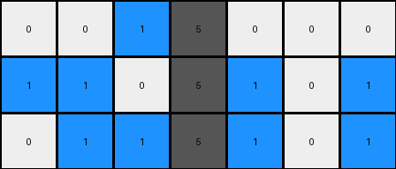

# 6-0520fde7 • 005 example_3 - NLP

---


**input**
```
0 0 1 5 0 0 0
1 1 0 5 1 0 1
0 1 1 5 1 0 1
```




**output**
```
0 0 0
2 0 0
0 0 2
```


**Instructions**

- Describe in natural language the step-by-step transformation observed between the input and output grids.
- Focus on identifying objects, their properties (predicates), and the actions performed on them.
- Be as clear and concise as possible, providing a complete description of the transformation rule.
