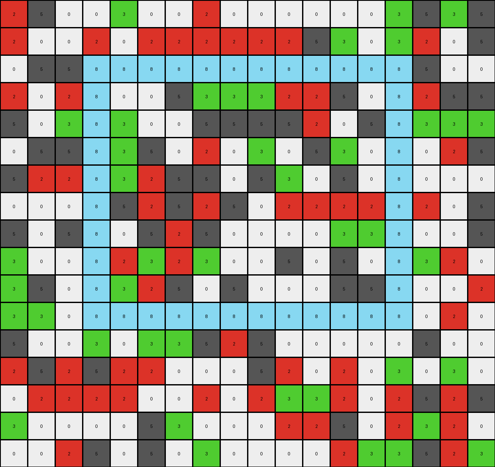
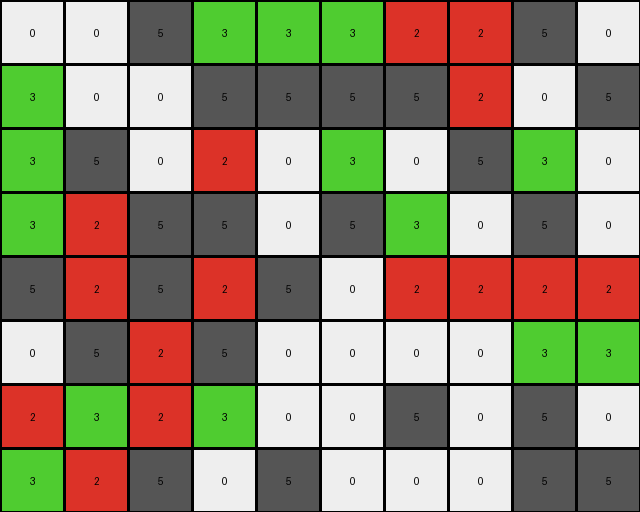

# 1c786137 • 005 • example_3 - NLP

---


**input**
```
2 5 0 0 3 0 0 2 0 0 0 0 0 0 3 5 3 5
2 0 0 2 0 2 2 2 2 2 2 5 3 0 3 2 0 5
0 5 5 8 8 8 8 8 8 8 8 8 8 8 8 5 0 0
2 0 2 8 0 0 5 3 3 3 2 2 5 0 8 2 5 5
5 0 3 8 3 0 0 5 5 5 5 2 0 5 8 3 3 3
0 5 5 8 3 5 0 2 0 3 0 5 3 0 8 0 2 5
5 2 2 8 3 2 5 5 0 5 3 0 5 0 8 0 0 0
0 0 0 8 5 2 5 2 5 0 2 2 2 2 8 2 0 5
5 0 5 8 0 5 2 5 0 0 0 0 3 3 8 0 0 5
3 0 0 8 2 3 2 3 0 0 5 0 5 0 8 3 2 0
3 5 0 8 3 2 5 0 5 0 0 0 5 5 8 0 0 2
3 3 0 8 8 8 8 8 8 8 8 8 8 8 8 0 2 0
5 0 0 3 0 3 3 5 2 5 0 0 0 0 0 5 0 0
2 5 2 5 2 2 0 0 0 5 2 0 2 0 3 0 3 0
0 2 2 2 2 0 0 2 0 2 3 3 2 0 2 5 2 5
3 0 0 0 0 5 3 0 0 0 2 2 5 0 2 3 2 0
0 0 2 5 0 5 0 3 0 0 0 0 2 3 3 5 2 3
```




**output**
```
0 0 5 3 3 3 2 2 5 0
3 0 0 5 5 5 5 2 0 5
3 5 0 2 0 3 0 5 3 0
3 2 5 5 0 5 3 0 5 0
5 2 5 2 5 0 2 2 2 2
0 5 2 5 0 0 0 0 3 3
2 3 2 3 0 0 5 0 5 0
3 2 5 0 5 0 0 0 5 5
```




**Instructions**

- Describe in natural language the step-by-step transformation observed between the input and output grids.
- Focus on identifying objects, their properties (predicates), and the actions performed on them.
- Be as clear and concise as possible, providing a complete description of the transformation rule.
