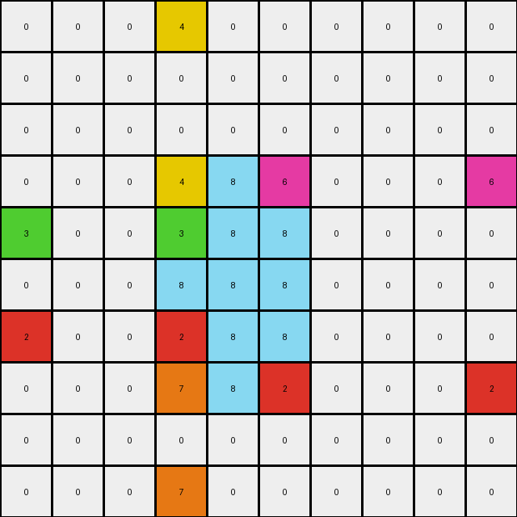

# 1f642eb9 • 005 • example_3 - NLP

---


**input**
```
0 0 0 4 0 0 0 0 0 0
0 0 0 0 0 0 0 0 0 0
0 0 0 0 0 0 0 0 0 0
0 0 0 8 8 8 0 0 0 6
3 0 0 8 8 8 0 0 0 0
0 0 0 8 8 8 0 0 0 0
2 0 0 8 8 8 0 0 0 0
0 0 0 8 8 8 0 0 0 2
0 0 0 0 0 0 0 0 0 0
0 0 0 7 0 0 0 0 0 0
```


**output**
```
0 0 0 4 0 0 0 0 0 0
0 0 0 0 0 0 0 0 0 0
0 0 0 0 0 0 0 0 0 0
0 0 0 4 8 6 0 0 0 6
3 0 0 3 8 8 0 0 0 0
0 0 0 8 8 8 0 0 0 0
2 0 0 2 8 8 0 0 0 0
0 0 0 7 8 2 0 0 0 2
0 0 0 0 0 0 0 0 0 0
0 0 0 7 0 0 0 0 0 0
```




**Instructions**

- Describe in natural language the step-by-step transformation observed between the input and output grids.
- Focus on identifying objects, their properties (predicates), and the actions performed on them.
- Be as clear and concise as possible, providing a complete description of the transformation rule.
