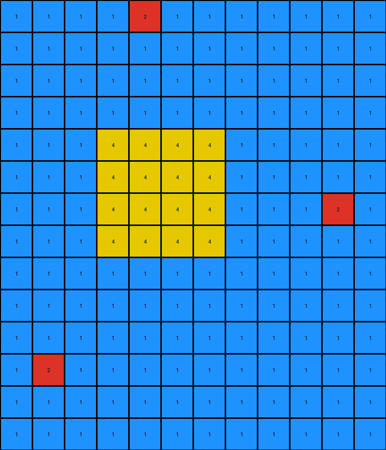
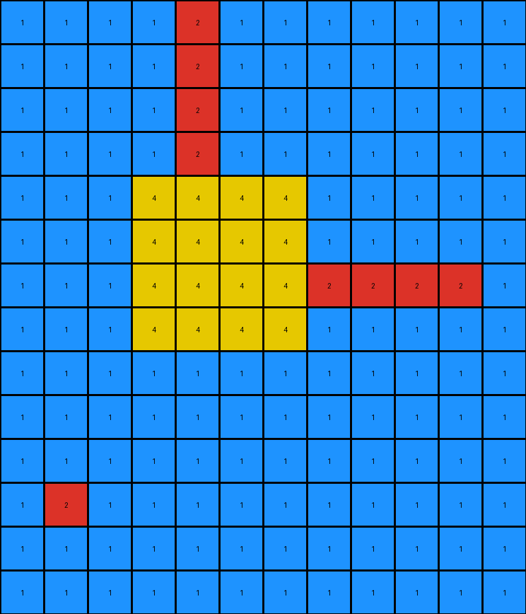

# 2c608aff • 005 • example_3 - NLP

---


**input**
```
1 1 1 1 2 1 1 1 1 1 1 1
1 1 1 1 1 1 1 1 1 1 1 1
1 1 1 1 1 1 1 1 1 1 1 1
1 1 1 1 1 1 1 1 1 1 1 1
1 1 1 4 4 4 4 1 1 1 1 1
1 1 1 4 4 4 4 1 1 1 1 1
1 1 1 4 4 4 4 1 1 1 2 1
1 1 1 4 4 4 4 1 1 1 1 1
1 1 1 1 1 1 1 1 1 1 1 1
1 1 1 1 1 1 1 1 1 1 1 1
1 1 1 1 1 1 1 1 1 1 1 1
1 2 1 1 1 1 1 1 1 1 1 1
1 1 1 1 1 1 1 1 1 1 1 1
1 1 1 1 1 1 1 1 1 1 1 1
```




**output**
```
1 1 1 1 2 1 1 1 1 1 1 1
1 1 1 1 2 1 1 1 1 1 1 1
1 1 1 1 2 1 1 1 1 1 1 1
1 1 1 1 2 1 1 1 1 1 1 1
1 1 1 4 4 4 4 1 1 1 1 1
1 1 1 4 4 4 4 1 1 1 1 1
1 1 1 4 4 4 4 2 2 2 2 1
1 1 1 4 4 4 4 1 1 1 1 1
1 1 1 1 1 1 1 1 1 1 1 1
1 1 1 1 1 1 1 1 1 1 1 1
1 1 1 1 1 1 1 1 1 1 1 1
1 2 1 1 1 1 1 1 1 1 1 1
1 1 1 1 1 1 1 1 1 1 1 1
1 1 1 1 1 1 1 1 1 1 1 1
```




**Instructions**

- Describe in natural language the step-by-step transformation observed between the input and output grids.
- Focus on identifying objects, their properties (predicates), and the actions performed on them.
- Be as clear and concise as possible, providing a complete description of the transformation rule.
