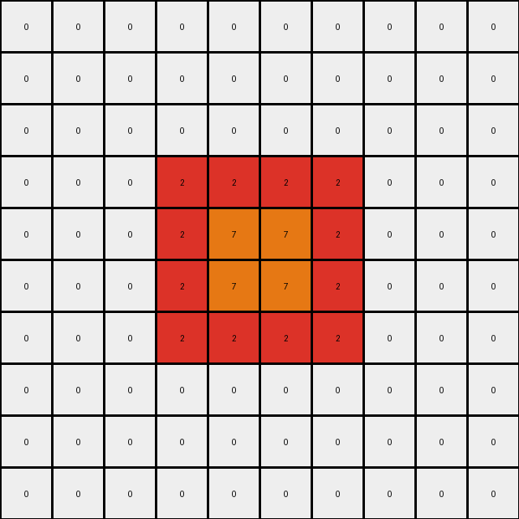
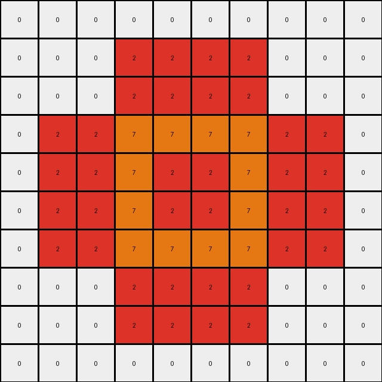

# 3befdf3e • 003 • example_2 - NLP

---


**input**
```
0 0 0 0 0 0 0 0 0 0
0 0 0 0 0 0 0 0 0 0
0 0 0 0 0 0 0 0 0 0
0 0 0 2 2 2 2 0 0 0
0 0 0 2 7 7 2 0 0 0
0 0 0 2 7 7 2 0 0 0
0 0 0 2 2 2 2 0 0 0
0 0 0 0 0 0 0 0 0 0
0 0 0 0 0 0 0 0 0 0
0 0 0 0 0 0 0 0 0 0
```




**output**
```
0 0 0 0 0 0 0 0 0 0
0 0 0 2 2 2 2 0 0 0
0 0 0 2 2 2 2 0 0 0
0 2 2 7 7 7 7 2 2 0
0 2 2 7 2 2 7 2 2 0
0 2 2 7 2 2 7 2 2 0
0 2 2 7 7 7 7 2 2 0
0 0 0 2 2 2 2 0 0 0
0 0 0 2 2 2 2 0 0 0
0 0 0 0 0 0 0 0 0 0
```




**Instructions**

- Describe in natural language the step-by-step transformation observed between the input and output grids.
- Focus on identifying objects, their properties (predicates), and the actions performed on them.
- Be as clear and concise as possible, providing a complete description of the transformation rule.
