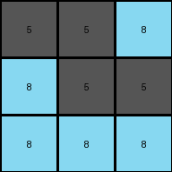

# 3c9b0459 • 005 • example_3 - NLP

---


**input**
```
8 8 8
5 5 8
8 5 5
```


**output**
```
5 5 8
8 5 5
8 8 8
```




**Instructions**

- Describe in natural language the step-by-step transformation observed between the input and output grids.
- Focus on identifying objects, their properties (predicates), and the actions performed on them.
- Be as clear and concise as possible, providing a complete description of the transformation rule.
