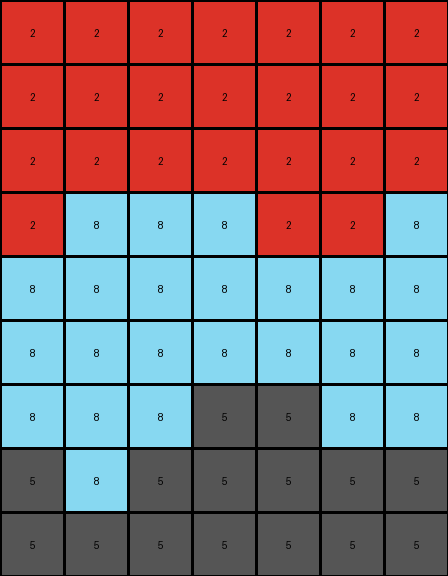
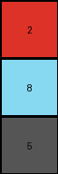

# 4be741c5 • 003 • example_2 - NLP

---


**input**
```
2 2 2 2 2 2 2
2 2 2 2 2 2 2
2 2 2 2 2 2 2
2 8 8 8 2 2 8
8 8 8 8 8 8 8
8 8 8 8 8 8 8
8 8 8 5 5 8 8
5 8 5 5 5 5 5
5 5 5 5 5 5 5
```




**output**
```
2
8
5
```




**Instructions**

- Describe in natural language the step-by-step transformation observed between the input and output grids.
- Focus on identifying objects, their properties (predicates), and the actions performed on them.
- Be as clear and concise as possible, providing a complete description of the transformation rule.
