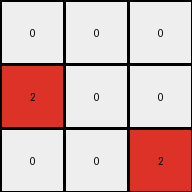

# 6-0520fde7 • 006 • example_3 - CODE

---

**input**
```
1 0 0 5 0 1 0
0 1 0 5 1 1 1
1 0 0 5 0 0 0
```


**output**
```
0 0 0
0 2 0
0 0 0
```


**Natural Language Program: Transformation Rule**

1. **Identify Columns:** Examine each column in the input grid.
2. **Detect Gray Column:** Check if any column is entirely composed of the color 5 (gray).
3. **Generate Output Grid:** If a column of color 5 is found, create a new 3x3 grid filled with the color 0 (white).
4. **Center Red Pixel:**  Set the color of the center cell (row 1, column 1 in 0-based indexing) of the newly created 3x3 grid to 2 (red).
5. **Output Result:** Output the resulting 3x3 grid.

**YAML Block: Task Context and Observations**

```yaml
task_context:
  input_grid_shape: variable
  output_grid_shape: fixed_3x3
  color_palette: [0, 1, 2, 5] # White, Blue, Red, Gray
  transformation_type: object_detection_and_fixed_output
  input_objects:
    color_1_regions: scattered_blue_regions
    color_5_column: vertical_column_of_gray
  output_object:
    single_red_pixel: center_of_3x3_grid

transformation_observations:
  input_contains_vertical_gray_column: true
  output_is_fixed_3x3_with_center_red_pixel: true
  transformation_logic: "If the input grid contains a vertical column of gray color (5), the output is a fixed 3x3 grid with a red pixel (2) in the center and white color (0) elsewhere. The input's content otherwise is ignored."
```
```python
"""
If the input grid contains a vertical column of gray color (5), the output is a fixed 3x3 grid with a red pixel (2) in the center and white color (0) elsewhere. The input's content otherwise is ignored.
"""

import numpy as np

def transform(input_grid):
    """
    Transforms the input grid based on the presence of a gray column.

    Args:
        input_grid (list of lists): The input grid.

    Returns:
        list of lists: The transformed output grid.
    """
    input_grid = np.array(input_grid)
    rows, cols = input_grid.shape

    # Check if any column is entirely composed of the color 5 (gray).
    gray_column_present = False
    for j in range(cols):
        if np.all(input_grid[:, j] == 5):
            gray_column_present = True
            break

    # Initialize a 3x3 output grid filled with 0 (white).
    output_grid = np.zeros((3, 3), dtype=int)

    # If a gray column is present, set the center cell to 2 (red).
    if gray_column_present:
        output_grid[1, 1] = 2

    return output_grid.tolist()
```

**input**
```
1 1 0 5 0 1 0
0 0 1 5 1 1 1
1 1 0 5 0 1 0
```


**output**
```
0 2 0
0 0 2
0 2 0
```


**Natural Language Program: Transformation Rule**

1. **Identify Columns:** Examine each column in the input grid.
2. **Detect Gray Column:** Check if any column is entirely composed of the color 5 (gray).
3. **Generate Output Grid:** If a column of color 5 is found, create a new 3x3 grid filled with the color 0 (white).
4. **Set Specific Red Pixels:** Set the color of the cells at the following positions (0-based indexing) in the 3x3 grid to 2 (red):
    - Row 0, Column 1
    - Row 1, Column 2
    - Row 2, Column 1
5. **Output Result:** Output the resulting 3x3 grid.

**YAML Block: Task Context and Observations**

```yaml
task_context:
  input_grid_shape: variable
  output_grid_shape: fixed_3x3
  color_palette: [0, 1, 2, 5] # White, Blue, Red, Gray
  transformation_type: object_detection_and_fixed_output
  input_objects:
    color_1_regions: scattered_blue_regions
    color_5_column: vertical_column_of_gray
  output_object:
    specific_red_pixel_pattern: non_centered_red_pixels_in_3x3_grid

transformation_observations:
  input_contains_vertical_gray_column: true
  output_is_fixed_3x3_with_specific_red_pixels: true
  red_pixel_locations_example_2: "Red pixels are at positions (0, 1), (1, 2), and (2, 1) in the 3x3 output grid (0-indexed)."
  transformation_logic: "If the input grid contains a vertical column of gray color (5), the output is a fixed 3x3 grid with specific red pixels (2) at positions (0, 1), (1, 2), and (2, 1), and white color (0) elsewhere. The input's content otherwise is ignored."
```

```python
"""
If the input grid contains a vertical column of gray color (5), the output is a fixed 3x3 grid with specific red pixels (2) at positions (0, 1), (1, 2), and (2, 1), and white color (0) elsewhere. The input's content otherwise is ignored.
"""

import numpy as np

def transform(input_grid):
    """
    Transforms the input grid based on the presence of a gray column.

    Args:
        input_grid (list of lists): The input grid.

    Returns:
        list of lists: The transformed output grid.
    """
    input_grid = np.array(input_grid)
    rows, cols = input_grid.shape

    # Check if any column is entirely composed of the color 5 (gray).
    gray_column_present = False
    for j in range(cols):
        if np.all(input_grid[:, j] == 5):
            gray_column_present = True
            break

    # Initialize a 3x3 output grid filled with 0 (white).
    output_grid = np.zeros((3, 3), dtype=int)

    # If a gray column is present, set the specific red pixel locations.
    if gray_column_present:
        output_grid[0, 1] = 2
        output_grid[1, 2] = 2
        output_grid[2, 1] = 2

    return output_grid.tolist()
```
**input**
```
0 0 0 0 0 0
0 0 0 0 0 0
0 0 0 0 0 5
0 0 0 0 0 0
0 0 0 0 0 0
```


**output**
```
0 0 0
0 0 0
0 0 0
```


```python
"""
If the input grid contains a vertical column of gray color (5), the output is a fixed 3x3 grid with specific red pixels (2) at positions (0, 1), (1, 2), and (2, 1), and white color (0) elsewhere. The input's content otherwise is ignored.
"""

import numpy as np

def transform(input_grid):
    """
    Transforms the input grid based on the presence of a gray column.

    Args:
        input_grid (list of lists): The input grid.

    Returns:
        list of lists: The transformed output grid.
    """
    input_grid = np.array(input_grid)
    rows, cols = input_grid.shape

    # Check if any column is entirely composed of the color 5 (gray).
    gray_column_present = False
    for j in range(cols):
        if np.all(input_grid[:, j] == 5):
            gray_column_present = True
            break

    # Initialize a 3x3 output grid filled with 0 (white).
    output_grid = np.zeros((3, 3), dtype=int)

    # If a gray column is present, set the specific red pixel locations.
    if gray_column_present:
        output_grid[0, 1] = 2
        output_grid[1, 2] = 2
        output_grid[2, 1] = 2

    return output_grid.tolist()
```

**input**
```
0 0 1 5 0 0 0
1 1 0 5 1 0 1
0 1 1 5 1 0 1
```


**output**
```
0 0 0
2 0 0
0 0 2
```



**Natural Language Program: Transformation Rule**

1. **Identify Columns:** Examine each column in the input grid.
2. **Detect Gray Column:** Check if any column is entirely composed of the color 5 (gray).
3. **Generate Output Grid:** If a column of color 5 is found, create a new 3x3 grid filled with the color 0 (white).
4. **Set Specific Red Pixels (Example 3 Pattern):** Set the color of the cells at the following positions (0-based indexing) in the 3x3 grid to 2 (red):
    - Row 1, Column 0
    - Row 2, Column 2
5. **Output Result:** Output the resulting 3x3 grid.

**YAML Block: Task Context and Observations**

```yaml
task_context:
  input_grid_shape: variable
  output_grid_shape: fixed_3x3
  color_palette: [0, 1, 2, 5] # White, Blue, Red, Gray
  transformation_type: object_detection_and_fixed_output
  input_objects:
    color_1_regions: scattered_blue_regions (present but ignored)
    color_5_column: vertical_column_of_gray (trigger)
  output_object:
    specific_red_pixel_pattern_example_3: non_centered_red_pixels_example_3_in_3x3_grid

transformation_observations:
  input_contains_vertical_gray_column: true
  output_is_fixed_3x3_with_specific_red_pixels_example_3: true
  red_pixel_locations_example_3: "Red pixels are at positions (1, 0) and (2, 2) in the 3x3 output grid (0-indexed)."
  transformation_logic: "If the input grid contains a vertical column of gray color (5), the output is a fixed 3x3 grid with specific red pixels (2) at positions (1, 0) and (2, 2), and white color (0) elsewhere. The input's content otherwise is ignored, except for the presence of the gray column which acts as a trigger."
```

```python
"""
If the input grid contains a vertical column of gray color (5), the output is a fixed 3x3 grid with specific red pixels (2) at positions (1, 0) and (2, 2), and white color (0) elsewhere. The input's content otherwise is ignored, except for the presence of the gray column which acts as a trigger.
"""

import numpy as np

def transform(input_grid):
    """
    Transforms the input grid based on the presence of a gray column.

    Args:
        input_grid (list of lists): The input grid.

    Returns:
        list of lists: The transformed output grid.
    """
    input_grid = np.array(input_grid)
    rows, cols = input_grid.shape

    # Check if any column is entirely composed of the color 5 (gray).
    gray_column_present = False
    for j in range(cols):
        if np.all(input_grid[:, j] == 5):
            gray_column_present = True
            break

    # Initialize a 3x3 output grid filled with 0 (white).
    output_grid = np.zeros((3, 3), dtype=int)

    # If a gray column is present, set the specific red pixel locations for example 3.
    if gray_column_present:
        output_grid[1, 0] = 2
        output_grid[2, 2] = 2

    return output_grid.tolist()
```
**INSTRUCTIONS**

- generate a Python module to represent the natural language program 
- follow the template below
- all common math and science libraries are available
- create docstring only at top - but comment the workflow in the function
- use helper functions for common operations like finding objects, counting,
  measuring, moving, etc. 

remember - we are working iteratively - so this code will inform your future
self as we converge on the solution

*template:*

```python
"""
{ natural language description of the transformation rule }
"""

{ imports }

def transform(input_grid):
    # initialize output_grid

    # change output pixels 

    return output_grid

```
