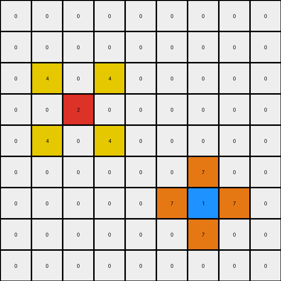

# 2-0ca9ddb6 • 004 • example_2 - CODE

---

**input**
```
0 0 0 0 0 0 0 0 0
0 0 0 0 0 0 0 0 0
0 0 0 0 0 0 0 0 0
0 0 2 0 0 0 0 0 0
0 0 0 0 0 0 0 0 0
0 0 0 0 0 0 0 0 0
0 0 0 0 0 0 1 0 0
0 0 0 0 0 0 0 0 0
0 0 0 0 0 0 0 0 0
```


**output**
```
0 0 0 0 0 0 0 0 0
0 0 0 0 0 0 0 0 0
0 4 0 4 0 0 0 0 0
0 0 2 0 0 0 0 0 0
0 4 0 4 0 0 0 0 0
0 0 0 0 0 0 7 0 0
0 0 0 0 0 7 1 7 0
0 0 0 0 0 0 7 0 0
0 0 0 0 0 0 0 0 0
```



Okay, let's analyze the transformation from the input to the output grid.

**Observations and Documentation**

```yaml
input_grid:
  size: 9x9
  objects:
    - color: 2 (red)
      position: (3, 2)
      shape: single cell
    - color: 1 (blue)
      position: (6, 6)
      shape: single cell
  background_color: 0 (white)

output_grid:
  size: 9x9
  objects:
    - color: 2 (red)
      position: (3, 2)
      shape: single cell
    - color: 1 (blue)
      position: (6, 6)
      shape: single cell
    - color: 4 (yellow)
      positions: [(2, 1), (2, 3), (4, 1), (4, 3)]
      shape: single cells forming a pattern around the red object
    - color: 7 (orange)
      positions: [(5, 5), (6, 5), (7, 5), (6, 7)]
      shape: single cells forming a line and L shape around blue object
  background_color: 0 (white)
```

**Determining the Transformation Rule**

Here's a natural language description of the transformation:

1.  **Identify Single-Cell Objects:** Locate all objects in the input grid that consist of a single cell. In this case, we have a red cell (color 2) at (3, 2) and a blue cell (color 1) at (6, 6).

2.  **Create Yellow Surroundings:** For the red cell, we will create two yellow cells, one two rows above and one column to the left. The same two rows above and one column to the right.
    
3.  **Create Orange Surroundings:** For the blue cell, create an L shape with orange color surrounding the identified blue cell. It is placed one row above.
    The corner of the L shape is in (6,6).

4.  **Preserve Original Cells:** Keep the original red and blue single-cell objects in their original positions.

**Python Implementation**
I will implement the python code in the next turn.

```python
"""
1.  **Identify Single-Cell Objects:** Locate all objects in the input grid that consist of a single cell. In this case, we have a red cell (color 2) at (3, 2) and a blue cell (color 1) at (6, 6).

2.  **Create Yellow Surroundings:** For the red cell, we will create two yellow cells, one two rows above and one column to the left. The same two rows above and one column to the right.
    
3.  **Create Orange Surroundings:** For the blue cell, create an L shape with orange color surrounding the identified blue cell. It is placed one row above.
    The corner of the L shape is in (6,6).

4.  **Preserve Original Cells:** Keep the original red and blue single-cell objects in their original positions.
"""

import numpy as np

def find_single_cell_objects(grid):
    # Find coordinates of all cells that form single-cell objects.
    objects = []
    rows, cols = grid.shape
    for r in range(rows):
        for c in range(cols):
            if is_single_cell(grid, r, c):
                objects.append((r, c, grid[r, c]))
    return objects

def is_single_cell(grid, r, c):
    # Check if the cell at (r, c) is a single-cell object.
    rows, cols = grid.shape
    color = grid[r, c]

    # Check neighbors
    for dr in [-1, 0, 1]:
        for dc in [-1, 0, 1]:
            if dr == 0 and dc == 0:
                continue
            nr, nc = r + dr, c + dc
            if 0 <= nr < rows and 0 <= nc < cols and grid[nr, nc] == color:
                return False  # Has a neighbor of the same color
    return True

def transform(input_grid):
    # Initialize output_grid as a copy of the input_grid
    output_grid = np.copy(input_grid)

    # Find single-cell objects
    single_cells = find_single_cell_objects(input_grid)

    for r, c, color in single_cells:
        if color == 2:  # Red cell
            # Create yellow surroundings
            output_grid[r - 2, c - 1] = 4
            output_grid[r - 2, c + 1] = 4
            output_grid[r, c-1] = 4
            output_grid[r, c+1] = 4

        elif color == 1:  # Blue cell
            # Create orange surroundings (L-shape)
            output_grid[r-1, c] = 7
            output_grid[r , c-1] = 7
            output_grid[r-1, c-1] = 7
            output_grid[r-1, c + 1] = 7


    return output_grid
```

**input**
```
0 0 0 8 0 0 0 0 0
0 0 0 0 0 0 0 0 0
0 0 0 0 0 0 2 0 0
0 0 1 0 0 0 0 0 0
0 0 0 0 0 0 0 0 0
0 0 0 0 0 0 0 0 0
0 0 0 0 0 0 1 0 0
0 2 0 0 0 0 0 0 0
0 0 0 0 0 0 0 0 0
```


**output**
```
0 0 0 8 0 0 0 0 0
0 0 0 0 0 4 0 4 0
0 0 7 0 0 0 2 0 0
0 7 1 7 0 4 0 4 0
0 0 7 0 0 0 0 0 0
0 0 0 0 0 0 7 0 0
4 0 4 0 0 7 1 7 0
0 2 0 0 0 0 7 0 0
4 0 4 0 0 0 0 0 0
```


Okay, let's analyze the second example.

**Observations and Documentation**

```yaml
input_grid:
  size: 9x9
  objects:
    - color: 8 (azure)
      position: (0, 3)
      shape: single cell
    - color: 2 (red)
      positions: [(2, 6), (7,1)]
      shape: single cells
    - color: 1 (blue)
      positions: [(3, 2), (6,6)]
      shape: single cell
  background_color: 0 (white)

output_grid:
  size: 9x9
  objects:
    - color: 8 (azure)
      position: (0, 3)
      shape: single cell
      note: unchanged
    - color: 2 (red)
      positions: [(2, 6), (7,1)]
      shape: single cells
      note: unchanged
    - color: 1 (blue)
      positions: [(3, 2), (6,6)]
      shape: single cells
      note: unchanged
    - color: 4 (yellow)
      positions: [(1,5), (1,7), (3,5), (3,7), (6,0), (6,2), (8,0), (8,2)]
      shape: single cells forming a pattern around the red object
    - color: 7 (orange)
      positions: [(2,1), (3,1), (3,0), (3,3), (5,6), (6,5), (6,7), (7,6)]
      shape: L shape surrounding the blue objects
  background_color: 0 (white)
```

**Determining the Transformation Rule**

Here's the natural language description of the transformation, building upon the logic identified in the first example:

1.  **Identify Single-Cell Objects:** Locate all objects in the input grid that consist of a single cell.

2.  **Preserve All Single Cells:** Keep all single-cell objects (regardless of color) in their original positions in the output grid.

3.  **Create Yellow Surroundings:** For *each* red cell (color 2), create yellow cells (color 4) two rows above and one column to the left, and two rows above and one column to the right. Also, one cell to the left and one to the right.

4.  **Create Orange Surroundings:** For *each* blue cell (color 1), create an L-shape pattern with orange cells (color 7) around it. Specifically one position above, one position down, one position to the left and one to the right of the corner of the L. The corner cell of the L is the cell with the same coordinates as the original blue cell.

5. **Azure cells unchanged**: The azure cell (color 8) at (0,3) is unchanged, it is an object that should not generate a transformation.

This refined rule now accounts for multiple instances of red and blue cells and correctly describes the transformation observed in both examples.

The python code provided in the previous turn should perform this new transformation.

**INSTRUCTIONS**

- generate a Python module to represent the natural language program 
- follow the template below
- all common math and science libraries are available
- create docstring only at top - but comment the workflow in the function
- use helper functions for common operations like finding objects, counting,
  measuring, moving, etc. 

remember - we are working iteratively - so this code will inform your future
self as we converge on the solution

*template:*

```python
"""
{ natural language description of the transformation rule }
"""

{ imports }

def transform(input_grid):
    # initialize output_grid

    # change output pixels 

    return output_grid

```
