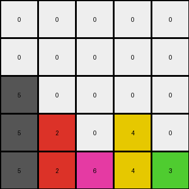

# 3-1e0a9b12 • 005 • example_3 - NLP

---
Okay, let's analyze the transformation from the input grid to the output grid in this third example.

**Observations and Documentation**

```yaml
input_grid:
  size: 5x5
  objects:
    - color: 1
      positions: [(0, 3), (2, 3)]
    - color: 3
      positions: [(1, 1), (2, 1), (4, 1)]
    - color: 2
      positions: [(2, 4)]
    - color: 6
      positions: [(3, 0)]
  background_color: 0

output_grid:
  size: 5x5
  objects:
    - color: 1
      positions: [(3, 3), (4, 3)]
    - color: 3
      positions: [(2, 1), (3, 1), (4, 1)]
    - color: 2
      positions: [(4, 4)]
    - color: 6
      positions: [(4, 0)]
  background_color: 0
```

**Determining the Transformation Rule**

Here's my natural language description of the step-by-step transformation:

1.  **Identify Objects:** Identify all the single-cell objects. In this case objects with color 1, 2, 3 and 6.

2. **Move all objects:** Move every object to the last available row, preserving their column position.

**Natural Language Program**
1. Find all objects.
2. Move each object at the bottom, preserving the column position and stacking if necessary.

```python
"""
1. Find all objects.
2. Move each object at the bottom, preserving the column position and stacking if necessary.
"""

import numpy as np

def find_objects(grid):
    """
    Finds all distinct single-cell objects in the grid.
    Returns a dictionary of color: (row, col) pairs.
    """
    objects = {}
    for r, row in enumerate(grid):
        for c, color in enumerate(row):
            if color != 0:
                if color not in objects:
                    objects[color] = []
                objects[color].append((r, c))
    return objects

def transform(input_grid):
    """
    Transforms the input grid according to the observed rule.
    """
    output_grid = np.zeros_like(input_grid)
    objects = find_objects(input_grid)

    # Create a dictionary to track the next available row for each column
    next_available_row = {col: input_grid.shape[0] - 1 for col in range(input_grid.shape[1])}

    # Iterate through each object and move it down
    for color, positions in objects.items():
        for r, c in positions:
          output_grid[next_available_row[c], c] = color
          next_available_row[c] -= 1

    return output_grid
```


Test Input Transformed Output:

