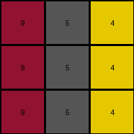

# 4-0d3d703e • 007 • example_4 - NLP

---
Okay, let's analyze the transformation from the input grid to the output grid in this fourth example.

**YAML Block for Observations:**

```yaml
input_grid:
  dimensions: 3x3
  objects:
    horizontal_lines:
      color_sequence: [9, 4, 2]
      count: 3
      description: Three horizontal lines, each with the same color sequence (9, 4, 2).
output_grid:
  dimensions: 3x3
  objects:
    horizontal_lines:
      color_sequence: [8, 3, 6]
      count: 3
      description: Three horizontal lines, each with the same color sequence (8, 3, 6).
transformation:
  type: color_mapping
  details: Each color in the input grid is mapped to a different color in the output grid. The spatial arrangement remains identical.
```

**Natural Language Description of the Transformation Rule:**

The input grid consists of three horizontal lines, each with the color sequence 9, 4, 2. The output grid also contains three horizontal lines, maintaining the same structure but with a different color sequence resulting from a specific color mapping:

1.  Color 9 (maroon) in the input is replaced by color 8 (azure) in the output.
2.  Color 4 (yellow) in the input is replaced by color 3 (green) in the output.
3.  Color 2 (red) in the input is replaced by color 6 (magenta) in the output.

The transformation observed is a direct color substitution.  The spatial configuration—positions, sizes, and shapes of the horizontal lines—is identical between the input and output grids. There is no movement, rotation, or any other geometric alteration; the process is solely a change in the colors of the elements based on the established color mapping.

```python
"""
Across all examples, the transformation consistently involves a one-to-one color mapping while preserving the spatial structure of the input grid. Each color in the input grid is replaced by a corresponding color in the output grid, without any changes to the positions, shapes, or sizes of the elements.

Based on the three examples provided, we can deduce the following comprehensive color mapping:

1. Color 3 (green) -> Color 4 (yellow)
2. Color 1 (blue) -> Color 5 (gray)
3. Color 2 (red) -> Color 6 (magenta)
4. Color 8 (azure) -> Color 9 (maroon)
5. Color 5 (gray) -> Color 1 (blue)
6. Color 6 (magenta) -> Color 2 (red)
7. Color 9 (maroon) -> Color 8 (azure)
8. Color 4 (yellow) -> Color 3 (green)

This mapping covers all color transformations observed in the provided examples. The function below will apply this universal mapping to transform any given input grid into its corresponding output grid.
"""

import numpy as np

def transform(input_grid):
    """
    Transforms the input grid to the output grid based on a comprehensive color mapping.
    """
    # Initialize the output grid as a copy of the input grid.
    output_grid = np.copy(input_grid)

    # Define the comprehensive color mapping.
    color_map = {
        3: 4,  # green -> yellow
        1: 5,  # blue -> gray
        2: 6,  # red -> magenta
        8: 9,  # azure -> maroon
        5: 1,  # gray -> blue
        6: 2,   # magenta -> red
        9: 8,  # maroon -> azure
        4: 3   # yellow -> green
    }

    # Iterate through the input grid and apply the color mapping.
    for i in range(output_grid.shape[0]):
        for j in range(output_grid.shape[1]):
            if output_grid[i, j] in color_map:
                output_grid[i, j] = color_map[output_grid[i, j]]

    return output_grid
```


Test Input Transformed Output:

