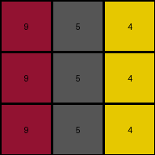

# 4-0d3d703e • 008 • example_4 - CODE

---
```python
"""
Across all examples, the transformation consistently involves a one-to-one color mapping while preserving the spatial structure of the input grid. Each color in the input grid is replaced by a corresponding color in the output grid, without any changes to the positions, shapes, or sizes of the elements.

Based on all four examples, we can deduce the following comprehensive color mapping:

1. Color 3 (green) -> Color 4 (yellow)
2. Color 1 (blue) -> Color 5 (gray)
3. Color 2 (red) -> Color 6 (magenta)
4. Color 8 (azure) -> Color 9 (maroon)
5. Color 5 (gray) -> Color 1 (blue)
6. Color 6 (magenta) -> Color 2 (red)
7. Color 9 (maroon) -> Color 8 (azure)
8. Color 4 (yellow) -> Color 3 (green)

This mapping covers all color transformations observed in the provided examples. The function below will apply this universal mapping to transform any given input grid into its corresponding output grid.
"""

import numpy as np

def transform(input_grid):
    """
    Transforms the input grid to the output grid based on a comprehensive color mapping.
    """
    # Initialize the output grid as a copy of the input grid.
    output_grid = np.copy(input_grid)

    # Define the comprehensive color mapping.
    color_map = {
        3: 4,  # green -> yellow
        1: 5,  # blue -> gray
        2: 6,  # red -> magenta
        8: 9,  # azure -> maroon
        5: 1,  # gray -> blue
        6: 2,   # magenta -> red
        9: 8,  # maroon -> azure
        4: 3   # yellow -> green
    }

    # Iterate through the input grid and apply the color mapping.
    for i in range(output_grid.shape[0]):
        for j in range(output_grid.shape[1]):
            if output_grid[i, j] in color_map:
                output_grid[i, j] = color_map[output_grid[i, j]]

    return output_grid
```


Test Input Transformed Output:

