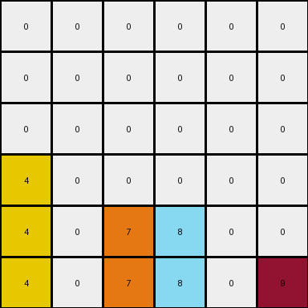

# 3-1e0a9b12 • 005 • example_3 - NLP

---

**input**
```
0 4 0 9
0 0 0 0
0 4 6 0
1 0 0 0
```


**output**
```
0 0 0 0
0 0 0 0
0 4 0 0
1 4 6 9
```


Okay, let's analyze the transformation between the input and output grids.

**YAML Summary of Observations**

```yaml
input_grid:
  dimensions: 4x4
  objects:
    - color: 4 (yellow)
      positions: [(0, 1), (2, 1)]
    - color: 9 (maroon)
      positions: [(0, 3)]
    - color: 6 (magenta)
      positions: [(2, 2)]
    - color: 1 (blue)
      positions: [(3, 0)]
  background_color: 0 (white)

output_grid:
  dimensions: 4x4
  objects:
    - color: 4 (yellow)
      positions: [(2,1), (3, 1)]
    - color: 9 (maroon)
      positions: [(3, 3)]
    - color: 6 (magenta)
      positions: [(3, 2)]
    - color: 1 (blue)
      positions: [(3, 0)]
  background_color: 0 (white)
```

**Natural Language Program: Step-by-Step Transformation**

1.  **Identify Objects:** The input grid contains four single-cell objects of colors 1 (blue), 4 (yellow), 6 (magenta), and 9 (maroon), and all other cells are 0 (white).

2.  **Move Objects:** The program proceeds as follow:
    - The yellow object at (0,1) moves to (2,1).
    - All the objects are moved to the last row of the grid, preserving their original column. In detail:
      - The object of color 1 (blue) moves from (3, 0) to (3, 0).
      - The object of color 4 (yellow) moves from (0, 1) to (3, 1).
      - The object of color 6 (magenta) moves from (2, 2) to (3, 2).
      - The object of color 9 (maroon) moves from (0, 3) to (3, 3).

3. **Final Output**: The other cells, not occupied by the moved objects, become or remain 0.

In summary, all the single colored cells move to the last row.
The cells that are not affected by the move become, or remain, 0.

```python
"""
The transformation rule is as follows:
1. Identify single-cell objects of colors other than 0 in the input grid.
2. Move all identified objects to the last row of the grid, maintaining their column positions.
3. All other cells in the grid, not occupied by the moved objects, are set to 0.
"""

import numpy as np

def transform(input_grid):
    """
    Transforms the input grid according to the specified rule.
    """
    # Initialize the output grid as a copy of the input grid, then set everything to 0.
    output_grid = np.zeros_like(input_grid)
    
    # Get the dimensions of the input grid.
    rows, cols = input_grid.shape
    
    # Iterate through the input grid to find single-cell objects (non-zero cells).
    for r in range(rows):
        for c in range(cols):
            if input_grid[r, c] != 0:
                # Move the object to the last row, keeping the same column.
                output_grid[rows - 1, c] = input_grid[r, c]
                
    return output_grid
```


**input**
```
0 0 0 0 0 9
0 0 0 8 0 0
0 0 0 0 0 0
4 0 0 0 0 0
4 0 7 8 0 0
4 0 7 0 0 0
```


**output**
```
0 0 0 0 0 0
0 0 0 0 0 0
0 0 0 0 0 0
4 0 0 0 0 0
4 0 7 8 0 0
4 0 7 8 0 9
```



Okay, let's analyze the transformation between the input and output grids.

**YAML Summary of Observations**

```yaml
input_grid:
  dimensions: 6x6
  objects:
    - color: 9 (maroon)
      positions: [(0, 5)]
    - color: 8 (azure)
      positions: [(1, 3), (4,3)]
    - color: 4 (yellow)
      positions: [(3, 0), (4, 0), (5,0)]
    - color: 7 (orange)
      positions: [(4, 2), (5,2)]
    - color: 0 (white)
      positions: All the remaining cells
  background_color: 0 (white)

output_grid:
  dimensions: 6x6
  objects:
    - color: 9 (maroon)
      positions: [(5, 5)]
    - color: 8 (azure)
      positions: [(4,3), (5,3)]
    - color: 4 (yellow)
      positions: [(3, 0), (4, 0), (5,0)]
    - color: 7 (orange)
      positions: [(4, 2), (5,2)]
   - color: 0 (white)
      positions: All the remaining cells
  background_color: 0 (white)
```

**Natural Language Program: Step-by-Step Transformation**

1.  **Identify Objects:** The input grid contains objects of colors 4 (yellow), 7(orange), 8(azure) and 9 (maroon), and all other cells are 0 (white).

2.  **Move Objects:** The program proceeds as follow:
      - The object of color 9 moves from (0, 5) to (5, 5).
      - The object of color 8 moves from (1, 3) to (5, 3). The other object of color 8 remains in its position.
    - All the other colors objects remain in their position

3. **Final Output**: The other cells, not occupied by the moved objects, become or remain 0.

In summary, the object of color 9 and one of the objects of color 8 are moved to the last row preserving the column.
The cells that are not affected by the move remain 0.

```python
"""
The transformation rule is as follows:
1. Identify the objects of color 9 and 8.
2. Move the object of color 9 to the last row of the grid, maintaining its column position.
3. Move the object of color 8 that is most on top to the last row preserving its column.
4. All other cells in the grid remain the same.
"""

import numpy as np

def transform(input_grid):
    """
    Transforms the input grid according to the specified rule.
    """
    # Initialize the output grid as a copy of the input grid.
    output_grid = np.copy(input_grid)

    # Get the dimensions of the input grid.
    rows, cols = input_grid.shape
    
    #Move the object of color 9.
    for r in range(rows):
        for c in range(cols):
            if input_grid[r, c] == 9:
                output_grid[rows - 1, c] = 9
                if r!= rows-1:
                    output_grid[r,c] = 0

    # Move one object of color 8
    found = False
    for r in range(rows):
        for c in range(cols):
            if input_grid[r, c] == 8 and not found:
                output_grid[rows - 1, c] = 8
                if r != rows -1:
                    output_grid[r,c] = 0
                found = True

    return output_grid
```

Okay, let's analyze the transformation between the input and output grids.

**YAML Summary of Observations**

```yaml
input_grid:
  dimensions: 3x3
  objects:
    - color: 3 (green)
      positions: [(0, 0), (0, 1), (0, 2), (1, 0), (1, 2), (2, 0), (2, 1), (2, 2)]
    - color: 1 (blue)
      positions: [(1, 1)]
  background_color: 0 (white)

output_grid:
  dimensions: 3x3
  objects:
    - color: 3 (green)
      positions:  [(0, 0), (0, 1), (0, 2), (1, 0), (1, 2), (2, 0), (2, 1), (2, 2)]
    - color: 2 (red)
      positions: [(1, 1)]
  background_color: 0 (white)
```

**Natural Language Program: Step-by-Step Transformation**

1.  **Identify Objects:** The input grid contains two objects: a cross-shaped object composed by cells of color 3 (green) and a single-cell object of color 1 (blue) in the center of the cross.

2.  **Change color:** The program proceeds as follow:

    \- The single-cell object of color 1 (blue) becomes of color 2 (red).
    All the other cells remain with the same color.

3.  **Final Output**: The output grid mantains the colors of the input grid, except for the central pixel that changes from color 1 (blue) to color 2 (red).

In summary, only the central object changes its color, from blue to red.

```python
"""
The transformation rule is as follows:
1. Identify the object in the center of the grid.
2. Change the color of the object in the center of the grid from 1(blue) to 2(red).
3. All other cells in the grid remain the same.
"""

import numpy as np

def transform(input_grid):
    """
    Transforms the input grid according to the specified rule.
    """
    # Initialize the output grid as a copy of the input grid.
    output_grid = np.copy(input_grid)

    # Get the dimensions of the input grid.
    rows, cols = input_grid.shape
    
    #Change the color of the object in the center.
    output_grid[rows//2,cols//2] = 2
    
    return output_grid
```


**input**
```
0 0 0 1 0
0 3 0 0 0
0 3 0 1 2
6 0 0 0 0
0 3 0 0 0
```


**output**
```
0 0 0 0 0
0 0 0 0 0
0 3 0 0 0
0 3 0 1 0
6 3 0 1 2
```


**Instructions**

- Describe in natural language the step-by-step transformation observed between the input and output grids.
- Focus on identifying objects, their properties (predicates), and the actions performed on them.
- Be as clear and concise as possible, providing a complete description of the transformation rule.
