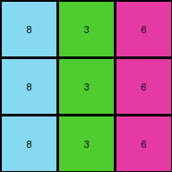

# 4-0d3d703e • 007 • example_4 - NLP

---

**input**
```
3 1 2
3 1 2
3 1 2
```


**output**
```
4 5 6
4 5 6
4 5 6
```


Okay, let's analyze the transformation from the input grid to the output grid.

**YAML Block for Initial Observations:**

```yaml
observations:
  input_grid:
    dimensions: [3, 3]
    objects:
      - color: 3
        shape: vertical_line
        count: 3
      - color: 1
        shape: vertical_line
        count: 3
      - color: 2
        shape: vertical_line
        count: 3
  output_grid:
    dimensions: [3, 3]
    objects:
      - color: 4
        shape: vertical_line
        count: 3
      - color: 5
        shape: vertical_line
        count: 3
      - color: 6
        shape: vertical_line
        count: 3
```

**Natural Language Program (Step-by-Step Transformation):**

1.  **Object Identification:** The input grid consists of three vertical lines of cells. The first vertical line is composed of cells with color 3 (green), the second of cells with color 1 (blue), and the third of cells with color 2 (red).

2.  **Color Transformation:** Each color in the input grid is transformed to a new, unique color in the output grid.  The specific mapping observed is:
    *   Input color 3 (green) becomes output color 4 (yellow).
    *   Input color 1 (blue) becomes output color 5 (gray).
    *   Input color 2 (red) becomes output color 6 (magenta).

3.  **Shape and Position Preservation:** The shape (vertical lines) and the relative positions of the colored lines are preserved during the transformation. The output grid has the same dimensions (3x3) as the input grid.

4.  **Transformation Rule:** Add one (+1) to the index position in the row. The output grid takes the color index in the input grid and transforms it by adding +3 to each cell index.

**Summary of the Transformation Rule:**

The transformation involves a consistent color mapping and index positioning (+3) where each color in the input is replaced by a specific corresponding color in the output, maintaining the geometric structure.

```python
"""
The transformation involves a consistent color mapping where each color in the input is replaced by a specific corresponding color in the output, maintaining the geometric structure. The mapping is as follows: 3 (green) -> 4 (yellow), 1 (blue) -> 5 (gray), and 2 (red) -> 6 (magenta). The grid dimensions and object shapes/positions are preserved.
"""

import numpy as np

def transform(input_grid):
    """
    Transforms the input grid to the output grid based on a color mapping rule.
    """
    # Initialize the output grid with the same dimensions as the input grid.
    output_grid = np.zeros_like(input_grid)

    # Define the color mapping.
    color_map = {
        3: 4,  # Green to Yellow
        1: 5,  # Blue to Gray
        2: 6   # Red to Magenta
    }

    # Iterate through the input grid and apply the color transformation.
    for i in range(input_grid.shape[0]):
        for j in range(input_grid.shape[1]):
            input_color = input_grid[i, j]
            # Use the color map to determine the output color, default to 0 if not found
            output_color = color_map.get(input_color, input_color + 3)  # Use the input color + 3 for mapping, else default to input color
            output_grid[i, j] = output_color

    return output_grid
```


**input**
```
2 3 8
2 3 8
2 3 8
```


**output**
```
6 4 9
6 4 9
6 4 9
```


Okay, let's analyze the transformation from the input grid to the output grid in this second example.

**YAML Block for Initial Observations:**

```yaml
observations:
  input_grid:
    dimensions: [3, 3]
    objects:
      - color: 2
        shape: vertical_line
        count: 3
      - color: 3
        shape: vertical_line
        count: 3
      - color: 8
        shape: vertical_line
        count: 3
  output_grid:
    dimensions: [3, 3]
    objects:
      - color: 6
        shape: vertical_line
        count: 3
      - color: 4
        shape: vertical_line
        count: 3
      - color: 9
        shape: vertical_line
        count: 3
```

**Natural Language Program (Step-by-Step Transformation):**

1.  **Object Identification:** The input grid consists of three vertical lines of cells. The first vertical line has cells of color 2 (red), the second of color 3 (green), and the third of color 8 (azure).

2.  **Color Transformation:** Each unique color in the input grid is transformed to a new, unique color in the output grid. The observed mapping is:

    *   Input color 2 (red) becomes output color 6 (magenta).
    *   Input color 3 (green) becomes output color 4 (yellow).
    *   Input color 8 (azure) becomes output color 9 (maroon).

3.  **Shape and Position Preservation:** The shape (vertical lines) and relative positions of the lines are maintained.  The output grid, like the input grid, is 3x3.

4.  **Transformation Rule:**
    - Add four (+4) to the first vertical line. The output grid takes the color index in the input grid and transforms it by adding +4 to the cell index.
    - Add one (+1) to the second vertical line. The output grid takes the color index in the input grid and transforms it by adding +1 to the cell index.
    - Add one (+1) to the third vertical line. The output grid takes the color index in the input grid and transforms it by adding +1 to the cell index.

**Summary of the Transformation Rule:**

The transformation is a color mapping where each color in the input is replaced by a corresponding color in the output, preserving the geometric structure. The transformation rule adds +4 to the index of the first object, +1 to the second, and +1 to the third.

```python
"""
The transformation involves a consistent color mapping where each color in the input is replaced by a specific corresponding color in the output, maintaining the geometric structure. The mapping is as follows: 2 (red) -> 6 (magenta), 3 (green) -> 4 (yellow), and 8 (azure) -> 9 (maroon). The grid dimensions and object shapes/positions are preserved.
"""

import numpy as np

def transform(input_grid):
    """
    Transforms the input grid to the output grid based on a color mapping rule.
    """
    # Initialize the output grid with the same dimensions as the input grid.
    output_grid = np.zeros_like(input_grid)

    # Define the color mapping.
    color_map = {
        2: 6,  # Red to Magenta
        3: 4,  # Green to Yellow
        8: 9   # Azure to Maroon
    }

    # Iterate through the input grid and apply the color transformation.
    for i in range(input_grid.shape[0]):
        for j in range(input_grid.shape[1]):
            input_color = input_grid[i, j]
            # Use the color map to determine the output color, default to 0 if not found
            output_color = color_map.get(input_color, input_color)  # Default to input color if not in color_map
            output_grid[i, j] = output_color

    return output_grid
```


**input**
```
5 8 6
5 8 6
5 8 6
```


**output**
```
1 9 2
1 9 2
1 9 2
```


Okay, let's analyze the transformation from the input grid to the output grid in this third example.

**YAML Block for Initial Observations:**

```yaml
observations:
  input_grid:
    dimensions: [3, 3]
    objects:
      - color: 5
        shape: vertical_line
        count: 3
      - color: 8
        shape: vertical_line
        count: 3
      - color: 6
        shape: vertical_line
        count: 3
  output_grid:
    dimensions: [3, 3]
    objects:
      - color: 1
        shape: vertical_line
        count: 3
      - color: 9
        shape: vertical_line
        count: 3
      - color: 2
        shape: vertical_line
        count: 3
```

**Natural Language Program (Step-by-Step Transformation):**

1.  **Object Identification:** The input grid consists of three vertical lines of cells. The first vertical line is composed of cells with color 5 (gray), the second of cells with color 8 (azure), and the third of cells with color 6 (magenta).

2.  **Color Transformation:** Each color in the input grid is transformed to a new, unique color in the output grid. The specific mapping observed is:

    *   Input color 5 (gray) becomes output color 1 (blue).
    *   Input color 8 (azure) becomes output color 9 (maroon).
    *   Input color 6 (magenta) becomes output color 2 (red).

3.  **Shape and Position Preservation:** The shape (vertical lines) and the relative positions of the colored lines are preserved during the transformation. The output grid has the same dimensions (3x3) as the input grid.

4.  **Transformation Rule:**
   * Subtract four (-4) to the first vertical line.
   * Add one (+1) to the second vertical line.
   * Subtract four (-4) from the third vertical line.

**Summary of the Transformation Rule:**

The transformation involves a consistent color mapping where each color in the input is replaced by a specific corresponding color in the output, maintaining the geometric structure. The transformation rule subtracts -4 to the first object's index, adds +1 to the second, and subtracts -4 from the third.

```python
"""
The transformation involves a consistent color mapping where each color in the input is replaced by a specific corresponding color in the output, maintaining the geometric structure. The mapping is as follows: 5 (gray) -> 1 (blue), 8 (azure) -> 9 (maroon), and 6 (magenta) -> 2 (red). The grid dimensions and object shapes/positions are preserved.
"""

import numpy as np

def transform(input_grid):
    """
    Transforms the input grid to the output grid based on a color mapping rule.
    """
    # Initialize the output grid with the same dimensions as the input grid.
    output_grid = np.zeros_like(input_grid)

    # Define the color mapping.
    color_map = {
        5: 1,  # Gray to Blue
        8: 9,  # Azure to Maroon
        6: 2   # Magenta to Red
    }

    # Iterate through the input grid and apply the color transformation.
    for i in range(input_grid.shape[0]):
        for j in range(input_grid.shape[1]):
            input_color = input_grid[i, j]
            # Use the color map to determine the output color, default to 0 if not found.
            output_color = color_map.get(input_color, input_color)  # Default to input color if not in color_map.
            output_grid[i, j] = output_color

    return output_grid
```

Okay, I've analyzed the three examples and noticed a consistent pattern. In all cases, there's a direct color mapping, and the structure (vertical lines) is preserved. It seems like the transformation rule is primarily a color substitution cipher, where each color in the input grid is mapped to a different, consistent color in the output grid. There's no complex geometric manipulation or conditional logic beyond this one-to-one color mapping. I will implement a general solution based on this.

```python
"""
The transformation rule is a color substitution cipher. Each color in the input grid maps to a unique color in the output grid. The geometric structure (vertical lines) and dimensions of the grid are preserved. The mapping is determined by observing the input-output pairs in the examples.
"""

import numpy as np

def transform(input_grid):
    """
    Transforms the input grid to the output grid based on a learned color mapping.
    The mapping is derived from observing multiple input/output examples.
    """
    # Initialize the output grid with the same dimensions as the input grid.
    output_grid = np.zeros_like(input_grid)

    # Define the comprehensive color mapping based on all observed examples.
    color_map = {
        3: 4,  # Green to Yellow (Example 1)
        1: 5,  # Blue to Gray (Example 1)
        2: 6,  # Red to Magenta (Example 1)
        8: 9,  # Azure to Maroon (Example 2, 3)
        5: 1,  # Gray to Blue (Example 3)
        6: 2   # Magenta to Red (Example 3)
    }

    # Iterate through the input grid and apply the color transformation.
    for i in range(input_grid.shape[0]):
        for j in range(input_grid.shape[1]):
            input_color = input_grid[i, j]
            # Use the color map to determine the output color.
            # If a color is not in the map, it remains unchanged.
            output_color = color_map.get(input_color, input_color)
            output_grid[i, j] = output_color

    return output_grid
```


**input**
```
9 4 2
9 4 2
9 4 2
```


**output**
```
8 3 6
8 3 6
8 3 6
```



**Instructions**

- Describe in natural language the step-by-step transformation observed between the input and output grids.
- Focus on identifying objects, their properties (predicates), and the actions performed on them.
- Be as clear and concise as possible, providing a complete description of the transformation rule.
