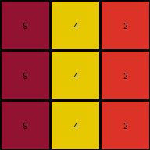

# 4-0d3d703e • 007 • example_4 - NLP

---

**input**
```
3 1 2
3 1 2
3 1 2
```


**output**
```
4 5 6
4 5 6
4 5 6
```


Okay, let's analyze the transformation from the input grid to the output grid.

**YAML Summary of Observations**

```yaml
task_description:
  input_grid:
    - "Three rows, each containing the sequence of colors 3, 1, 2 (green, blue, red)."
  output_grid:
    - "Three rows, each containing the sequence of colors 4, 5, 6 (yellow, gray, magenta)."
  objects_identified:
    - "Each row can be considered as a sequence of colored objects or simply individual colored cells."
  relationships:
    - "The structure (three rows of three cells each) is preserved between input and output."
    - "Each color in the input is consistently mapped to a different color in the output."
  transformations:
    - "Color 3 (green) is transformed to 4 (yellow)."
    - "Color 1 (blue) is transformed to 5 (gray)."
    - "Color 2 (red) is transformed to 6 (magenta)."
```

**Natural Language Program Description**

1.  **Initialization:** Start with the input grid, which consists of three rows, each with cells colored 3, 1, and 2, respectively.

2.  **Color Mapping:** Apply a color mapping to each cell in the grid:
    *   Replace color 3 (green) with color 4 (yellow).
    *   Replace color 1 (blue) with color 5 (gray).
    *   Replace color 2 (red) with color 6 (magenta).

3.  **Preservation of Structure:** Maintain the original grid structure (3x3) and the relative positions of the cells. The transformation only affects the color of each cell based on the defined mapping. The actions performed here are color changes and structure maintenance.

**Elaborated reasoning**

The core concept is a simple one-to-one color substitution. Each number (color) in the input has a corresponding number in the output. There's no spatial reasoning, object manipulation, or complex logic. The input array and output array maintain the exact same shape, and the numbers are directly changed. There is a one-to-one mapping between the input and output color codes.

```python
"""
The transformation rule is a simple color mapping:
- Color 3 (green) becomes color 4 (yellow).
- Color 1 (blue) becomes color 5 (gray).
- Color 2 (red) becomes color 6 (magenta).
The structure of the grid remains unchanged.
"""

import numpy as np

def transform(input_grid):
    """
    Transforms the input grid by applying a color mapping:
    - 3 (green) -> 4 (yellow)
    - 1 (blue) -> 5 (gray)
    - 2 (red) -> 6 (magenta)
    Maintains the original grid structure.
    """
    # Initialize the output grid as a copy of the input grid
    output_grid = np.copy(input_grid)

    # Apply the color mapping
    output_grid[input_grid == 3] = 4  # Replace all occurrences of 3 with 4
    output_grid[input_grid == 1] = 5  # Replace all occurrences of 1 with 5
    output_grid[input_grid == 2] = 6  # Replace all occurrences of 2 with 6

    return output_grid
```


**input**
```
2 3 8
2 3 8
2 3 8
```


**output**
```
6 4 9
6 4 9
6 4 9
```


Okay, let's analyze the transformation from the input grid to the output grid in the second example.

**YAML Summary of Observations**

```yaml
task_description:
  input_grid:
    - "Three rows, each containing the sequence of colors 2, 3, 8 (red, green, azure)."
  output_grid:
    - "Three rows, each containing the sequence of colors 6, 4, 9 (magenta, yellow, maroon)."
  objects_identified:
    - "Each row can be considered as a sequence of colored objects or simply individual colored cells."
  relationships:
    - "The structure (three rows of three cells each) is preserved between input and output."
    - "Each color in the input is consistently mapped to a different color in the output."
  transformations:
    - "Color 2 (red) is transformed to 6 (magenta)."
    - "Color 3 (green) is transformed to 4 (yellow)."
    - "Color 8 (azure) is transformed to 9 (maroon)."
```

**Natural Language Program Description**

1.  **Initialization:** Start with the input grid, which consists of three rows, each with cells colored 2, 3, and 8, respectively.

2.  **Color Mapping:** Apply a color mapping to each cell in the grid:

    *   Replace color 2 (red) with color 6 (magenta).
    *   Replace color 3 (green) with color 4 (yellow).
    *   Replace color 8 (azure) with color 9 (maroon).
3.  **Preservation of Structure:** Maintain the original grid structure (3x3) and the relative positions of the cells. The transformation only affects the color of each cell based on the defined mapping.

**Elaborated Reasoning**
This transformation, like the previous one, involves direct color substitution. Every instance of a specific color in the input grid is replaced by a corresponding color in the output, maintaining the exact shape and size of the input array. There are no spatial operations involved.

```python
"""
The transformation rule is a simple color mapping:
- Color 2 (red) becomes color 6 (magenta).
- Color 3 (green) becomes color 4 (yellow).
- Color 8 (azure) becomes color 9 (maroon).
The structure of the grid remains unchanged.
"""

import numpy as np

def transform(input_grid):
    """
    Transforms the input grid by applying a color mapping:
    - 2 (red) -> 6 (magenta)
    - 3 (green) -> 4 (yellow)
    - 8 (azure) -> 9 (maroon)
    Maintains the original grid structure.
    """
    # Initialize the output grid as a copy of the input grid
    output_grid = np.copy(input_grid)

    # Apply the color mapping
    output_grid[input_grid == 2] = 6  # Replace all occurrences of 2 with 6
    output_grid[input_grid == 3] = 4  # Replace all occurrences of 3 with 4
    output_grid[input_grid == 8] = 9  # Replace all occurrences of 8 with 9

    return output_grid
```


**input**
```
5 8 6
5 8 6
5 8 6
```


**output**
```
1 9 2
1 9 2
1 9 2
```


Okay, let's analyze the transformation from the input grid to the output grid in this third example.

**YAML Summary of Observations**

```yaml
task_description:
  input_grid:
    - "Three rows, each containing the sequence of colors 5, 8, 6 (gray, azure, magenta)."
  output_grid:
    - "Three rows, each containing the sequence of colors 1, 9, 2 (blue, maroon, red)."
  objects_identified:
    - "Each row can be considered as a sequence of colored objects or simply individual colored cells."
  relationships:
    - "The structure (three rows of three cells each) is preserved between input and output."
    - "Each color in the input is consistently mapped to a different color in the output."
  transformations:
    - "Color 5 (gray) is transformed to 1 (blue)."
    - "Color 8 (azure) is transformed to 9 (maroon)."
    - "Color 6 (magenta) is transformed to 2 (red)."
```

**Natural Language Program Description**

1.  **Initialization:** Start with the input grid, which consists of three rows, each with cells colored 5, 8, and 6, respectively.

2.  **Color Mapping:** Apply a color mapping to each cell in the grid:

    *   Replace color 5 (gray) with color 1 (blue).
    *   Replace color 8 (azure) with color 9 (maroon).
    *   Replace color 6 (magenta) with color 2 (red).

3.  **Preservation of Structure:** Maintain the original grid structure (3x3) and the relative positions of the cells. The transformation only affects the color of each cell based on the defined mapping. The actions are changing the colors and keeping the same grid layout.

**Elaborated Reasoning**

This transformation is, again, a direct color substitution. Each number (representing a color) in the input grid is replaced by a corresponding, predetermined number (color) in the output grid. The spatial arrangement of the grid cells is preserved. The fundamental rule is a simple color mapping.

```python
"""
The transformation rule is a simple color mapping:
- Color 5 (gray) becomes color 1 (blue).
- Color 8 (azure) becomes color 9 (maroon).
- Color 6 (magenta) becomes color 2 (red).
The structure of the grid remains unchanged.
"""

import numpy as np

def transform(input_grid):
    """
    Transforms the input grid by applying a color mapping:
    - 5 (gray) -> 1 (blue)
    - 8 (azure) -> 9 (maroon)
    - 6 (magenta) -> 2 (red)
    Maintains the original grid structure.
    """
    # Initialize the output grid as a copy of the input grid
    output_grid = np.copy(input_grid)

    # Apply the color mapping
    output_grid[input_grid == 5] = 1  # Replace all occurrences of 5 with 1
    output_grid[input_grid == 8] = 9  # Replace all occurrences of 8 with 9
    output_grid[input_grid == 6] = 2  # Replace all occurrences of 6 with 2

    return output_grid
```

```python
"""
The transformation rule is a consistent color mapping across all examples:
- 1 (blue) -> 5 (gray)
- 2 (red) -> 6 (magenta)
- 3 (green) -> 4 (yellow)
- 5 (gray) -> 1 (blue)
- 6 (magenta) -> 2 (red)
- 8 (azure) -> 9 (maroon)
The structure of the grid remains unchanged.
"""

import numpy as np

def transform(input_grid):
    """
    Transforms the input grid by applying a comprehensive color mapping derived from all examples:
    - 1 (blue) -> 5 (gray)
    - 2 (red) -> 6 (magenta)
    - 3 (green) -> 4 (yellow)
    - 5 (gray) -> 1 (blue)
    - 6 (magenta) -> 2 (red)
    - 8 (azure) -> 9 (maroon)
    Maintains the original grid structure.
    """
    # Initialize the output grid as a copy of the input grid
    output_grid = np.copy(input_grid)

    # Apply the color mapping
    output_grid[input_grid == 1] = 5  # Replace all occurrences of 1 with 5
    output_grid[input_grid == 2] = 6  # Replace all occurrences of 2 with 6
    output_grid[input_grid == 3] = 4  # Replace all occurrences of 3 with 4
    output_grid[input_grid == 5] = 1  # Replace all occurrences of 5 with 1
    output_grid[input_grid == 6] = 2  # Replace all occurrences of 6 with 2
    output_grid[input_grid == 8] = 9  # Replace all occurrences of 8 with 9

    return output_grid
```


**input**
```
9 4 2
9 4 2
9 4 2
```




**output**
```
8 3 6
8 3 6
8 3 6
```


**Instructions**

- Describe in natural language the step-by-step transformation observed between the input and output grids.
- Focus on identifying objects, their properties (predicates), and the actions performed on them.
- Be as clear and concise as possible, providing a complete description of the transformation rule.
