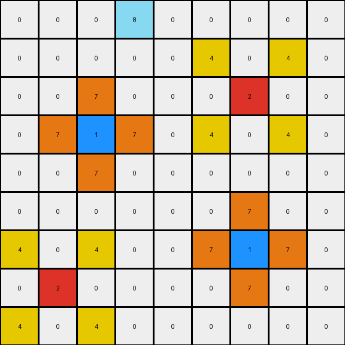

# 2-0ca9ddb6 • 003 • example_2 - NLP

---

**input**
```
0 0 0 0 0 0 0 0 0
0 0 0 0 0 0 0 0 0
0 0 0 0 0 0 0 0 0
0 0 2 0 0 0 0 0 0
0 0 0 0 0 0 0 0 0
0 0 0 0 0 0 0 0 0
0 0 0 0 0 0 1 0 0
0 0 0 0 0 0 0 0 0
0 0 0 0 0 0 0 0 0
```


**output**
```
0 0 0 0 0 0 0 0 0
0 0 0 0 0 0 0 0 0
0 4 0 4 0 0 0 0 0
0 0 2 0 0 0 0 0 0
0 4 0 4 0 0 0 0 0
0 0 0 0 0 0 7 0 0
0 0 0 0 0 7 1 7 0
0 0 0 0 0 0 7 0 0
0 0 0 0 0 0 0 0 0
```


Okay, let's analyze the transformation from the input grid to the output grid.

**YAML Summary of Observations**

```yaml
input_grid:
  objects:
    - color: 2
      position: (3, 2)
      shape: single cell
    - color: 1
      position: (6, 6)
      shape: single cell
  dimensions: (9, 9)

output_grid:
  objects:
    - color: 2
      position: (3, 2)
      shape: single cell
    - color: 1
      position: (6, 6)
      shape: single cell
    - color: 4
      positions: [(2, 1), (2, 3), (4, 1), (4, 3)]
      shape: L-shape x 2, mirrored
     - color: 7
      positions: [(5,6), (6,6), (7,6), (6,5), (6,7)]
      shape: cross

  dimensions: (9, 9)
```

**Natural Language Program: Step-by-Step Transformation Description**

1.  **Identify Initial Objects:** In the input grid, we have two single-cell objects: a red cell (color 2) at position (3, 2) and a blue cell (color 1) at position (6, 6).

2.  **Yellow Marks:** Two yellow cells are placed, forming an L shape mirrored over a central axis. The positions of the centers of these L shapes are one unit above the red cell color.

3.  **Orange/Brown Marks:** An orange cross shape is formed around and including the initial blue cell.

4. **Complete Description** For any single red cell, two yellow cells are placed horizontally symetrically one unit above. And for any single blue cell, a cross of orange color is placed centered on that blue cell.

**Transformation Rule Summary**

The transformation involves adding a mirrored L-shape made of yellow color above each initial red cell, and an orange cross centered on the blue cell.

```python
"""
The transformation involves adding a mirrored L-shape made of yellow color above each initial red cell, and an orange cross centered on the blue cell.
"""

import numpy as np

def find_objects(grid, color):
    # Find coordinates of all cells with the specified color.
    return np.array(np.where(grid == color)).T

def transform(input_grid):
    # Initialize output_grid as a copy of the input_grid.
    output_grid = np.copy(input_grid)

    # Find the red (color 2) and blue (color 1) cells.
    red_cells = find_objects(input_grid, 2)
    blue_cells = find_objects(input_grid, 1)

    # Add mirrored L-shape yellow marks (color 4) above the red cell.
    for red_cell in red_cells:
        y, x = red_cell
        output_grid[y - 1, x - 1] = 4
        output_grid[y - 1, x + 1] = 4

    # Add orange cross (color 7) centered on the blue cell.
    for blue_cell in blue_cells:
        y, x = blue_cell
        output_grid[y, x] = 7      # Center
        output_grid[y - 1, x] = 7  # Top
        output_grid[y + 1, x] = 7  # Bottom
        output_grid[y, x - 1] = 7  # Left
        output_grid[y, x + 1] = 7  # Right
    return output_grid
```

**input**
```
0 0 0 8 0 0 0 0 0
0 0 0 0 0 0 0 0 0
0 0 0 0 0 0 2 0 0
0 0 1 0 0 0 0 0 0
0 0 0 0 0 0 0 0 0
0 0 0 0 0 0 0 0 0
0 0 0 0 0 0 1 0 0
0 2 0 0 0 0 0 0 0
0 0 0 0 0 0 0 0 0
```


**output**
```
0 0 0 8 0 0 0 0 0
0 0 0 0 0 4 0 4 0
0 0 7 0 0 0 2 0 0
0 7 1 7 0 4 0 4 0
0 0 7 0 0 0 0 0 0
0 0 0 0 0 0 7 0 0
4 0 4 0 0 7 1 7 0
0 2 0 0 0 0 7 0 0
4 0 4 0 0 0 0 0 0
```



**Instructions**

- Describe in natural language the step-by-step transformation observed between the input and output grids.
- Focus on identifying objects, their properties (predicates), and the actions performed on them.
- Be as clear and concise as possible, providing a complete description of the transformation rule.
