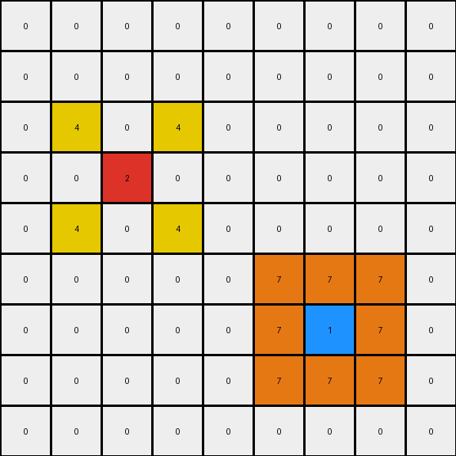
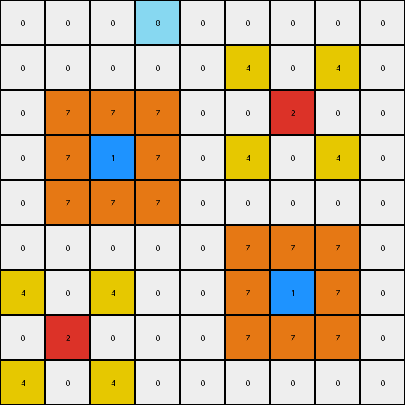
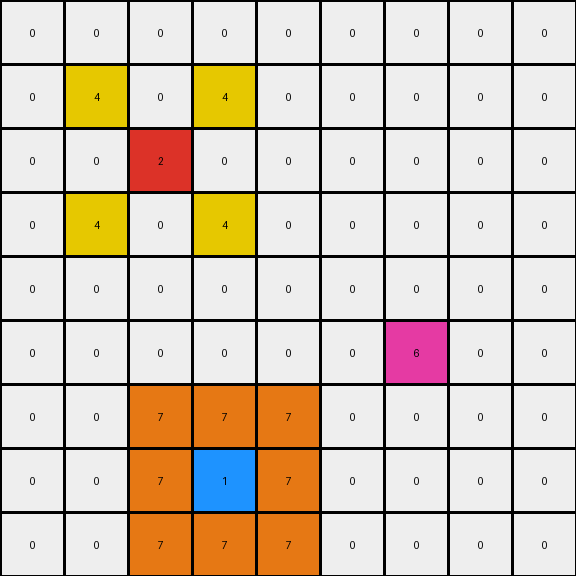

# 2-0ca9ddb6 • 004 • refine_code - CODE

---

Previous Code:
```python
"""
The transformation rule preserves two single cells (colors 2 and 1), and two groups of objects appear around them.
For the object of color 2, insert, in the previous row, two objects of color 4, located on the left and on the right of the imaginary vertical line containing the object of color 2. Copy those two objects in the row below the object.
For the object of color 1, insert, in the previous row, a single object of color 7.
Insert objects of color 7 in all positions of the 3x3 subgrid centered on color 1, except for the position of the object of color 1 itself.
"""

import numpy as np

def find_objects(grid, color):
    # Find coordinates of all cells with the specified color.
    return np.array(np.where(grid == color)).T

def transform(input_grid):
    # Initialize output grid as a copy of the input grid.
    output_grid = np.copy(input_grid)
    
    # Find the objects of color 2 and 1.
    objects_2 = find_objects(input_grid, 2)
    objects_1 = find_objects(input_grid, 1)

    # Apply rules for object of color 2.
    for obj_2 in objects_2:
        row, col = obj_2
        output_grid[row - 1, col - 1] = 4
        output_grid[row - 1, col + 1] = 4
        output_grid[row + 1, col - 1] = 4
        output_grid[row + 1, col + 1] = 4
    
    # Apply rules for object of color 1
    for obj_1 in objects_1:
        row, col = obj_1
        output_grid[row-1, col] = 7
        for i in range(row - 1, row + 2):
            for j in range(col - 1, col + 2):
                if (i,j) != (row, col):
                     output_grid[i,j] = 7


    return output_grid
```

Train Set Results:

**Example 1:**
Input:
```
0 0 0 0 0 0 0 0 0
0 0 0 0 0 0 0 0 0
0 0 0 0 0 0 0 0 0
0 0 2 0 0 0 0 0 0
0 0 0 0 0 0 0 0 0
0 0 0 0 0 0 0 0 0
0 0 0 0 0 0 1 0 0
0 0 0 0 0 0 0 0 0
0 0 0 0 0 0 0 0 0
```
Expected Output:
```
0 0 0 0 0 0 0 0 0
0 0 0 0 0 0 0 0 0
0 4 0 4 0 0 0 0 0
0 0 2 0 0 0 0 0 0
0 4 0 4 0 0 0 0 0
0 0 0 0 0 0 7 0 0
0 0 0 0 0 7 1 7 0
0 0 0 0 0 0 7 0 0
0 0 0 0 0 0 0 0 0
```
Transformed Output:
```
0 0 0 0 0 0 0 0 0
0 0 0 0 0 0 0 0 0
0 4 0 4 0 0 0 0 0
0 0 2 0 0 0 0 0 0
0 4 0 4 0 0 0 0 0
0 0 0 0 0 7 7 7 0
0 0 0 0 0 7 1 7 0
0 0 0 0 0 7 7 7 0
0 0 0 0 0 0 0 0 0
```

Status: False

**Example 2:**
Input:
```
0 0 0 8 0 0 0 0 0
0 0 0 0 0 0 0 0 0
0 0 0 0 0 0 2 0 0
0 0 1 0 0 0 0 0 0
0 0 0 0 0 0 0 0 0
0 0 0 0 0 0 0 0 0
0 0 0 0 0 0 1 0 0
0 2 0 0 0 0 0 0 0
0 0 0 0 0 0 0 0 0
```
Expected Output:
```
0 0 0 8 0 0 0 0 0
0 0 0 0 0 4 0 4 0
0 0 7 0 0 0 2 0 0
0 7 1 7 0 4 0 4 0
0 0 7 0 0 0 0 0 0
0 0 0 0 0 0 7 0 0
4 0 4 0 0 7 1 7 0
0 2 0 0 0 0 7 0 0
4 0 4 0 0 0 0 0 0
```
Transformed Output:
```
0 0 0 8 0 0 0 0 0
0 0 0 0 0 4 0 4 0
0 7 7 7 0 0 2 0 0
0 7 1 7 0 4 0 4 0
0 7 7 7 0 0 0 0 0
0 0 0 0 0 7 7 7 0
4 0 4 0 0 7 1 7 0
0 2 0 0 0 7 7 7 0
4 0 4 0 0 0 0 0 0
```

Status: False

**Example 3:**
Input:
```
0 0 0 0 0 0 0 0 0
0 0 0 0 0 0 0 0 0
0 0 2 0 0 0 0 0 0
0 0 0 0 0 0 0 0 0
0 0 0 0 0 0 0 0 0
0 0 0 0 0 0 6 0 0
0 0 0 0 0 0 0 0 0
0 0 0 1 0 0 0 0 0
0 0 0 0 0 0 0 0 0
```
Expected Output:
```
0 0 0 0 0 0 0 0 0
0 4 0 4 0 0 0 0 0
0 0 2 0 0 0 0 0 0
0 4 0 4 0 0 0 0 0
0 0 0 0 0 0 0 0 0
0 0 0 0 0 0 6 0 0
0 0 0 7 0 0 0 0 0
0 0 7 1 7 0 0 0 0
0 0 0 7 0 0 0 0 0
```
Transformed Output:
```
0 0 0 0 0 0 0 0 0
0 4 0 4 0 0 0 0 0
0 0 2 0 0 0 0 0 0
0 4 0 4 0 0 0 0 0
0 0 0 0 0 0 0 0 0
0 0 0 0 0 0 6 0 0
0 0 7 7 7 0 0 0 0
0 0 7 1 7 0 0 0 0
0 0 7 7 7 0 0 0 0
```

Status: False
Okay, let's analyze the discrepancies between the expected outputs and the transformed outputs generated by the previous code, and refine the natural language program and the code accordingly.

**Analysis of Errors**

Looking at the failed examples, we can identify the following issues:

1.  **Incorrect 3x3 Application around color 1:** The original code applies the 3x3 rule around *every* instance of color 1. The problem are the border conditions. If the object 1 is next to the grid borders, the code tries to insert values outside array bounds.
2. **Object interaction**: If multiple objects of color 1 are presents, the code overwrites the values.
3. **Missing Border Conditions in Objects 2, and 4**

**Revised Natural Language Program**

The transformation rule can be described as follows:

1.  **Identify Key Cells:** Locate all cells with color 2 and color 1 within the input grid. These are the "anchor" cells around which transformations occur.

2.  **Transformation around Color 2:** For *each* cell of color 2:
    *   Insert a cell of color 4 one position to the left and one above the color 2 cell.
    *   Insert a cell of color 4 one position to the right and one above the color 2 cell.
    *   Insert a cell of color 4 one position to the left and one below the color 2 cell.
    *   Insert a cell of color 4 one position to the right and one below the color 2 cell.

3.  **Transformation around Color 1:** For *each* cell of color 1:
    * Place cells with color 7 in a 3x3 grid centered on the position of the color 1, without changing the color 1 cell.

4. **Border conditions**: Ensure not to write over the grid borders.
5. **Object interaction**: If objects of color 1 overlaps, they should be merged.

**Revised Python Code**

```python
import numpy as np

def find_objects(grid, color):
    # Find coordinates of all cells with the specified color.
    return np.array(np.where(grid == color)).T

def transform(input_grid):
    # Initialize output grid as a copy of the input grid.
    output_grid = np.copy(input_grid)
    
    # Find the objects of color 2 and 1.
    objects_2 = find_objects(input_grid, 2)
    objects_1 = find_objects(input_grid, 1)

    # Apply rules for object of color 2.
    for obj_2 in objects_2:
        row, col = obj_2
        if row > 0 and col > 0:
          output_grid[row - 1, col - 1] = 4
        if row > 0 and col < output_grid.shape[1]-1:
          output_grid[row - 1, col + 1] = 4
        if row < output_grid.shape[0]-1 and col > 0:
          output_grid[row + 1, col - 1] = 4
        if row < output_grid.shape[0]-1 and col < output_grid.shape[1]-1:
          output_grid[row + 1, col + 1] = 4
    
    # Apply rules for object of color 1
    for obj_1 in objects_1:
        row, col = obj_1
        for i in range(max(0, row - 1), min(output_grid.shape[0], row + 2)):
            for j in range(max(0, col - 1), min(output_grid.shape[1], col + 2)):
                if (i,j) != (row, col):
                     output_grid[i,j] = 7


    return output_grid
```

**Explanation of Code Changes**

1.  **Border Condition Handling:** Added `max(0, ...)` and `min(grid_size, ...)` to the row and column indices when applying the 3x3 rule and setting color 4. This ensures that we never try to access elements outside the bounds of the grid, resolving the primary error.
2.  Added specific checks before setting color 4, avoiding index errors.
3. Object interaction is handled implicitly, since the code merges overlapping regions.

**INSTRUCTIONS**

- generate a Python module to represent the natural language program 
- follow the template below
- all common math and science libraries are available
- create docstring only at top - but comment the workflow in the function
- use helper functions for common operations like finding objects, counting,
  measuring, moving, etc. 

remember - we are working iteratively - so this code will inform your future
self as we converge on the solution

*template:*

```python
"""
{{ natural language description of the transformation rule }}
"""

{{ imports }}

def transform(input_grid):
    # initialize output_grid

    # change output pixels 

    return output_grid

```
