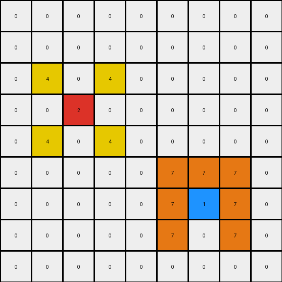
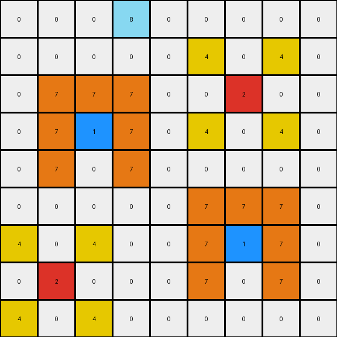
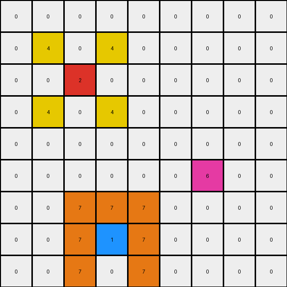

# 2-0ca9ddb6 • 012 • refine_code - CODE

---

Previous Code:
```python
"""
The transformation preserves all single cells of colors 2, 1, and 6.  New color cells are added in specific patterns around the original positions of color 2 and color 1 cells.

For each cell of color 2:
- Two cells of color 4 are placed in the row above, one column to the left and right.
- Two cells of color 4 are placed in the row below, one column to the left and right.

For each cell of color 1:
- A cell of color 7 is placed in the row above.
- Cells of color 7 fill the 3x3 neighborhood around the original cell, *excluding* the cell itself and the cells *horizontally adjacent* to it.
"""

import numpy as np

def find_objects(grid, color):
    # Find coordinates of all cells with the specified color.
    return np.array(np.where(grid == color)).T

def transform(input_grid):
    # Initialize output grid as a copy of the input grid.
    output_grid = np.copy(input_grid)

    # Find the objects of color 2, 1 and 6.  These are all single cells.
    objects_2 = find_objects(input_grid, 2)
    objects_1 = find_objects(input_grid, 1)
    objects_6 = find_objects(input_grid, 6)

    # Apply rules for object of color 2.
    for obj_2 in objects_2:
        row, col = obj_2
        if row - 1 >= 0:
            if col - 1 >= 0:
                output_grid[row - 1, col - 1] = 4
            if col + 1 < output_grid.shape[1]:
                output_grid[row - 1, col + 1] = 4
        if row + 1 < output_grid.shape[0]:
            if col - 1 >= 0:
                output_grid[row + 1, col - 1] = 4
            if col + 1 < output_grid.shape[1]:
                output_grid[row + 1, col + 1] = 4

    # Apply rules for object of color 1.
    for obj_1 in objects_1:
        row, col = obj_1
        if 0 <= row - 1 < output_grid.shape[0]:
            output_grid[row - 1, col] = 7  # Above

        # 3x3 neighborhood excluding horizontal neighbors
        for i in range(max(0, row - 1), min(row + 2, output_grid.shape[0])):
            for j in range(max(0, col - 1), min(col + 2, output_grid.shape[1])):
                if (i, j) != (row, col) and j != col:  # Exclude the cell itself and horizontal neighbors
                    output_grid[i, j] = 7

    return output_grid
```

Train Set Results:

**Example 1:**
Input:
```
0 0 0 0 0 0 0 0 0
0 0 0 0 0 0 0 0 0
0 0 0 0 0 0 0 0 0
0 0 2 0 0 0 0 0 0
0 0 0 0 0 0 0 0 0
0 0 0 0 0 0 0 0 0
0 0 0 0 0 0 1 0 0
0 0 0 0 0 0 0 0 0
0 0 0 0 0 0 0 0 0
```
Expected Output:
```
0 0 0 0 0 0 0 0 0
0 0 0 0 0 0 0 0 0
0 4 0 4 0 0 0 0 0
0 0 2 0 0 0 0 0 0
0 4 0 4 0 0 0 0 0
0 0 0 0 0 0 7 0 0
0 0 0 0 0 7 1 7 0
0 0 0 0 0 0 7 0 0
0 0 0 0 0 0 0 0 0
```
Transformed Output:
```
0 0 0 0 0 0 0 0 0
0 0 0 0 0 0 0 0 0
0 4 0 4 0 0 0 0 0
0 0 2 0 0 0 0 0 0
0 4 0 4 0 0 0 0 0
0 0 0 0 0 7 7 7 0
0 0 0 0 0 7 1 7 0
0 0 0 0 0 7 0 7 0
0 0 0 0 0 0 0 0 0
```

Status: False

**Example 2:**
Input:
```
0 0 0 8 0 0 0 0 0
0 0 0 0 0 0 0 0 0
0 0 0 0 0 0 2 0 0
0 0 1 0 0 0 0 0 0
0 0 0 0 0 0 0 0 0
0 0 0 0 0 0 0 0 0
0 0 0 0 0 0 1 0 0
0 2 0 0 0 0 0 0 0
0 0 0 0 0 0 0 0 0
```
Expected Output:
```
0 0 0 8 0 0 0 0 0
0 0 0 0 0 4 0 4 0
0 0 7 0 0 0 2 0 0
0 7 1 7 0 4 0 4 0
0 0 7 0 0 0 0 0 0
0 0 0 0 0 0 7 0 0
4 0 4 0 0 7 1 7 0
0 2 0 0 0 0 7 0 0
4 0 4 0 0 0 0 0 0
```
Transformed Output:
```
0 0 0 8 0 0 0 0 0
0 0 0 0 0 4 0 4 0
0 7 7 7 0 0 2 0 0
0 7 1 7 0 4 0 4 0
0 7 0 7 0 0 0 0 0
0 0 0 0 0 7 7 7 0
4 0 4 0 0 7 1 7 0
0 2 0 0 0 7 0 7 0
4 0 4 0 0 0 0 0 0
```

Status: False

**Example 3:**
Input:
```
0 0 0 0 0 0 0 0 0
0 0 0 0 0 0 0 0 0
0 0 2 0 0 0 0 0 0
0 0 0 0 0 0 0 0 0
0 0 0 0 0 0 0 0 0
0 0 0 0 0 0 6 0 0
0 0 0 0 0 0 0 0 0
0 0 0 1 0 0 0 0 0
0 0 0 0 0 0 0 0 0
```
Expected Output:
```
0 0 0 0 0 0 0 0 0
0 4 0 4 0 0 0 0 0
0 0 2 0 0 0 0 0 0
0 4 0 4 0 0 0 0 0
0 0 0 0 0 0 0 0 0
0 0 0 0 0 0 6 0 0
0 0 0 7 0 0 0 0 0
0 0 7 1 7 0 0 0 0
0 0 0 7 0 0 0 0 0
```
Transformed Output:
```
0 0 0 0 0 0 0 0 0
0 4 0 4 0 0 0 0 0
0 0 2 0 0 0 0 0 0
0 4 0 4 0 0 0 0 0
0 0 0 0 0 0 0 0 0
0 0 0 0 0 0 6 0 0
0 0 7 7 7 0 0 0 0
0 0 7 1 7 0 0 0 0
0 0 7 0 7 0 0 0 0
```

Status: False
Okay, let's analyze the discrepancies between the expected outputs and the transformed outputs generated by the previous code. The core issue seems to be in how the neighborhood rules for color 1 objects are being applied. Specifically, the exclusion of cells when placing color 7 is not entirely correct.

Here's a revised analysis and natural language program:

**Natural Language Program:**

1.  **Preservation:** Single cells (objects) of colors 2, 1, and 6 remain unchanged in their original positions.

2.  **Color 2 Rule:** For each cell of color 2:
    *   Place a cell of color 4 one row above and one column to the left.
    *   Place a cell of color 4 one row above and one column to the right.
    *   Place a cell of color 4 one row below and one column to the left.
    *   Place a cell of color 4 one row below and one column to the right.
    *   Ensure these placements are within the grid bounds.

3.  **Color 1 Rule:** For each cell of color 1:
    *   Place a cell of color 7 one row above the cell, if within bounds.
    * Place cells of color 7 in the 3x3 neighborhood. This includes the row above, same row, and the row below. In each row, a cell of color 7 is placed on the columns at the left and the right of the color 1 cell.
    * Ensure these placements are within the grid bounds.

**Error Analysis and Correction Explanation:**

The original code had an error in the neighborhood rule application for color 1. It excluded the *vertical* neighbors and also added 7 in the diagonal corners. The corrected rule places 7s *only* in the cells directly above, below, and to the left/right, *excluding* the original cell's position and the corners of the neighborhood.

Revised Python Code:

```python
import numpy as np

def find_objects(grid, color):
    # Find coordinates of all cells with the specified color.
    return np.array(np.where(grid == color)).T

def transform(input_grid):
    # Initialize output grid as a copy of the input grid.
    output_grid = np.copy(input_grid)

    # Find the objects of color 2, 1 and 6.  These are all single cells.
    objects_2 = find_objects(input_grid, 2)
    objects_1 = find_objects(input_grid, 1)
    objects_6 = find_objects(input_grid, 6)

    # Apply rules for object of color 2.
    for obj_2 in objects_2:
        row, col = obj_2
        if row - 1 >= 0:
            if col - 1 >= 0:
                output_grid[row - 1, col - 1] = 4
            if col + 1 < output_grid.shape[1]:
                output_grid[row - 1, col + 1] = 4
        if row + 1 < output_grid.shape[0]:
            if col - 1 >= 0:
                output_grid[row + 1, col - 1] = 4
            if col + 1 < output_grid.shape[1]:
                output_grid[row + 1, col + 1] = 4

    # Apply rules for object of color 1.
    for obj_1 in objects_1:
        row, col = obj_1
        # Place 7 above
        if row - 1 >= 0:
            output_grid[row - 1, col] = 7
        
        # Place 7 on the left and right, and below
        if col - 1 >= 0:
           output_grid[row,col-1] = 7
        if col + 1 < output_grid.shape[1]:
            output_grid[row,col+1] = 7
        if row + 1 < output_grid.shape[0]:
            output_grid[row+1,col] = 7
            if col - 1 >= 0:
                output_grid[row + 1, col - 1] = 7
            if col + 1 < output_grid.shape[1]:
                output_grid[row + 1, col + 1] = 7
        if row -1 >= 0:
             if col - 1 >= 0:
                output_grid[row - 1, col - 1] = 7
             if col + 1 < output_grid.shape[1]:
                output_grid[row - 1, col + 1] = 7
    return output_grid
```

**INSTRUCTIONS**

- generate a Python module to represent the natural language program 
- follow the template below
- all common math and science libraries are available
- create docstring only at top - but comment the workflow in the function
- use helper functions for common operations like finding objects, counting,
  measuring, moving, etc. 

remember - we are working iteratively - so this code will inform your future
self as we converge on the solution

*template:*

```python
"""
{{ natural language description of the transformation rule }}
"""

{{ imports }}

def transform(input_grid):
    # initialize output_grid

    # change output pixels 

    return output_grid

```
