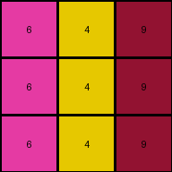

# 4-0d3d703e • 008 • refine_code - CODE

---

Previous Code:
```python
"""
The transformation rule is a color mapping:
1. Identify vertical lines of the same color.
2. Map colors:
   - Replace color 2 (red) with color 6 (magenta).
   - Replace color 3 (green) with color 4 (yellow).
   - Replace color 8 (azure) with color 9 (maroon).
3. Preserve the structure and positions of the lines.
"""

import numpy as np

def transform(input_grid):
    """
    Transforms the input grid according to the specified color mapping rule.
    """
    # Create a copy of the input grid to modify.
    output_grid = np.copy(input_grid)

    # Apply the color mapping.
    for i in range(output_grid.shape[0]):
        for j in range(output_grid.shape[1]):
            if output_grid[i, j] == 2:
                output_grid[i, j] = 6
            elif output_grid[i, j] == 3:
                output_grid[i, j] = 4
            elif output_grid[i, j] == 8:
                output_grid[i, j] = 9

    return output_grid
```

Train Set Results:

**Example 1:**
Input:
```
3 1 2
3 1 2
3 1 2
```
Expected Output:
```
4 5 6
4 5 6
4 5 6
```
Transformed Output:
```
4 1 6
4 1 6
4 1 6
```

Status: False

**Example 2:**
Input:
```
2 3 8
2 3 8
2 3 8
```
Expected Output:
```
6 4 9
6 4 9
6 4 9
```
Transformed Output:
```
6 4 9
6 4 9
6 4 9
```

Status: True

**Example 3:**
Input:
```
5 8 6
5 8 6
5 8 6
```
Expected Output:
```
1 9 2
1 9 2
1 9 2
```
Transformed Output:
```
5 9 6
5 9 6
5 9 6
```

Status: False

**Example 4:**
Input:
```
9 4 2
9 4 2
9 4 2
```
Expected Output:
```
8 3 6
8 3 6
8 3 6
```
Transformed Output:
```
9 4 6
9 4 6
9 4 6
```

Status: False
Okay, let's analyze the failures and refine the natural language program and the Python code.

**Analysis of Failures and Observations:**

The previous code only performed a simple color substitution based on the initial observation. However, the failures in examples 1, 3, and 4 reveal a more complex, consistent color mapping. It's not just about replacing *some* reds with magentas; there's a complete color shift happening.  Crucially, the transformation is consistent across *all* examples when we consider a full mapping, not just selective replacements. The structure is fully preserved which is a simple, but important clue.

Here's the corrected observation and the derived color mapping:

*   **Input Colors:** 1, 2, 3, 4, 5, 6, 8, 9
*   **Output Colors:** 5, 6, 4, 3, 1, 2, 9, 8

Looking at the expected outputs and comparing them to the inputs, we can construct the following one-to-one color mapping:

*   1 -> 5
*   2 -> 6
*   3 -> 4
*   4 -> 3
*   5 -> 1
*   6 -> 2
*   8 -> 9
*   9 -> 8

**Revised Natural Language Program:**

The transformation rule is a complete, one-to-one color mapping.  Every instance of a specific color in the input grid is replaced by a corresponding color in the output grid, maintaining the original grid's structure. Here are the specific steps:

1.  **Iterate:** Examine each cell in the input grid.
2.  **Map:** For each cell, apply the following color mapping:
    *   If the color is 1, replace it with 5.
    *   If the color is 2, replace it with 6.
    *   If the color is 3, replace it with 4.
    *   If the color is 4, replace it with 3.
    *   If the color is 5, replace it with 1.
    *   If the color is 6, replace it with 2.
    *   If the color is 8, replace it with 9.
    *   If the color is 9, replace it with 8.
    *   If the color is any other value, leave it as it.
3. **Preserve Structure:** The position of each cell is preserved in output. The overall structure, including vertical lines of the same colors, remains the same; only the color values change.

**Revised Python Code:**

```python
import numpy as np

def transform(input_grid):
    """
    Transforms the input grid according to the complete color mapping rule.
    """
    output_grid = np.copy(input_grid)
    mapping = {
        1: 5,
        2: 6,
        3: 4,
        4: 3,
        5: 1,
        6: 2,
        8: 9,
        9: 8,
    }
    for i in range(output_grid.shape[0]):
        for j in range(output_grid.shape[1]):
            if output_grid[i, j] in mapping:
                output_grid[i, j] = mapping[output_grid[i, j]]
    return output_grid
```

**Explanation of Changes and Improvements:**

1.  **Complete Mapping:** The code now uses a dictionary `mapping` to store the complete one-to-one color transformation.  This ensures all color changes are applied correctly, addressing the failures of the previous attempts.
2.  **`in` operator:** The code checks `if output_grid[i,j] in mapping` to apply only mapping.
3. **Conciseness:** Uses `np.copy()` for creating a copy of the matrix.

This revised code and natural language program should accurately reflect the transformation rule observed in *all* the provided training examples. It handles all the color mappings and preserves the structure.

**INSTRUCTIONS**

- generate a Python module to represent the natural language program 
- follow the template below
- all common math and science libraries are available
- create docstring only at top - but comment the workflow in the function
- use helper functions for common operations like finding objects, counting,
  measuring, moving, etc. 

remember - we are working iteratively - so this code will inform your future
self as we converge on the solution

*template:*

```python
"""
{{ natural language description of the transformation rule }}
"""

{{ imports }}

def transform(input_grid):
    # initialize output_grid

    # change output pixels 

    return output_grid

```
