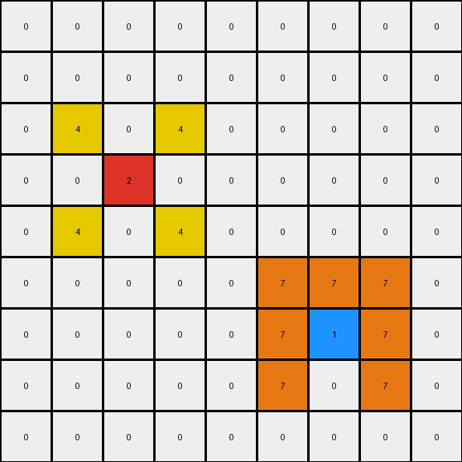
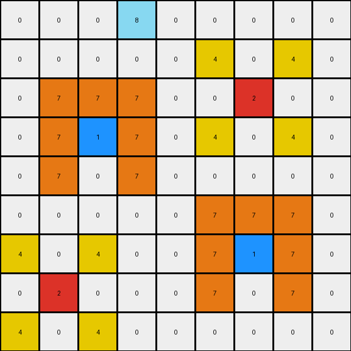
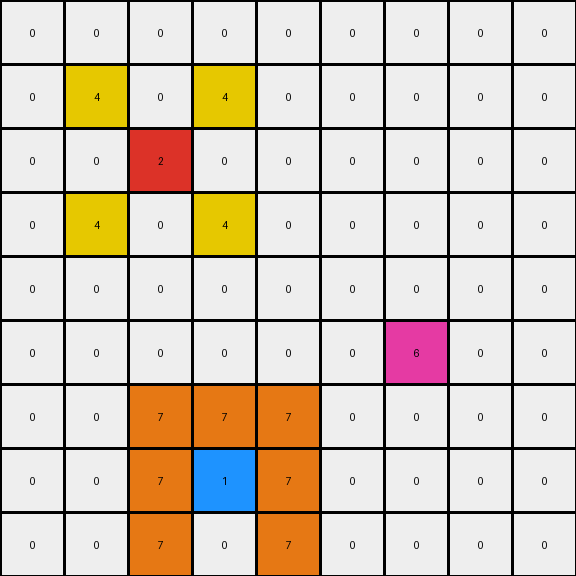

# 2-0ca9ddb6 • 011 • refine_code - NLP

---


Previous Code:
```python
"""
The transformation preserves all single cells of colors 2, 1, and 6.  New color cells are added in specific patterns around the original positions of color 2 and color 1 cells.

For each cell of color 2:
- Two cells of color 4 are placed in the row above, one column to the left and right.
- Two cells of color 4 are placed in the row below, one column to the left and right.

For each cell of color 1:
- A cell of color 7 is placed in the row above.
- Cells of color 7 fill the 3x3 neighborhood around the original cell, *excluding* the cell itself and the cells *horizontally adjacent* to it.
"""

import numpy as np

def find_objects(grid, color):
    # Find coordinates of all cells with the specified color.
    return np.array(np.where(grid == color)).T

def transform(input_grid):
    # Initialize output grid as a copy of the input grid.
    output_grid = np.copy(input_grid)

    # Find the objects of color 2, 1 and 6.  These are all single cells.
    objects_2 = find_objects(input_grid, 2)
    objects_1 = find_objects(input_grid, 1)
    objects_6 = find_objects(input_grid, 6)

    # Apply rules for object of color 2.
    for obj_2 in objects_2:
        row, col = obj_2
        if row - 1 >= 0:
            if col - 1 >= 0:
                output_grid[row - 1, col - 1] = 4
            if col + 1 < output_grid.shape[1]:
                output_grid[row - 1, col + 1] = 4
        if row + 1 < output_grid.shape[0]:
            if col - 1 >= 0:
                output_grid[row + 1, col - 1] = 4
            if col + 1 < output_grid.shape[1]:
                output_grid[row + 1, col + 1] = 4

    # Apply rules for object of color 1.
    for obj_1 in objects_1:
        row, col = obj_1
        if 0 <= row - 1 < output_grid.shape[0]:
            output_grid[row - 1, col] = 7  # Above

        # 3x3 neighborhood excluding horizontal neighbors
        for i in range(max(0, row - 1), min(row + 2, output_grid.shape[0])):
            for j in range(max(0, col - 1), min(col + 2, output_grid.shape[1])):
                if (i, j) != (row, col) and j != col:  # Exclude the cell itself and horizontal neighbors
                    output_grid[i, j] = 7

    return output_grid
```

Train Set Results:

**Example 1:**
Input:
```
0 0 0 0 0 0 0 0 0
0 0 0 0 0 0 0 0 0
0 0 0 0 0 0 0 0 0
0 0 2 0 0 0 0 0 0
0 0 0 0 0 0 0 0 0
0 0 0 0 0 0 0 0 0
0 0 0 0 0 0 1 0 0
0 0 0 0 0 0 0 0 0
0 0 0 0 0 0 0 0 0
```
Expected Output:
```
0 0 0 0 0 0 0 0 0
0 0 0 0 0 0 0 0 0
0 4 0 4 0 0 0 0 0
0 0 2 0 0 0 0 0 0
0 4 0 4 0 0 0 0 0
0 0 0 0 0 0 7 0 0
0 0 0 0 0 7 1 7 0
0 0 0 0 0 0 7 0 0
0 0 0 0 0 0 0 0 0
```
Transformed Output:
```
0 0 0 0 0 0 0 0 0
0 0 0 0 0 0 0 0 0
0 4 0 4 0 0 0 0 0
0 0 2 0 0 0 0 0 0
0 4 0 4 0 0 0 0 0
0 0 0 0 0 7 7 7 0
0 0 0 0 0 7 1 7 0
0 0 0 0 0 7 0 7 0
0 0 0 0 0 0 0 0 0
```

Status: False

**Example 2:**
Input:
```
0 0 0 8 0 0 0 0 0
0 0 0 0 0 0 0 0 0
0 0 0 0 0 0 2 0 0
0 0 1 0 0 0 0 0 0
0 0 0 0 0 0 0 0 0
0 0 0 0 0 0 0 0 0
0 0 0 0 0 0 1 0 0
0 2 0 0 0 0 0 0 0
0 0 0 0 0 0 0 0 0
```
Expected Output:
```
0 0 0 8 0 0 0 0 0
0 0 0 0 0 4 0 4 0
0 0 7 0 0 0 2 0 0
0 7 1 7 0 4 0 4 0
0 0 7 0 0 0 0 0 0
0 0 0 0 0 0 7 0 0
4 0 4 0 0 7 1 7 0
0 2 0 0 0 0 7 0 0
4 0 4 0 0 0 0 0 0
```
Transformed Output:
```
0 0 0 8 0 0 0 0 0
0 0 0 0 0 4 0 4 0
0 7 7 7 0 0 2 0 0
0 7 1 7 0 4 0 4 0
0 7 0 7 0 0 0 0 0
0 0 0 0 0 7 7 7 0
4 0 4 0 0 7 1 7 0
0 2 0 0 0 7 0 7 0
4 0 4 0 0 0 0 0 0
```

Status: False

**Example 3:**
Input:
```
0 0 0 0 0 0 0 0 0
0 0 0 0 0 0 0 0 0
0 0 2 0 0 0 0 0 0
0 0 0 0 0 0 0 0 0
0 0 0 0 0 0 0 0 0
0 0 0 0 0 0 6 0 0
0 0 0 0 0 0 0 0 0
0 0 0 1 0 0 0 0 0
0 0 0 0 0 0 0 0 0
```
Expected Output:
```
0 0 0 0 0 0 0 0 0
0 4 0 4 0 0 0 0 0
0 0 2 0 0 0 0 0 0
0 4 0 4 0 0 0 0 0
0 0 0 0 0 0 0 0 0
0 0 0 0 0 0 6 0 0
0 0 0 7 0 0 0 0 0
0 0 7 1 7 0 0 0 0
0 0 0 7 0 0 0 0 0
```
Transformed Output:
```
0 0 0 0 0 0 0 0 0
0 4 0 4 0 0 0 0 0
0 0 2 0 0 0 0 0 0
0 4 0 4 0 0 0 0 0
0 0 0 0 0 0 0 0 0
0 0 0 0 0 0 6 0 0
0 0 7 7 7 0 0 0 0
0 0 7 1 7 0 0 0 0
0 0 7 0 7 0 0 0 0
```

Status: False

**Instructions**

- Describe in natural language the step-by-step transformation observed between the input and output grids.
- Focus on identifying objects, their properties (predicates), and the actions performed on them.
- Be as clear and concise as possible, providing a complete description of the transformation rule.
