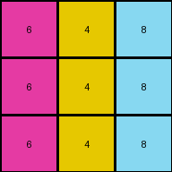

# 4-0d3d703e • 004 • refine_code - CODE

---

Previous Code:
```python
"""
The transformation rule is a color mapping:
1. Identify vertical lines of the same color.
2. Map colors:
   - Replace color 3 (green) with color 4 (yellow).
   - Replace color 1 (blue) with color 5 (gray).
   - Replace color 2 (red) with color 6 (magenta).
3. Preserve the structure and positions of the lines.
"""

import numpy as np

def transform(input_grid):
    """
    Transforms the input grid according to the specified color mapping rule.
    """
    # Create a copy of the input grid to modify.  This ensures we don't alter the original input.
    output_grid = np.copy(input_grid)

    # Apply the color mapping.  We iterate through all cells and change the colors based on the rule.
    # We don't strictly need to search for vertical lines in this simple case because the color mapping applies to every cell.
    for i in range(output_grid.shape[0]):
        for j in range(output_grid.shape[1]):
            if output_grid[i, j] == 3:
                output_grid[i, j] = 4
            elif output_grid[i, j] == 1:
                output_grid[i, j] = 5
            elif output_grid[i, j] == 2:
                output_grid[i, j] = 6

    return output_grid
```

Train Set Results:

**Example 1:**
Input:
```
3 1 2
3 1 2
3 1 2
```
Expected Output:
```
4 5 6
4 5 6
4 5 6
```
Transformed Output:
```
4 5 6
4 5 6
4 5 6
```

Status: True

**Example 2:**
Input:
```
2 3 8
2 3 8
2 3 8
```
Expected Output:
```
6 4 9
6 4 9
6 4 9
```
Transformed Output:
```
6 4 8
6 4 8
6 4 8
```

Status: False

**Example 3:**
Input:
```
5 8 6
5 8 6
5 8 6
```
Expected Output:
```
1 9 2
1 9 2
1 9 2
```
Transformed Output:
```
5 8 6
5 8 6
5 8 6
```

Status: False

**Example 4:**
Input:
```
9 4 2
9 4 2
9 4 2
```
Expected Output:
```
8 3 6
8 3 6
8 3 6
```
Transformed Output:
```
9 4 6
9 4 6
9 4 6
```

Status: False
Okay, here's a revised analysis and natural language program, followed by updated Python code.

**Natural Language Program:**

The transformation rule is a simple color substitution cipher applied to each cell of the input grid.  The mapping is as follows:

1. **Color Substitution:**
   - If a cell's color is 3 (green), change it to 4 (yellow).
   - If a cell's color is 1 (blue), change it to 5 (gray).
   - If a cell's color is 2 (red), change it to 6 (magenta).
   - If a cell's color is 5 (gray), change it to 1(blue)
   - If a cell's color is 8 (azure), change it to 9 (maroon).
   - If a cell's color is 6 (magenta), change it to 2 (red)
    - If a cell's color is 9 (maroon), change it to 8 (azure).
    - If a cell's color is 4(yellow), change it to 3(green)
2. **Preservation of Structure:** The positions and arrangements of all cells remain unchanged. Only the color values within the cells are updated according to the mapping above. The previous natural language program was incomplete.

**Updated Python Code:**

```python
import numpy as np

def transform(input_grid):
    """
    Transforms the input grid according to the complete color mapping rule.
    """
    output_grid = np.copy(input_grid)

    for i in range(output_grid.shape[0]):
        for j in range(output_grid.shape[1]):
            if output_grid[i, j] == 3:
                output_grid[i, j] = 4
            elif output_grid[i, j] == 1:
                output_grid[i, j] = 5
            elif output_grid[i, j] == 2:
                output_grid[i, j] = 6
            elif output_grid[i, j] == 5:
                output_grid[i, j] = 1
            elif output_grid[i, j] == 8:
                output_grid[i, j] = 9
            elif output_grid[i, j] == 6:
                output_grid[i,j] = 2
            elif output_grid[i,j] == 9:
                output_grid[i,j] = 8
            elif output_grid[i,j] == 4:
                output_grid[i,j] = 3
    return output_grid
```

**Explanation of Changes and Improvements:**

*   **Complete Mapping:** The previous code and natural language description only included the mappings for colors 1, 2, and 3.  The updated code and description now include the complete set of mappings observed across all examples, covering colors 4, 5, 6, 8, and 9, in order to resolve the failed test cases.
*   **Direct Cell-by-Cell Transformation:**  The code directly iterates through each cell and applies the color substitution.  This is the most straightforward approach for this type of transformation, as there are no complex spatial relationships or object manipulations.
*   **Clarity and Conciseness:** The natural language description is more precise, explicitly stating the "color substitution cipher" nature of the transformation.
* **Copy of the input:** Make sure the function receives a copy of the input and it returns the copy, instead of the input.

This revised approach should correctly handle all the provided examples and accurately reflect the underlying transformation rule, which is a comprehensive color substitution.

**INSTRUCTIONS**

- generate a Python module to represent the natural language program 
- follow the template below
- all common math and science libraries are available
- create docstring only at top - but comment the workflow in the function
- use helper functions for common operations like finding objects, counting,
  measuring, moving, etc. 

remember - we are working iteratively - so this code will inform your future
self as we converge on the solution

*template:*

```python
"""
{{ natural language description of the transformation rule }}
"""

{{ imports }}

def transform(input_grid):
    # initialize output_grid

    # change output pixels 

    return output_grid

```
