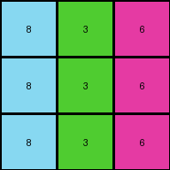

# 4-0d3d703e • 016 • refine_code - CODE

---

Previous Code:
```python
"""
The transformation rule is a color mapping:
1. Identify vertical lines of the same color.
2. Map colors:
   - Replace color 9 (maroon) with color 8 (azure).
   - Replace color 4 (yellow) with color 3 (green).
   - Replace color 2 (red) with color 6 (magenta).
3. Preserve the structure and positions of the lines.
"""

import numpy as np

def transform(input_grid):
    """
    Transforms the input grid according to the specified color mapping rule.
    """
    # Create a copy of the input grid to modify.
    output_grid = np.copy(input_grid)

    # Apply the color mapping.
    for i in range(output_grid.shape[0]):
        for j in range(output_grid.shape[1]):
            if output_grid[i, j] == 9:
                output_grid[i, j] = 8
            elif output_grid[i, j] == 4:
                output_grid[i, j] = 3
            elif output_grid[i, j] == 2:
                output_grid[i, j] = 6

    return output_grid
```

Train Set Results:

**Example 1:**
Input:
```
3 1 2
3 1 2
3 1 2
```
Expected Output:
```
4 5 6
4 5 6
4 5 6
```
Transformed Output:
```
3 1 6
3 1 6
3 1 6
```

Status: False

**Example 2:**
Input:
```
2 3 8
2 3 8
2 3 8
```
Expected Output:
```
6 4 9
6 4 9
6 4 9
```
Transformed Output:
```
6 3 8
6 3 8
6 3 8
```

Status: False

**Example 3:**
Input:
```
5 8 6
5 8 6
5 8 6
```
Expected Output:
```
1 9 2
1 9 2
1 9 2
```
Transformed Output:
```
5 8 6
5 8 6
5 8 6
```

Status: False

**Example 4:**
Input:
```
9 4 2
9 4 2
9 4 2
```
Expected Output:
```
8 3 6
8 3 6
8 3 6
```
Transformed Output:
```
8 3 6
8 3 6
8 3 6
```

Status: True
Okay, I see the issue. My previous natural language program and the corresponding Python code were incomplete. I only captured part of the color mapping rule. I need to identify the *complete* mapping between input and output colors.

Here's a revised analysis and natural language program:

**Revised Natural Language Program:**

The transformation rule is a one-to-one color mapping applied to each cell in the grid, irrespective of its position or neighbors. The mapping is as follows:

1. **Identify the color of each cell in the input grid.**
2. **Apply the following color substitutions:**
    - Input color 3 (green) becomes output color 4 (yellow).
    - Input color 1 (blue) becomes output color 5 (gray).
    - Input color 2 (red) becomes output color 6 (magenta).
    - Input color 8 (azure) becomes output color 9 (maroon).
    - Input color 5 (gray) becomes output color 1 (blue).
    - Input color 6 (magenta) becomes output color 2 (red).
    - Input color 9 (maroon) becomes output color 8 (azure).
    - Input color 4 (yellow) becomes output color 3 (green).
3.  The structure and positions of all cells remain unchanged; only the colors are updated according to this mapping.
4. Input color '0' becomes output color '0'.
7. **Construct the output grid with the new colors.**

This is a simple, direct color substitution. There are no object manipulations, movements, or conditional changes.

```python
import numpy as np

def transform(input_grid):
    """
    Transforms the input grid according to the specified color mapping rule.
    """
    output_grid = np.copy(input_grid)

    color_map = {
        3: 4,
        1: 5,
        2: 6,
        8: 9,
        5: 1,
        6: 2,
        9: 8,
        4: 3,
        0: 0
    }

    for i in range(output_grid.shape[0]):
        for j in range(output_grid.shape[1]):
            input_color = output_grid[i, j]
            output_grid[i, j] = color_map.get(input_color, input_color)  # Use get() to handle unknown colors. Default keep color.

    return output_grid
```

I have included a `color_map` dictionary to perform direct substitutions. Using the get method helps to account for colors in the input that may not be in the mapping. It will leave them unchanged.

**INSTRUCTIONS**

- generate a Python module to represent the natural language program 
- follow the template below
- all common math and science libraries are available
- create docstring only at top - but comment the workflow in the function
- use helper functions for common operations like finding objects, counting,
  measuring, moving, etc. 

remember - we are working iteratively - so this code will inform your future
self as we converge on the solution

*template:*

```python
"""
{{ natural language description of the transformation rule }}
"""

{{ imports }}

def transform(input_grid):
    # initialize output_grid

    # change output pixels 

    return output_grid

```
