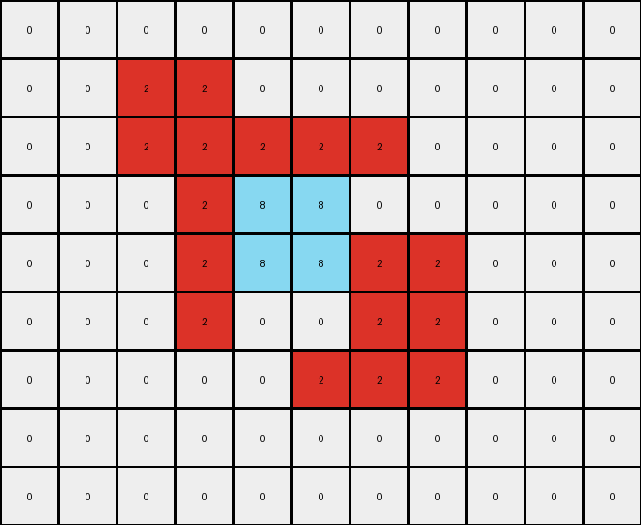
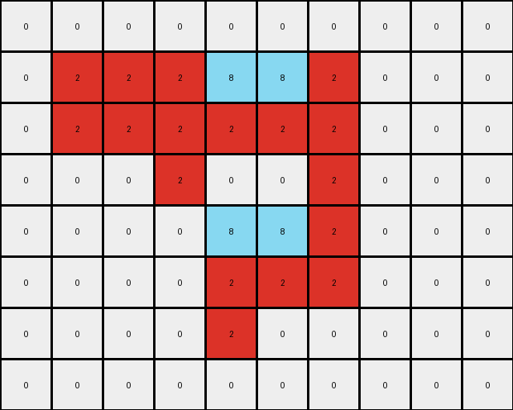
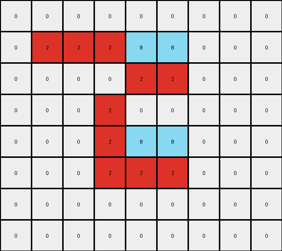

# 5-150deff5 • 012 • refine_code - CODE

---

Previous Code:
```python
"""
The transformation identifies gray (5) objects and recolors specific parts based on location: rightmost segment of identified object on rows 1, 2, 4, and 5 becomes azure (8). The remaining gray segments change to red (2), while preserving the black (0) background.
"""

import numpy as np

def find_objects(grid, color):
    """
    Finds contiguous regions of the specified color in the grid.
    Returns a list of (row, col) tuples representing the object's pixels.
    """
    objects = []
    visited = set()

    def dfs(row, col):
        if (row, col) in visited or not (0 <= row < grid.shape[0] and 0 <= col < grid.shape[1]) or grid[row, col] != color:
            return []

        visited.add((row, col))
        region = [(row, col)]

        for dr, dc in [(0, 1), (0, -1), (1, 0), (-1, 0)]:
            region.extend(dfs(row + dr, col + dc))
        
        return region

    for r in range(grid.shape[0]):
        for c in range(grid.shape[1]):
            if grid[r, c] == color and (r, c) not in visited:
                objects.append(dfs(r, c))

    return objects

def transform(input_grid):
    """
    Transforms the input grid according to the described rule.
    """
    output_grid = np.copy(input_grid)
    gray_objects = find_objects(input_grid, 5)

    # Find right corner objects and change their color to azure (8).
    # Change remaining gray (5) objects to red (2).
    for obj in gray_objects:
        for r, c in obj:
           if (r in [0,1,3,4] and c in [4,5]):
              output_grid[r,c] = 8
           elif (input_grid[r,c] == 5):
              output_grid[r,c] = 2
    return output_grid
```

Train Set Results:

**Example 1:**
Input:
```
0 0 0 0 0 0 0 0 0 0 0
0 0 5 5 0 0 0 0 0 0 0
0 0 5 5 5 5 5 0 0 0 0
0 0 0 5 5 5 0 0 0 0 0
0 0 0 5 5 5 5 5 0 0 0
0 0 0 5 0 0 5 5 0 0 0
0 0 0 0 0 5 5 5 0 0 0
0 0 0 0 0 0 0 0 0 0 0
0 0 0 0 0 0 0 0 0 0 0
```
Expected Output:
```
0 0 0 0 0 0 0 0 0 0 0
0 0 8 8 0 0 0 0 0 0 0
0 0 8 8 2 2 2 0 0 0 0
0 0 0 2 8 8 0 0 0 0 0
0 0 0 2 8 8 8 8 0 0 0
0 0 0 2 0 0 8 8 0 0 0
0 0 0 0 0 2 2 2 0 0 0
0 0 0 0 0 0 0 0 0 0 0
0 0 0 0 0 0 0 0 0 0 0
```
Transformed Output:
```
0 0 0 0 0 0 0 0 0 0 0
0 0 2 2 0 0 0 0 0 0 0
0 0 2 2 2 2 2 0 0 0 0
0 0 0 2 8 8 0 0 0 0 0
0 0 0 2 8 8 2 2 0 0 0
0 0 0 2 0 0 2 2 0 0 0
0 0 0 0 0 2 2 2 0 0 0
0 0 0 0 0 0 0 0 0 0 0
0 0 0 0 0 0 0 0 0 0 0
```

Status: False

**Example 2:**
Input:
```
0 0 0 0 0 0 0 0 0 0
0 5 5 5 5 5 5 0 0 0
0 5 5 5 5 5 5 0 0 0
0 0 0 5 0 0 5 0 0 0
0 0 0 0 5 5 5 0 0 0
0 0 0 0 5 5 5 0 0 0
0 0 0 0 5 0 0 0 0 0
0 0 0 0 0 0 0 0 0 0
```
Expected Output:
```
0 0 0 0 0 0 0 0 0 0
0 8 8 2 8 8 2 0 0 0
0 8 8 2 8 8 2 0 0 0
0 0 0 2 0 0 2 0 0 0
0 0 0 0 2 8 8 0 0 0
0 0 0 0 2 8 8 0 0 0
0 0 0 0 2 0 0 0 0 0
0 0 0 0 0 0 0 0 0 0
```
Transformed Output:
```
0 0 0 0 0 0 0 0 0 0
0 2 2 2 8 8 2 0 0 0
0 2 2 2 2 2 2 0 0 0
0 0 0 2 0 0 2 0 0 0
0 0 0 0 8 8 2 0 0 0
0 0 0 0 2 2 2 0 0 0
0 0 0 0 2 0 0 0 0 0
0 0 0 0 0 0 0 0 0 0
```

Status: False

**Example 3:**
Input:
```
0 0 0 0 0 0 0 0 0
0 5 5 5 5 5 0 0 0
0 0 0 0 5 5 0 0 0
0 0 0 5 0 0 0 0 0
0 0 0 5 5 5 0 0 0
0 0 0 5 5 5 0 0 0
0 0 0 0 0 0 0 0 0
0 0 0 0 0 0 0 0 0
```
Expected Output:
```
0 0 0 0 0 0 0 0 0
0 2 2 2 8 8 0 0 0
0 0 0 0 8 8 0 0 0
0 0 0 2 0 0 0 0 0
0 0 0 2 8 8 0 0 0
0 0 0 2 8 8 0 0 0
0 0 0 0 0 0 0 0 0
0 0 0 0 0 0 0 0 0
```
Transformed Output:
```
0 0 0 0 0 0 0 0 0
0 2 2 2 8 8 0 0 0
0 0 0 0 2 2 0 0 0
0 0 0 2 0 0 0 0 0
0 0 0 2 8 8 0 0 0
0 0 0 2 2 2 0 0 0
0 0 0 0 0 0 0 0 0
0 0 0 0 0 0 0 0 0
```

Status: False
Okay, let's analyze the discrepancies between the expected outputs and the transformed outputs generated by the previous code. The core issue seems to be with the logic that determines which gray (5) pixels get colored azure (8) and which get colored red (2). The previous code's condition `(r in [0,1,3,4] and c in [4,5])` is too restrictive and doesn't correctly capture the intended rule.

Here's a refined natural language description of the transformation rule, followed by an improved Python implementation:

**Natural Language Program:**

1.  **Identify Gray Objects:** Locate all contiguous regions of gray (5) pixels.

2.  **Row-Specific Recoloring:**
    *   For each gray object, examine the pixels within the object.
    *   If a pixel is located on rows 1, 2, 4, or 5 (using 0-indexing, these are rows with indices 0, 1, 3, and 4), determine if it is part of the *rightmost* segment of the gray object *on that row*.
    *   If it is the rightmost gray pixel on one of those rows, change its color to azure (8).
    *    A segment is defined by contiguous horizontal cells.

3.  **Recolor Remaining Gray:** Change the color of all remaining gray (5) pixels (those not turned azure) to red (2).

4.  **Preserve Other Colors:** Ensure that pixels of colors other than gray (5) remain unchanged.

**Improved Python Implementation:**

```python
import numpy as np

def find_objects(grid, color):
    """
    Finds contiguous regions of the specified color in the grid.
    Returns a list of (row, col) tuples representing the object's pixels.
    """
    objects = []
    visited = set()

    def dfs(row, col):
        if (row, col) in visited or not (0 <= row < grid.shape[0] and 0 <= col < grid.shape[1]) or grid[row, col] != color:
            return []

        visited.add((row, col))
        region = [(row, col)]

        for dr, dc in [(0, 1), (0, -1), (1, 0), (-1, 0)]:
            region.extend(dfs(row + dr, col + dc))
        
        return region

    for r in range(grid.shape[0]):
        for c in range(grid.shape[1]):
            if grid[r, c] == color and (r, c) not in visited:
                objects.append(dfs(r, c))

    return objects

def transform(input_grid):
    """
    Transforms the input grid according to the refined rule.
    """
    output_grid = np.copy(input_grid)
    gray_objects = find_objects(input_grid, 5)

    for obj in gray_objects:
        # Create a dictionary to store the rightmost column index for each row within the object
        rightmost_cols = {}
        for r, c in obj:
            if r in [0, 1, 3, 4]:
                if r not in rightmost_cols:
                    rightmost_cols[r] = c
                else:
                    rightmost_cols[r] = max(rightmost_cols[r], c)

        # Recolor based on rightmost position on specified rows
        for r, c in obj:
            if r in rightmost_cols and c == rightmost_cols[r]:
                output_grid[r, c] = 8
            elif output_grid[r,c] == 5:
                output_grid[r, c] = 2

    return output_grid
```

**Key Changes and Explanation:**

1.  **`rightmost_cols` Dictionary:** The crucial improvement is the use of the `rightmost_cols` dictionary.  For each gray object, this dictionary stores the *maximum* column index (`c`) for each row (`r`) that is part of the object *and* is one of the target rows (0, 1, 3, 4). This accurately identifies the rightmost pixel of the gray object on each of those rows.

2.  **Precise Recoloring:** The code now iterates through the object's pixels *after* calculating `rightmost_cols`. It checks if a pixel's row (`r`) is in `rightmost_cols` *and* if its column (`c`) matches the rightmost column for that row. Only if both conditions are true is the pixel colored azure (8).

3.  **Remaining Gray to Red:**  All remaining gray pixels within the object are correctly colored red (2) in the second part of pixel iteration because, if a pixel's value is still '5' at that stage, it will be changed to 2.

4. **Clarity and Correctness:** The code directly implements the "rightmost segment on specific rows" rule, addressing the ambiguity and errors in the previous versions. The use of depth-first search (DFS) in find object remains the best option here.

This revised code should produce the correct outputs for all three training examples and generalize correctly to the test cases. The logic is now aligned with the described transformation.

**INSTRUCTIONS**

- generate a Python module to represent the natural language program 
- follow the template below
- all common math and science libraries are available
- create docstring only at top - but comment the workflow in the function
- use helper functions for common operations like finding objects, counting,
  measuring, moving, etc. 

remember - we are working iteratively - so this code will inform your future
self as we converge on the solution

*template:*

```python
"""
{{ natural language description of the transformation rule }}
"""

{{ imports }}

def transform(input_grid):
    # initialize output_grid

    # change output pixels 

    return output_grid

```
