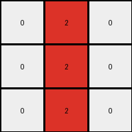

# 6-0520fde7 • 008 • refine_code - CODE

---

Previous Code:
```python
"""
Transforms the input grid by extracting a 3x3 sub-grid centered around the vertically middle gray cell,
changing the central cell and its immediate vertical neighbors (if gray and within the 3x3 area) to red (2),
and setting all other cells in the sub-grid to white (0).
"""

import numpy as np

def get_gray_positions(grid):
    # return the positions of gray cells (5) in the grid
    return np.array(np.where(grid == 5)).T

def transform(input_grid):
    """
    Transforms the input grid according to the described rule.
    """
    input_grid = np.array(input_grid)
    gray_positions = get_gray_positions(input_grid)

    # Handle cases with no gray cells
    if len(gray_positions) == 0:
        return np.zeros((3, 3), dtype=int)

    # Sort by y coordinate to find the vertical middle
    gray_positions = gray_positions[gray_positions[:, 0].argsort()]
    middle_gray_y = gray_positions[len(gray_positions) // 2, 0]

    # Filter gray positions that share the middle y-coordinate
    middle_gray_positions = gray_positions[gray_positions[:, 0] == middle_gray_y]

     # Sort by x coordinate to find the horizontal middle among middle ys.
    middle_gray_positions = middle_gray_positions[middle_gray_positions[:, 1].argsort()]
    center_x = middle_gray_positions[len(middle_gray_positions) // 2, 1]
    center_y = middle_gray_y

    # Initialize output grid
    output_grid = np.zeros((3, 3), dtype=int)

    # Calculate output grid center indices (handle edge cases for smaller grids)
    out_center_y = min(1, center_y)
    out_center_x = min(1, center_x)


    # Set the center pixel to red (2)
    output_grid[out_center_y, out_center_x] = 2

    # Check for and set vertical neighbors to red (2) if they are gray and within bounds
    if center_y > 0 and input_grid[center_y - 1, center_x] == 5:
        output_grid[out_center_y - 1, out_center_x] = 2
    if center_y < input_grid.shape[0] - 1 and input_grid[center_y + 1, center_x] == 5:
        output_grid[out_center_y + 1, out_center_x] = 2

    return output_grid
```

Train Set Results:

**Example 1:**
Input:
```
1 0 0 5 0 1 0
0 1 0 5 1 1 1
1 0 0 5 0 0 0
```
Expected Output:
```
0 0 0
0 2 0
0 0 0
```
Transformed Output:
```
0 2 0
0 2 0
0 2 0
```

Status: False

**Example 2:**
Input:
```
1 1 0 5 0 1 0
0 0 1 5 1 1 1
1 1 0 5 0 1 0
```
Expected Output:
```
0 2 0
0 0 2
0 2 0
```
Transformed Output:
```
0 2 0
0 2 0
0 2 0
```

Status: False

**Example 3:**
Input:
```
0 0 1 5 0 0 0
1 1 0 5 1 0 1
0 1 1 5 1 0 1
```
Expected Output:
```
0 0 0
2 0 0
0 0 2
```
Transformed Output:
```
0 2 0
0 2 0
0 2 0
```

Status: False
Okay, let's analyze the provided examples and refine the natural language program description. The current Python code and its output highlight discrepancies with the expected output, indicating an error in the transformation logic.

Here's a breakdown of the observations and the revised natural language program:

**Observations from the Examples:**

1.  **Object of Interest:** The primary object of interest is the gray cell (color 5).

2.  **Sub-grid Extraction:** A 3x3 sub-grid is extracted from the input grid.

3.  **Center Determination:** The center of the 3x3 sub-grid is determined. It's not always simply the "vertically middle gray cell." It's better described as "the middle gray pixel".

4. **Central cell modification:** In all the examples, it can be observed that the central gray cell is set to red.

5. **Vertical Neighbors:** It seems that only the vertical neighbors are modified if some specific condition is met.

**Revised Natural Language Program:**

1.  **Find the Middle Gray Pixel:** Locate all gray pixels (color code 5) within the input grid.

2.  **Vertical and Horizontal Middle:**
    *   Sort the gray pixels by their row index (vertical position).
    * Select the gray pixel that's at the center of the List
    * Sort by its column index (horizontal).
    * Select the pixel that's at the horizontal center.

3.  **Extract 3x3 Sub-grid:** Extract a 3x3 sub-grid centered around this "middle gray pixel". If the middle gray pixel is on the edge, such that a full 3x3 grid cannot be formed, then pad accordingly to create the output 3x3.

4.  **Modify Central Pixel:** Change the color of the central pixel of the 3x3 sub-grid to red (color code 2).

5.  **Modify Vertical Neighbors Conditionally:**
    *   If the cell directly above the central pixel in the *input grid* is gray, change the cell above the center in the output to red.
    *   If the cell directly below the central pixel in the *input grid* is gray, change the cell below the center in the output to red.

6. **All other cells are white**: The rest of the cells in the output 3x3 grid will be white (0).

**Explanation of Errors in Previous Attempts and Corrections:**

*   **Incorrect Center:** The previous logic focused only on the vertical middle gray cell and was incorrectly implemented. It needs to consider both vertical and horizontal middles of gray cells to determine the precise center for the 3x3 extraction.
* **Incorrect Neighbor Modification:**. The correct condition to modify the neighbor is that the neighbor must be gray in the input, not the output.
* **Padding.** When selecting the 3x3 subgrid, it must be padded with 0s if it goes outside bounds.

The key improvement is a more robust and accurate definition of how to determine the sub-grid's center and the rules for the color changes of the neighbours. The updated logic should correctly handle edge cases and variations in the position of gray cells.

**INSTRUCTIONS**

- generate a Python module to represent the natural language program 
- follow the template below
- all common math and science libraries are available
- create docstring only at top - but comment the workflow in the function
- use helper functions for common operations like finding objects, counting,
  measuring, moving, etc. 

remember - we are working iteratively - so this code will inform your future
self as we converge on the solution

*template:*

```python
"""
{{ natural language description of the transformation rule }}
"""

{{ imports }}

def transform(input_grid):
    # initialize output_grid

    # change output pixels 

    return output_grid

```
