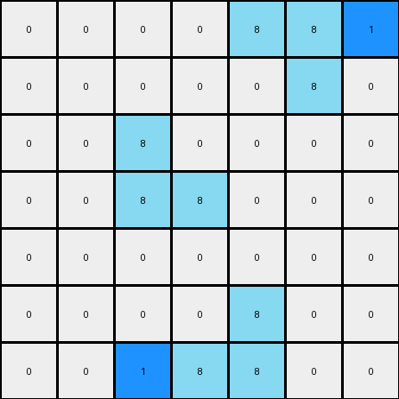

# 1-3aa6fb7a • 007 • refine_code - NLP

---

Previous Code:
```python
"""
The transformation rule is:

1. Preserve Azure: Copy all azure (color 8) objects from the input grid to the output grid without changes.

2. Add Blue - Top: Find the uppermost azure object. Place a blue pixel (color 1) to the right of its rightmost cell.

3. Add Blue - Bottom: Find the lowermost azure object. Place a blue pixel (color 1) to the left of its leftmost cell.
"""

import numpy as np

def find_objects(grid, color):
    objects = []
    visited = set()

    def dfs(row, col, current_object):
        if (row, col) in visited or not (0 <= row < grid.shape[0] and 0 <= col < grid.shape[1]) or grid[row, col] != color:
            return
        visited.add((row, col))
        current_object.append((row, col))
        dfs(row + 1, col, current_object)
        dfs(row - 1, col, current_object)
        dfs(row, col + 1, current_object)
        dfs(row, col - 1, current_object)

    for row in range(grid.shape[0]):
        for col in range(grid.shape[1]):
            if grid[row, col] == color and (row, col) not in visited:
                current_object = []
                dfs(row, col, current_object)
                objects.append(current_object)
    return objects

def transform(input_grid):
    output_grid = np.copy(input_grid)
    azure_objects = find_objects(input_grid, 8)

    # Find uppermost object
    if azure_objects:
      uppermost_object = min(azure_objects, key=lambda obj: (min(r for r, c in obj), min(c for r, c in obj)))
      rightmost_cell = max(uppermost_object, key=lambda cell: cell[1])
      if rightmost_cell[1] + 1 < output_grid.shape[1]:
        output_grid[rightmost_cell[0], rightmost_cell[1] + 1] = 1

    # Find lowermost object
      lowermost_object = max(azure_objects, key=lambda obj: (max(r for r, c in obj), min(c for r, c in obj)))
      leftmost_cell = min(lowermost_object, key=lambda cell: cell[1])
    
      if leftmost_cell[1] -1 >= 0:
        output_grid[leftmost_cell[0], leftmost_cell[1] - 1] = 1

    return output_grid
```

Train Set Results:

**Example 1:**
Input:
```
0 0 0 0 0 0 0
0 8 0 0 0 0 0
0 8 8 0 0 0 0
0 0 0 0 8 8 0
0 0 0 0 0 8 0
0 0 0 0 0 0 0
0 0 0 0 0 0 0
```
Expected Output:
```
0 0 0 0 0 0 0
0 8 1 0 0 0 0
0 8 8 0 0 0 0
0 0 0 0 8 8 0
0 0 0 0 1 8 0
0 0 0 0 0 0 0
0 0 0 0 0 0 0
```
Transformed Output:
```
0 0 0 0 0 0 0
0 8 0 0 0 0 0
0 8 8 1 0 0 0
0 0 0 1 8 8 0
0 0 0 0 0 8 0
0 0 0 0 0 0 0
0 0 0 0 0 0 0
```

Status: False

**Example 2:**
Input:
```
0 0 0 0 8 8 0
0 0 0 0 0 8 0
0 0 8 0 0 0 0
0 0 8 8 0 0 0
0 0 0 0 0 0 0
0 0 0 0 8 0 0
0 0 0 8 8 0 0
```
Expected Output:
```
0 0 0 0 8 8 0
0 0 0 0 1 8 0
0 0 8 1 0 0 0
0 0 8 8 0 0 0
0 0 0 0 0 0 0
0 0 0 1 8 0 0
0 0 0 8 8 0 0
```
Transformed Output:
```
0 0 0 0 8 8 1
0 0 0 0 0 8 0
0 0 8 0 0 0 0
0 0 8 8 0 0 0
0 0 0 0 0 0 0
0 0 0 0 8 0 0
0 0 1 8 8 0 0
```

Status: False
**Instructions**

- Describe in natural language the step-by-step transformation observed between the input and output grids.
- Focus on identifying objects, their properties (predicates), and the actions performed on them.
- Be as clear and concise as possible, providing a complete description of the transformation rule.
