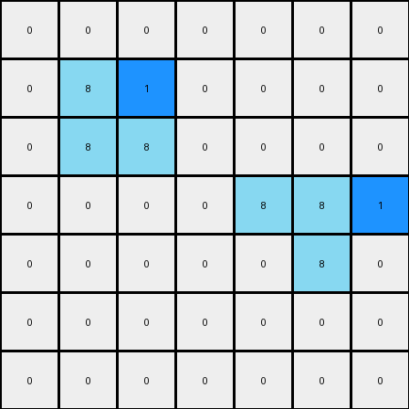

# 1-3aa6fb7a • 003 • refine_code - NLP

---

Previous Code:
```python
"""
The transformation rule is as follows:
1. Identify all vertical azure (color 8) lines that are 2x1 in the input grid.
2. For each identified line, place a blue (color 1) pixel to the immediate right of the top pixel of the line.
"""

import numpy as np

def find_vertical_lines(grid, color, height, width):
    """
    Find vertical lines of specified color, height, and width in the grid.
    """
    lines = []
    rows, cols = grid.shape
    for r in range(rows - height + 1):
        for c in range(cols - width + 1):
            if all(grid[r+i, c] == color for i in range(height)):
                lines.append((r, c))
    return lines

def transform(input_grid):
    """
    Transforms the input grid according to the specified rule:
    1. Find 2x1 vertical lines of azure color.
    2. Add one blue pixel at the upper-right of each of these lines
    """
    # Initialize output grid as a copy of the input grid
    output_grid = np.copy(input_grid)

    # Find all 2x1 vertical lines of color 8 (azure)
    azure_lines = find_vertical_lines(input_grid, 8, 2, 1)

    # For each azure line, place a blue pixel (color 1) to the right of the top pixel
    for line in azure_lines:
        r, c = line
        if c + 1 < output_grid.shape[1]:  # Check bounds
            output_grid[r, c + 1] = 1

    return output_grid
```

Train Set Results:

**Example 1:**
Input:
```
0 0 0 0 0 0 0
0 8 0 0 0 0 0
0 8 8 0 0 0 0
0 0 0 0 8 8 0
0 0 0 0 0 8 0
0 0 0 0 0 0 0
0 0 0 0 0 0 0
```
Expected Output:
```
0 0 0 0 0 0 0
0 8 1 0 0 0 0
0 8 8 0 0 0 0
0 0 0 0 8 8 0
0 0 0 0 1 8 0
0 0 0 0 0 0 0
0 0 0 0 0 0 0
```
Transformed Output:
```
0 0 0 0 0 0 0
0 8 1 0 0 0 0
0 8 8 0 0 0 0
0 0 0 0 8 8 1
0 0 0 0 0 8 0
0 0 0 0 0 0 0
0 0 0 0 0 0 0
```

Status: False

**Example 2:**
Input:
```
0 0 0 0 8 8 0
0 0 0 0 0 8 0
0 0 8 0 0 0 0
0 0 8 8 0 0 0
0 0 0 0 0 0 0
0 0 0 0 8 0 0
0 0 0 8 8 0 0
```
Expected Output:
```
0 0 0 0 8 8 0
0 0 0 0 1 8 0
0 0 8 1 0 0 0
0 0 8 8 0 0 0
0 0 0 0 0 0 0
0 0 0 1 8 0 0
0 0 0 8 8 0 0
```
Transformed Output:
```
0 0 0 0 8 8 1
0 0 0 0 0 8 0
0 0 8 1 0 0 0
0 0 8 8 0 0 0
0 0 0 0 0 0 0
0 0 0 0 8 1 0
0 0 0 8 8 0 0
```

Status: False
**Instructions**

- Describe in natural language the step-by-step transformation observed between the input and output grids.
- Focus on identifying objects, their properties (predicates), and the actions performed on them.
- Be as clear and concise as possible, providing a complete description of the transformation rule.
