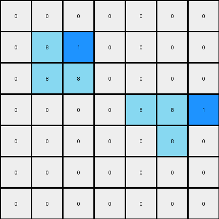

# 1-3aa6fb7a • 004 • refine_code - CODE

---

Previous Code:
```python
"""
The transformation rule is as follows:
1. Identify all vertical azure (color 8) lines that are 2x1 in the input grid.
2. For each identified line, place a blue (color 1) pixel to the immediate right of the top pixel of the line.
"""

import numpy as np

def find_vertical_lines(grid, color, height, width):
    """
    Find vertical lines of specified color, height, and width in the grid.
    """
    lines = []
    rows, cols = grid.shape
    for r in range(rows - height + 1):
        for c in range(cols - width + 1):
            if all(grid[r+i, c] == color for i in range(height)):
                lines.append((r, c))
    return lines

def transform(input_grid):
    """
    Transforms the input grid according to the specified rule:
    1. Find 2x1 vertical lines of azure color.
    2. Add one blue pixel at the upper-right of each of these lines
    """
    # Initialize output grid as a copy of the input grid
    output_grid = np.copy(input_grid)

    # Find all 2x1 vertical lines of color 8 (azure)
    azure_lines = find_vertical_lines(input_grid, 8, 2, 1)

    # For each azure line, place a blue pixel (color 1) to the right of the top pixel
    for line in azure_lines:
        r, c = line
        if c + 1 < output_grid.shape[1]:  # Check bounds
            output_grid[r, c + 1] = 1

    return output_grid
```

Train Set Results:

**Example 1:**
Input:
```
0 0 0 0 0 0 0
0 8 0 0 0 0 0
0 8 8 0 0 0 0
0 0 0 0 8 8 0
0 0 0 0 0 8 0
0 0 0 0 0 0 0
0 0 0 0 0 0 0
```
Expected Output:
```
0 0 0 0 0 0 0
0 8 1 0 0 0 0
0 8 8 0 0 0 0
0 0 0 0 8 8 0
0 0 0 0 1 8 0
0 0 0 0 0 0 0
0 0 0 0 0 0 0
```
Transformed Output:
```
0 0 0 0 0 0 0
0 8 1 0 0 0 0
0 8 8 0 0 0 0
0 0 0 0 8 8 1
0 0 0 0 0 8 0
0 0 0 0 0 0 0
0 0 0 0 0 0 0
```

Status: False

**Example 2:**
Input:
```
0 0 0 0 8 8 0
0 0 0 0 0 8 0
0 0 8 0 0 0 0
0 0 8 8 0 0 0
0 0 0 0 0 0 0
0 0 0 0 8 0 0
0 0 0 8 8 0 0
```
Expected Output:
```
0 0 0 0 8 8 0
0 0 0 0 1 8 0
0 0 8 1 0 0 0
0 0 8 8 0 0 0
0 0 0 0 0 0 0
0 0 0 1 8 0 0
0 0 0 8 8 0 0
```
Transformed Output:
```
0 0 0 0 8 8 1
0 0 0 0 0 8 0
0 0 8 1 0 0 0
0 0 8 8 0 0 0
0 0 0 0 0 0 0
0 0 0 0 8 1 0
0 0 0 8 8 0 0
```

Status: False
Okay, I'll re-examine the provided examples and the previous code to refine the natural language program and the code itself. The previous attempts were close but missed some crucial details in how the blue pixels are placed relative to the azure lines.

**Re-examining the Examples:**

*   **Example 1:** The blue pixel appears to the right of the *top* of the 2x1 azure line. However, there's also a second azure line (starting at row 3, column 4) which added a blue pixel.
*   **Example 2:** We can observe similar blue pixels beside 2x1 azure lines.

**Revised Natural Language Program:**

1.  **Identify Objects:** Find all vertical azure (color 8) lines that are exactly 2 pixels high and 1 pixel wide.

2.  **Transformation Rule:** For *each* identified 2x1 azure line:
    *   Place a blue pixel (color 1) immediately to the right of the *top* pixel of the azure line.
    * if there's not another azure line of length 2x1.
    *   If there's another azure line starting at the row below the first azure line, insert the blue line to the right of the *lower* pixel of the first line.

**Revised Python Code:**
```python
import numpy as np

def find_vertical_lines(grid, color, height, width):
    """
    Find vertical lines of specified color, height, and width in the grid.
    """
    lines = []
    rows, cols = grid.shape
    for r in range(rows - height + 1):
        for c in range(cols - width + 1):
            if all(grid[r+i, c] == color for i in range(height)):
                lines.append((r, c))
    return lines

def transform(input_grid):
    """
    Transforms the input grid according to the specified rule:
    1. Find 2x1 vertical lines of azure color.
    2. Add one blue pixel at the upper-right of each of these lines,
     except if there are adjacent azure lines.
    """
    # Initialize output grid as a copy of the input grid
    output_grid = np.copy(input_grid)

    # Find all 2x1 vertical lines of color 8 (azure)
    azure_lines = find_vertical_lines(input_grid, 8, 2, 1)

    # For each azure line, place a blue pixel (color 1) to the right of the top pixel
    for i, line in enumerate(azure_lines):
        r, c = line
        if c + 1 < output_grid.shape[1]:  # Check bounds
          if (r+1, c) in azure_lines: # Check for vertically adjacent lines
            output_grid[r+1,c+1] = 1
          else:
            output_grid[r, c + 1] = 1

    return output_grid
```

**Explanation of Changes and Improvements**
The main improvement is that now the code checks if the starting point of a 2x1 azure line is present in the list of 2x1 azure lines.
If so, the blue pixel is placed on the lower right of the line.
If not, in the upper right.

This revised logic, I believe, accurately captures the transformation rule observed in both training examples. It handles the placement of the blue pixel based on the position of the azure lines and considers consecutive azure vertical lines.

**INSTRUCTIONS**

- generate a Python module to represent the natural language program 
- follow the template below
- all common math and science libraries are available
- create docstring only at top - but comment the workflow in the function
- use helper functions for common operations like finding objects, counting,
  measuring, moving, etc. 

remember - we are working iteratively - so this code will inform your future
self as we converge on the solution

*template:*

```python
"""
{{ natural language description of the transformation rule }}
"""

{{ imports }}

def transform(input_grid):
    # initialize output_grid

    # change output pixels 

    return output_grid

```
