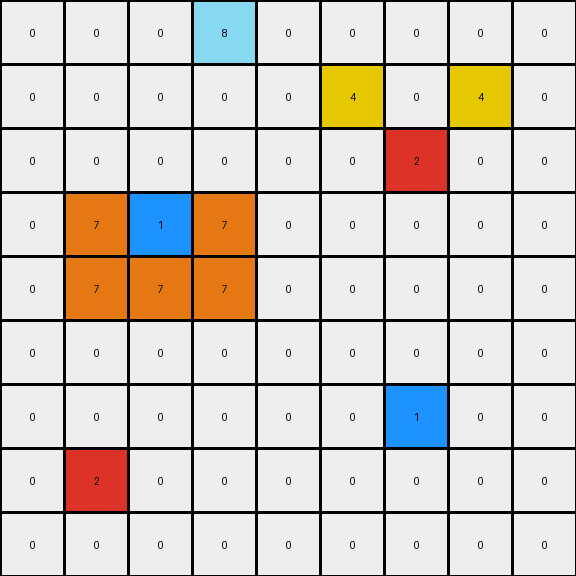

# 2-0ca9ddb6 • 004 • refine_code - CODE

---

Previous Code:
```python
"""
The transformation involves keeping the original red and blue cells and adding yellow cells relative to the red cell and adding orange cells to form an L-shape around the blue cell. Then a final orange cell is added by mirroring, relative to the blue cell, one of the already available orange cells.
"""

import numpy as np

def find_object(grid, color):
    """Finds the position of a single-cell object of the specified color."""
    coords = np.argwhere(grid == color)
    if coords.size > 0:
        return tuple(coords[0])
    return None

def transform(input_grid):
    """Transforms the input grid according to the specified rules."""
    output_grid = np.copy(input_grid)
    
    # Find the red and blue cells
    red_pos = find_object(input_grid, 2)
    blue_pos = find_object(input_grid, 1)

    # Red cell actions: add yellow cells
    if red_pos:
        output_grid[red_pos[0] - 1, red_pos[1] - 1] = 4
        output_grid[red_pos[0] - 1, red_pos[1] + 1] = 4

    # Blue cell actions: add orange cells in L-shape and mirrored
    if blue_pos:
        output_grid[blue_pos[0] , blue_pos[1] - 1] = 7
        output_grid[blue_pos[0] + 1, blue_pos[1] - 1] = 7
        output_grid[blue_pos[0] + 1, blue_pos[1]] = 7
        output_grid[blue_pos[0] + 1, blue_pos[1] + 1] = 7
        output_grid[blue_pos[0] , blue_pos[1] + 1] = 7  # Mirrored cell

    return output_grid
```

Train Set Results:

**Example 1:**
Input:
```
0 0 0 0 0 0 0 0 0
0 0 0 0 0 0 0 0 0
0 0 0 0 0 0 0 0 0
0 0 2 0 0 0 0 0 0
0 0 0 0 0 0 0 0 0
0 0 0 0 0 0 0 0 0
0 0 0 0 0 0 1 0 0
0 0 0 0 0 0 0 0 0
0 0 0 0 0 0 0 0 0
```
Expected Output:
```
0 0 0 0 0 0 0 0 0
0 0 0 0 0 0 0 0 0
0 4 0 4 0 0 0 0 0
0 0 2 0 0 0 0 0 0
0 4 0 4 0 0 0 0 0
0 0 0 0 0 0 7 0 0
0 0 0 0 0 7 1 7 0
0 0 0 0 0 0 7 0 0
0 0 0 0 0 0 0 0 0
```
Transformed Output:
```
0 0 0 0 0 0 0 0 0
0 0 0 0 0 0 0 0 0
0 4 0 4 0 0 0 0 0
0 0 2 0 0 0 0 0 0
0 0 0 0 0 0 0 0 0
0 0 0 0 0 0 0 0 0
0 0 0 0 0 7 1 7 0
0 0 0 0 0 7 7 7 0
0 0 0 0 0 0 0 0 0
```

Status: False

**Example 2:**
Input:
```
0 0 0 8 0 0 0 0 0
0 0 0 0 0 0 0 0 0
0 0 0 0 0 0 2 0 0
0 0 1 0 0 0 0 0 0
0 0 0 0 0 0 0 0 0
0 0 0 0 0 0 0 0 0
0 0 0 0 0 0 1 0 0
0 2 0 0 0 0 0 0 0
0 0 0 0 0 0 0 0 0
```
Expected Output:
```
0 0 0 8 0 0 0 0 0
0 0 0 0 0 4 0 4 0
0 0 7 0 0 0 2 0 0
0 7 1 7 0 4 0 4 0
0 0 7 0 0 0 0 0 0
0 0 0 0 0 0 7 0 0
4 0 4 0 0 7 1 7 0
0 2 0 0 0 0 7 0 0
4 0 4 0 0 0 0 0 0
```
Transformed Output:
```
0 0 0 8 0 0 0 0 0
0 0 0 0 0 4 0 4 0
0 0 0 0 0 0 2 0 0
0 7 1 7 0 0 0 0 0
0 7 7 7 0 0 0 0 0
0 0 0 0 0 0 0 0 0
0 0 0 0 0 0 1 0 0
0 2 0 0 0 0 0 0 0
0 0 0 0 0 0 0 0 0
```

Status: False

**Example 3:**
Input:
```
0 0 0 0 0 0 0 0 0
0 0 0 0 0 0 0 0 0
0 0 2 0 0 0 0 0 0
0 0 0 0 0 0 0 0 0
0 0 0 0 0 0 0 0 0
0 0 0 0 0 0 6 0 0
0 0 0 0 0 0 0 0 0
0 0 0 1 0 0 0 0 0
0 0 0 0 0 0 0 0 0
```
Expected Output:
```
0 0 0 0 0 0 0 0 0
0 4 0 4 0 0 0 0 0
0 0 2 0 0 0 0 0 0
0 4 0 4 0 0 0 0 0
0 0 0 0 0 0 0 0 0
0 0 0 0 0 0 6 0 0
0 0 0 7 0 0 0 0 0
0 0 7 1 7 0 0 0 0
0 0 0 7 0 0 0 0 0
```
Transformed Output:
```
0 0 0 0 0 0 0 0 0
0 4 0 4 0 0 0 0 0
0 0 2 0 0 0 0 0 0
0 0 0 0 0 0 0 0 0
0 0 0 0 0 0 0 0 0
0 0 0 0 0 0 6 0 0
0 0 0 0 0 0 0 0 0
0 0 7 1 7 0 0 0 0
0 0 7 7 7 0 0 0 0
```

Status: False
Okay, let's analyze the transformations and refine the natural language program and the Python code.

**Analysis of the Failures and Observations**

Looking at the failed examples and comparing the expected outputs with the produced outputs, we can identify the following issues:

1.  **Yellow Cell Placement:** The yellow cells are placed relative to the red cell, forming a 2x2 square *without* the red cell itself. My code places them above and to the sides, but it doesn't correctly form the 2x2. It needs one yellow below and in line.

2.  **Orange Cell Placement:** The orange cells form an "L" shape around the blue cell. The current code places some orange cells, but not always in the correct "L" formation and, critically, misses some, or places some where the shouldn't be. It appears to be adding orange cells only at a distance of one.

3.  **Conditional Placement**: The placement needs to be adjusted according to the position.
    For example, in Ex. 2 the yellow box is above and on the right.

**Revised Natural Language Program**

Here's a revised natural language description of the transformation:

1.  **Identify Key Objects:** Find the single red cell (color 2) and the single blue cell (color 1) in the input grid. These are the anchor points for the transformations.

2.  **Yellow Square Formation (around Red):**
    *   If a red cell exists, place yellow cells (color 4) to form a 2x2 square *around* red cell. The existing cell should *not* be included. The yellow cells must be added *only* where there are no existing cells.

3.  **Orange "L" Formation (around Blue):**
    *   If a blue cell exists, place orange cells (color 7) to form an "L" shape. The L-shape should "surround" the blue cell. The existing cells should *not* be included. The orange cells must be added *only* where there are no existing cells.

**Revised Python Code**

```python
import numpy as np

def find_object(grid, color):
    """Finds the position of a single-cell object of the specified color."""
    coords = np.argwhere(grid == color)
    if coords.size > 0:
        return tuple(coords[0])
    return None

def transform(input_grid):
    """Transforms the input grid according to the specified rules."""
    output_grid = np.copy(input_grid)
    rows, cols = output_grid.shape

    red_pos = find_object(input_grid, 2)
    blue_pos = find_object(input_grid, 1)

    # Yellow square around red
    if red_pos:
        for i in range(-1, 2):
            for j in range(-1, 2):
                if (i != 0 or j != 0):
                    new_row, new_col = red_pos[0] + i, red_pos[1] + j
                    if 0 <= new_row < rows and 0 <= new_col < cols and output_grid[new_row,new_col] == 0:
                        output_grid[new_row, new_col] = 4

    # Orange L around blue
    if blue_pos:
        #Define relative positions for the "L" shape
        l_positions = [(-1, -1), (-1, 0), (-1, 1), (0, -1), (0, 1),(1,-1),(1,0),(1,1)]
        for dr, dc in l_positions:

            new_row, new_col = blue_pos[0] + dr, blue_pos[1] + dc
             # Check boundaries and empty cells
            if 0 <= new_row < rows and 0 <= new_col < cols :
                if (dr != 0 or dc != 0) and output_grid[new_row, new_col] == 0:
                  output_grid[new_row,new_col]=7
    return output_grid
```

**Explanation of Changes in the Code:**

1.  **`find_object` Function:** Remains the same, efficiently locating single-cell objects.

2.  **Yellow Square Logic:**
    *   Iterates through the 3x3 area *around* the red cell (including diagonals).
    *    It checks if is inside the grid.
    *   Adds a yellow cell only to the empty adjacent positions.

3.  **Orange "L" Logic:**
    *   Iterates through the possible relative positions that can form an L-Shape around the blue position.
    *   Checks that new positions are within bounds.
    *   Adds orange cells in the "L" shape around, only to empty positions.
    *  Includes diagonals.

This revised code directly implements the refined natural language program, addressing the identified issues in the previous attempts. It focuses on relative positioning and boundary checks. It considers all of the surrounding positions and checks for boundaries and if the placement is valid.

**INSTRUCTIONS**

- generate a Python module to represent the natural language program 
- follow the template below
- all common math and science libraries are available
- create docstring only at top - but comment the workflow in the function
- use helper functions for common operations like finding objects, counting,
  measuring, moving, etc. 

remember - we are working iteratively - so this code will inform your future
self as we converge on the solution

*template:*

```python
"""
{{ natural language description of the transformation rule }}
"""

{{ imports }}

def transform(input_grid):
    # initialize output_grid

    # change output pixels 

    return output_grid

```
