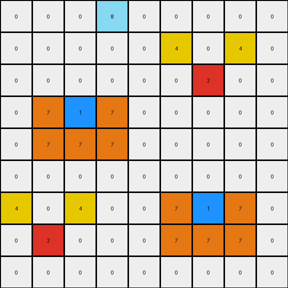
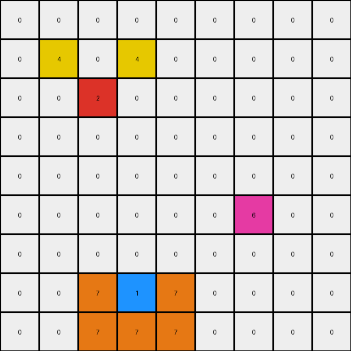

# 2-0ca9ddb6 • 011 • refine_code - NLP

---


Previous Code:
```python
"""
The transformation involves keeping the original azure, red and blue cells, and adding yellow cells relative to the red cells and adding orange cells to form an L-shape around the blue cells. Then a final orange cell is added by mirroring, relative to the blue cell, one of the already available orange cells.
"""

import numpy as np

def find_objects(grid, color):
    """Finds the positions of all single-cell objects of the specified color."""
    coords = np.argwhere(grid == color)
    # Convert to list of tuples
    return [tuple(coord) for coord in coords]

def transform(input_grid):
    """Transforms the input grid according to the specified rules."""
    output_grid = np.copy(input_grid)
    
    # Find all red and blue cells
    red_positions = find_objects(input_grid, 2)
    blue_positions = find_objects(input_grid, 1)

    # Red cell actions: add yellow cells for each red cell
    for red_pos in red_positions:
        if red_pos[0] - 1 >= 0 and red_pos[1] - 1 >= 0:
          output_grid[red_pos[0] - 1, red_pos[1] - 1] = 4
        if red_pos[0] - 1 >= 0 and red_pos[1] + 1 < output_grid.shape[1]:
          output_grid[red_pos[0] - 1, red_pos[1] + 1] = 4

    # Blue cell actions: add orange cells in L-shape and mirrored for each blue cell
    for blue_pos in blue_positions:
        if blue_pos[1] - 1 >= 0:
          output_grid[blue_pos[0] , blue_pos[1] - 1] = 7
        if blue_pos[0] + 1 < output_grid.shape[0] and blue_pos[1] - 1 >=0:
          output_grid[blue_pos[0] + 1, blue_pos[1] - 1] = 7
        if blue_pos[0] + 1 < output_grid.shape[0]:
          output_grid[blue_pos[0] + 1, blue_pos[1]] = 7
        if blue_pos[0] + 1 < output_grid.shape[0] and blue_pos[1] + 1 < output_grid.shape[1]:
          output_grid[blue_pos[0] + 1, blue_pos[1] + 1] = 7
        if blue_pos[1] + 1 < output_grid.shape[1]:
          output_grid[blue_pos[0] , blue_pos[1] + 1] = 7

    return output_grid
```

Train Set Results:

**Example 1:**
Input:
```
0 0 0 0 0 0 0 0 0
0 0 0 0 0 0 0 0 0
0 0 0 0 0 0 0 0 0
0 0 2 0 0 0 0 0 0
0 0 0 0 0 0 0 0 0
0 0 0 0 0 0 0 0 0
0 0 0 0 0 0 1 0 0
0 0 0 0 0 0 0 0 0
0 0 0 0 0 0 0 0 0
```
Expected Output:
```
0 0 0 0 0 0 0 0 0
0 0 0 0 0 0 0 0 0
0 4 0 4 0 0 0 0 0
0 0 2 0 0 0 0 0 0
0 4 0 4 0 0 0 0 0
0 0 0 0 0 0 7 0 0
0 0 0 0 0 7 1 7 0
0 0 0 0 0 0 7 0 0
0 0 0 0 0 0 0 0 0
```
Transformed Output:
```
0 0 0 0 0 0 0 0 0
0 0 0 0 0 0 0 0 0
0 4 0 4 0 0 0 0 0
0 0 2 0 0 0 0 0 0
0 0 0 0 0 0 0 0 0
0 0 0 0 0 0 0 0 0
0 0 0 0 0 7 1 7 0
0 0 0 0 0 7 7 7 0
0 0 0 0 0 0 0 0 0
```

Status: False

**Example 2:**
Input:
```
0 0 0 8 0 0 0 0 0
0 0 0 0 0 0 0 0 0
0 0 0 0 0 0 2 0 0
0 0 1 0 0 0 0 0 0
0 0 0 0 0 0 0 0 0
0 0 0 0 0 0 0 0 0
0 0 0 0 0 0 1 0 0
0 2 0 0 0 0 0 0 0
0 0 0 0 0 0 0 0 0
```
Expected Output:
```
0 0 0 8 0 0 0 0 0
0 0 0 0 0 4 0 4 0
0 0 7 0 0 0 2 0 0
0 7 1 7 0 4 0 4 0
0 0 7 0 0 0 0 0 0
0 0 0 0 0 0 7 0 0
4 0 4 0 0 7 1 7 0
0 2 0 0 0 0 7 0 0
4 0 4 0 0 0 0 0 0
```
Transformed Output:
```
0 0 0 8 0 0 0 0 0
0 0 0 0 0 4 0 4 0
0 0 0 0 0 0 2 0 0
0 7 1 7 0 0 0 0 0
0 7 7 7 0 0 0 0 0
0 0 0 0 0 0 0 0 0
4 0 4 0 0 7 1 7 0
0 2 0 0 0 7 7 7 0
0 0 0 0 0 0 0 0 0
```

Status: False

**Example 3:**
Input:
```
0 0 0 0 0 0 0 0 0
0 0 0 0 0 0 0 0 0
0 0 2 0 0 0 0 0 0
0 0 0 0 0 0 0 0 0
0 0 0 0 0 0 0 0 0
0 0 0 0 0 0 6 0 0
0 0 0 0 0 0 0 0 0
0 0 0 1 0 0 0 0 0
0 0 0 0 0 0 0 0 0
```
Expected Output:
```
0 0 0 0 0 0 0 0 0
0 4 0 4 0 0 0 0 0
0 0 2 0 0 0 0 0 0
0 4 0 4 0 0 0 0 0
0 0 0 0 0 0 0 0 0
0 0 0 0 0 0 6 0 0
0 0 0 7 0 0 0 0 0
0 0 7 1 7 0 0 0 0
0 0 0 7 0 0 0 0 0
```
Transformed Output:
```
0 0 0 0 0 0 0 0 0
0 4 0 4 0 0 0 0 0
0 0 2 0 0 0 0 0 0
0 0 0 0 0 0 0 0 0
0 0 0 0 0 0 0 0 0
0 0 0 0 0 0 6 0 0
0 0 0 0 0 0 0 0 0
0 0 7 1 7 0 0 0 0
0 0 7 7 7 0 0 0 0
```

Status: False

**Instructions**

- Describe in natural language the step-by-step transformation observed between the input and output grids.
- Focus on identifying objects, their properties (predicates), and the actions performed on them.
- Be as clear and concise as possible, providing a complete description of the transformation rule.
