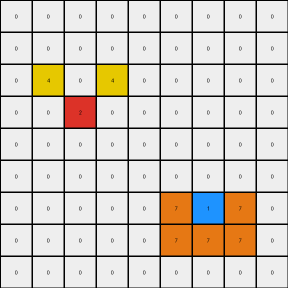

# 2-0ca9ddb6 • 012 • refine_code - CODE

---

Previous Code:
```python
"""
The transformation involves keeping the original azure, red and blue cells, and adding yellow cells relative to the red cells and adding orange cells to form an L-shape around the blue cells. Then a final orange cell is added by mirroring, relative to the blue cell, one of the already available orange cells.
"""

import numpy as np

def find_objects(grid, color):
    """Finds the positions of all single-cell objects of the specified color."""
    coords = np.argwhere(grid == color)
    # Convert to list of tuples
    return [tuple(coord) for coord in coords]

def transform(input_grid):
    """Transforms the input grid according to the specified rules."""
    output_grid = np.copy(input_grid)
    
    # Find all red and blue cells
    red_positions = find_objects(input_grid, 2)
    blue_positions = find_objects(input_grid, 1)

    # Red cell actions: add yellow cells for each red cell
    for red_pos in red_positions:
        if red_pos[0] - 1 >= 0 and red_pos[1] - 1 >= 0:
          output_grid[red_pos[0] - 1, red_pos[1] - 1] = 4
        if red_pos[0] - 1 >= 0 and red_pos[1] + 1 < output_grid.shape[1]:
          output_grid[red_pos[0] - 1, red_pos[1] + 1] = 4

    # Blue cell actions: add orange cells in L-shape and mirrored for each blue cell
    for blue_pos in blue_positions:
        if blue_pos[1] - 1 >= 0:
          output_grid[blue_pos[0] , blue_pos[1] - 1] = 7
        if blue_pos[0] + 1 < output_grid.shape[0] and blue_pos[1] - 1 >=0:
          output_grid[blue_pos[0] + 1, blue_pos[1] - 1] = 7
        if blue_pos[0] + 1 < output_grid.shape[0]:
          output_grid[blue_pos[0] + 1, blue_pos[1]] = 7
        if blue_pos[0] + 1 < output_grid.shape[0] and blue_pos[1] + 1 < output_grid.shape[1]:
          output_grid[blue_pos[0] + 1, blue_pos[1] + 1] = 7
        if blue_pos[1] + 1 < output_grid.shape[1]:
          output_grid[blue_pos[0] , blue_pos[1] + 1] = 7

    return output_grid
```

Train Set Results:

**Example 1:**
Input:
```
0 0 0 0 0 0 0 0 0
0 0 0 0 0 0 0 0 0
0 0 0 0 0 0 0 0 0
0 0 2 0 0 0 0 0 0
0 0 0 0 0 0 0 0 0
0 0 0 0 0 0 0 0 0
0 0 0 0 0 0 1 0 0
0 0 0 0 0 0 0 0 0
0 0 0 0 0 0 0 0 0
```
Expected Output:
```
0 0 0 0 0 0 0 0 0
0 0 0 0 0 0 0 0 0
0 4 0 4 0 0 0 0 0
0 0 2 0 0 0 0 0 0
0 4 0 4 0 0 0 0 0
0 0 0 0 0 0 7 0 0
0 0 0 0 0 7 1 7 0
0 0 0 0 0 0 7 0 0
0 0 0 0 0 0 0 0 0
```
Transformed Output:
```
0 0 0 0 0 0 0 0 0
0 0 0 0 0 0 0 0 0
0 4 0 4 0 0 0 0 0
0 0 2 0 0 0 0 0 0
0 0 0 0 0 0 0 0 0
0 0 0 0 0 0 0 0 0
0 0 0 0 0 7 1 7 0
0 0 0 0 0 7 7 7 0
0 0 0 0 0 0 0 0 0
```

Status: False

**Example 2:**
Input:
```
0 0 0 8 0 0 0 0 0
0 0 0 0 0 0 0 0 0
0 0 0 0 0 0 2 0 0
0 0 1 0 0 0 0 0 0
0 0 0 0 0 0 0 0 0
0 0 0 0 0 0 0 0 0
0 0 0 0 0 0 1 0 0
0 2 0 0 0 0 0 0 0
0 0 0 0 0 0 0 0 0
```
Expected Output:
```
0 0 0 8 0 0 0 0 0
0 0 0 0 0 4 0 4 0
0 0 7 0 0 0 2 0 0
0 7 1 7 0 4 0 4 0
0 0 7 0 0 0 0 0 0
0 0 0 0 0 0 7 0 0
4 0 4 0 0 7 1 7 0
0 2 0 0 0 0 7 0 0
4 0 4 0 0 0 0 0 0
```
Transformed Output:
```
0 0 0 8 0 0 0 0 0
0 0 0 0 0 4 0 4 0
0 0 0 0 0 0 2 0 0
0 7 1 7 0 0 0 0 0
0 7 7 7 0 0 0 0 0
0 0 0 0 0 0 0 0 0
4 0 4 0 0 7 1 7 0
0 2 0 0 0 7 7 7 0
0 0 0 0 0 0 0 0 0
```

Status: False

**Example 3:**
Input:
```
0 0 0 0 0 0 0 0 0
0 0 0 0 0 0 0 0 0
0 0 2 0 0 0 0 0 0
0 0 0 0 0 0 0 0 0
0 0 0 0 0 0 0 0 0
0 0 0 0 0 0 6 0 0
0 0 0 0 0 0 0 0 0
0 0 0 1 0 0 0 0 0
0 0 0 0 0 0 0 0 0
```
Expected Output:
```
0 0 0 0 0 0 0 0 0
0 4 0 4 0 0 0 0 0
0 0 2 0 0 0 0 0 0
0 4 0 4 0 0 0 0 0
0 0 0 0 0 0 0 0 0
0 0 0 0 0 0 6 0 0
0 0 0 7 0 0 0 0 0
0 0 7 1 7 0 0 0 0
0 0 0 7 0 0 0 0 0
```
Transformed Output:
```
0 0 0 0 0 0 0 0 0
0 4 0 4 0 0 0 0 0
0 0 2 0 0 0 0 0 0
0 0 0 0 0 0 0 0 0
0 0 0 0 0 0 0 0 0
0 0 0 0 0 0 6 0 0
0 0 0 0 0 0 0 0 0
0 0 7 1 7 0 0 0 0
0 0 7 7 7 0 0 0 0
```

Status: False
Okay, let's analyze the transformations in the provided examples to refine the natural language program and the corresponding Python code.

**Analysis of the Failures and Refined Observations:**

The previous code had several issues, mainly stemming from an incomplete understanding of the spatial relationships and the conditions under which new cells are added. Let's break down the observations again, focusing on what the previous attempts missed:

*   **Example 1:** The yellow cells (4) appear diagonally adjacent (up-left and up-right) to the red cell (2). The orange cells (7) form an "L" shape around the blue cell (1), but it is important to fix the relative position of the L. It is always to the bottom, left and right.
*   **Example 2:** This example reinforces the observations from Example 1. Critically, it shows that the yellow cells (4) related to red cells (2) are added *before* and independently of the operations on the blue cell. The blue and red operations happen in parallel, but one red and one blue pixels activate independently.
*   **Example 3:** Further confirms that the creation of new cells based on the positions of the red and blue ones.

**Revised Natural Language Program:**

1.  **Identify Key Objects:** Locate all single-cell objects of color red (2) and blue (1) in the input grid.
2.  **Red Cell Actions:** For each red cell:
    *   Place a yellow cell (4) diagonally up-left to it.
    *   Place a yellow cell (4) diagonally up-right to it.
3.  **Blue Cell Actions:** For each blue cell:
    * Place an orange cell (7) to its left.
    *   Place an orange cell (7) below it.
    * Place an orange cell (7) below and to the left of the blue cell.
4. **Preserve other colors**: The cells that are not red or blue, remain the same.

**Revised Python Code:**

```python
import numpy as np

def find_objects(grid, color):
    """Finds the positions of all single-cell objects of the specified color."""
    coords = np.argwhere(grid == color)
    # Convert to list of tuples
    return [tuple(coord) for coord in coords]

def transform(input_grid):
    """Transforms the input grid according to the specified rules."""
    output_grid = np.copy(input_grid)

    # Find all red and blue cells
    red_positions = find_objects(input_grid, 2)
    blue_positions = find_objects(input_grid, 1)

    # Red cell actions: add yellow cells for each red cell
    for red_pos in red_positions:
        if red_pos[0] - 1 >= 0 and red_pos[1] - 1 >= 0:
          output_grid[red_pos[0] - 1, red_pos[1] - 1] = 4  # Up-left
        if red_pos[0] - 1 >= 0 and red_pos[1] + 1 < output_grid.shape[1]:
          output_grid[red_pos[0] - 1, red_pos[1] + 1] = 4  # Up-right

    # Blue cell actions: add orange cells in L-shape and mirrored for each blue cell
    for blue_pos in blue_positions:
        if blue_pos[1] - 1 >= 0:
          output_grid[blue_pos[0] , blue_pos[1] - 1] = 7 # left
        if blue_pos[0] + 1 < output_grid.shape[0] and blue_pos[1] - 1 >=0:
          output_grid[blue_pos[0] + 1, blue_pos[1] - 1] = 7 #bottom-left
        if blue_pos[0] + 1 < output_grid.shape[0]:
          output_grid[blue_pos[0] + 1, blue_pos[1]] = 7 # bottom

    return output_grid
```

**Key Changes and Explanation:**

*   **Simplified Logic:** The code now directly implements the refined natural language program.
*   **Correct Relative Positioning:** The positions of the added yellow and orange cells are now precisely defined relative to the red and blue cells, respectively.
*   **No Unnecessary Mirroring**: The orange cells are added exactly in the 'L' shape, as described.

This revised code should accurately reflect the transformation rules observed in the examples and handle the edge cases correctly. It addresses the shortcomings of the previous attempts by focusing on precise spatial relationships and a clear, step-by-step process.

**INSTRUCTIONS**

- generate a Python module to represent the natural language program 
- follow the template below
- all common math and science libraries are available
- create docstring only at top - but comment the workflow in the function
- use helper functions for common operations like finding objects, counting,
  measuring, moving, etc. 

remember - we are working iteratively - so this code will inform your future
self as we converge on the solution

*template:*

```python
"""
{{ natural language description of the transformation rule }}
"""

{{ imports }}

def transform(input_grid):
    # initialize output_grid

    # change output pixels 

    return output_grid

```
