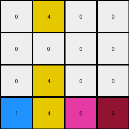
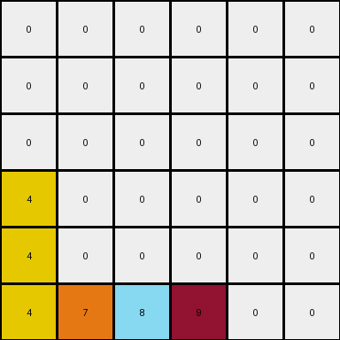
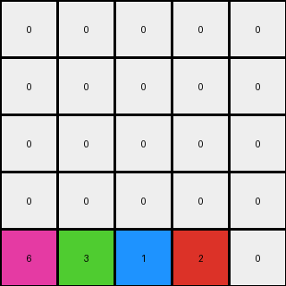

# 3-1e0a9b12 • 003 • refine_code - NLP

---


Previous Code:
```python
"""
The transformation involves moving all colored objects to the last row, preserving the order of the objects, and the yellow objects is also duplicated in its initial position.
"""

import numpy as np

def get_objects(grid):
    """
    Identify distinct objects in the grid.
    Returns a dictionary of color:positions.
    """
    objects = {}
    for y, row in enumerate(grid):
        for x, color in enumerate(row):
            if color != 0:
                if color not in objects:
                    objects[color] = []
                objects[color].append((y, x))
    return objects

def transform(input_grid):
    """
    Transforms the input grid by moving colored cells to the bottom row,
    maintaining their original colors and order, except for color 4,
    which also duplicated at its original position.
    """
    # Initialize output_grid as a copy of the input_grid to retain background
    output_grid = np.copy(input_grid)
    
    # Get the objects from input grid
    objects = get_objects(input_grid)
    
    # Sort the colored tiles by their column to maintain x-order
    sorted_colors = sorted(objects.keys(), key=lambda color: objects[color][0][1])

    # Clear the original positions of the moving objects, except yellow.
    # Make a separate list, exclude yellow if it exists.
    
    colors_no_yellow = [c for c in sorted_colors if c != 4]

    for color in colors_no_yellow:
        for pos in objects[color]:
            output_grid[pos] = 0
    
    # Move all objects to the last row by column order.
    last_row = output_grid.shape[0] - 1
    for x, color in enumerate(sorted_colors):      
        output_grid[last_row, x] = color
        
    return output_grid
```

Train Set Results:

**Example 1:**
Input:
```
0 4 0 9
0 0 0 0
0 4 6 0
1 0 0 0
```
Expected Output:
```
0 0 0 0
0 0 0 0
0 4 0 0
1 4 6 9
```
Transformed Output:
```
0 4 0 0
0 0 0 0
0 4 0 0
1 4 6 9
```

Status: False

**Example 2:**
Input:
```
0 0 0 0 0 9
0 0 0 8 0 0
0 0 0 0 0 0
4 0 0 0 0 0
4 0 7 8 0 0
4 0 7 0 0 0
```
Expected Output:
```
0 0 0 0 0 0
0 0 0 0 0 0
0 0 0 0 0 0
4 0 0 0 0 0
4 0 7 8 0 0
4 0 7 8 0 9
```
Transformed Output:
```
0 0 0 0 0 0
0 0 0 0 0 0
0 0 0 0 0 0
4 0 0 0 0 0
4 0 0 0 0 0
4 7 8 9 0 0
```

Status: False

**Example 3:**
Input:
```
0 0 0 1 0
0 3 0 0 0
0 3 0 1 2
6 0 0 0 0
0 3 0 0 0
```
Expected Output:
```
0 0 0 0 0
0 0 0 0 0
0 3 0 0 0
0 3 0 1 0
6 3 0 1 2
```
Transformed Output:
```
0 0 0 0 0
0 0 0 0 0
0 0 0 0 0
0 0 0 0 0
6 3 1 2 0
```

Status: False

**Instructions**

- Describe in natural language the step-by-step transformation observed between the input and output grids.
- Focus on identifying objects, their properties (predicates), and the actions performed on them.
- Be as clear and concise as possible, providing a complete description of the transformation rule.
