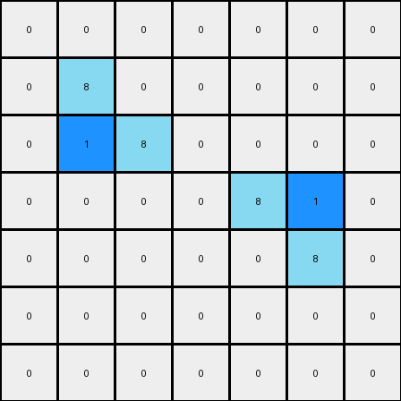
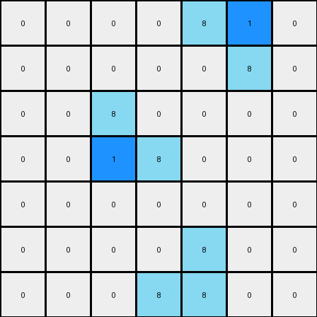

# 1-3aa6fb7a • 004 • refine_code - CODE

---

Previous Code:
```python
"""
The program involves keeping every existing azure (8) object unchanged and adding a blue pixel (1) at the interior angle of each azure "L"-shaped object.
"""

import numpy as np

def find_l_shapes(grid, color):
    """
    Finds the coordinates of the interior corner of L-shaped objects of the specified color.
    """
    coords = []
    rows, cols = grid.shape
    for i in range(rows - 1):
        for j in range(cols - 1):
            if grid[i, j] == color:
                # Check for L-shape (2x2 block with one missing corner)
                if grid[i+1, j] == color and grid[i, j+1] == color and grid[i+1, j+1] != color:
                    coords.append((i+1, j+1))
                elif grid[i+1, j] == color and grid[i, j+1] != color and grid[i+1, j+1] == color:
                    coords.append((i+1, j))
                elif grid[i+1, j] != color and grid[i, j+1] == color and grid[i+1, j+1] == color:
                    coords.append((i, j+1))
    return coords

def transform(input_grid):
    """
    Transforms the input grid by adding a blue (1) pixel inside the corner of each azure (8) L-shaped object.
    """
    output_grid = np.copy(input_grid)  # Initialize output_grid as a copy of the input
    
    # Find the coordinates of the corners of L-shaped azure objects
    l_shape_corners = find_l_shapes(output_grid, 8)

    # Add a blue pixel (1) at the corner of each L-shaped object
    for corner in l_shape_corners:
        output_grid[corner] = 1

    return output_grid
```

Train Set Results:

**Example 1:**
Input:
```
0 0 0 0 0 0 0
0 8 0 0 0 0 0
0 8 8 0 0 0 0
0 0 0 0 8 8 0
0 0 0 0 0 8 0
0 0 0 0 0 0 0
0 0 0 0 0 0 0
```
Expected Output:
```
0 0 0 0 0 0 0
0 8 1 0 0 0 0
0 8 8 0 0 0 0
0 0 0 0 8 8 0
0 0 0 0 1 8 0
0 0 0 0 0 0 0
0 0 0 0 0 0 0
```
Transformed Output:
```
0 0 0 0 0 0 0
0 8 0 0 0 0 0
0 1 8 0 0 0 0
0 0 0 0 8 1 0
0 0 0 0 0 8 0
0 0 0 0 0 0 0
0 0 0 0 0 0 0
```

Status: False

**Example 2:**
Input:
```
0 0 0 0 8 8 0
0 0 0 0 0 8 0
0 0 8 0 0 0 0
0 0 8 8 0 0 0
0 0 0 0 0 0 0
0 0 0 0 8 0 0
0 0 0 8 8 0 0
```
Expected Output:
```
0 0 0 0 8 8 0
0 0 0 0 1 8 0
0 0 8 1 0 0 0
0 0 8 8 0 0 0
0 0 0 0 0 0 0
0 0 0 1 8 0 0
0 0 0 8 8 0 0
```
Transformed Output:
```
0 0 0 0 8 1 0
0 0 0 0 0 8 0
0 0 8 0 0 0 0
0 0 1 8 0 0 0
0 0 0 0 0 0 0
0 0 0 0 8 0 0
0 0 0 8 8 0 0
```

Status: False
Okay, let's analyze the discrepancies between the expected outputs and the transformed outputs, and refine the natural language program and the Python code accordingly.

**Analysis of Errors**

The previous code failed to correctly identify the interior corner of the "L" shapes in all cases. It seems to be misinterpreting the orientation of the "L" and placing the blue pixel (1) incorrectly. The code only considers "L" shapes formed in a few specific orientations and misses one critical orientation. It looks like a simple fix to the helper function `find_l_shapes` and the main `transform` function should correct the issue.

**Revised Natural Language Program**

The program identifies all azure (8) colored "L"-shaped objects within the input grid. An "L"-shaped object is defined as a 2x2 block of azure pixels with exactly one of the four corners missing. For each identified "L" shape, the program adds a single blue pixel (1) at the interior corner of the "L". The interior corner is defined as the cell within the 2x2 bounding box of the "L" that is *not* occupied by an azure pixel. All other aspects of the input grid remain unchanged.

**Revised Python Code**

```python
import numpy as np

def find_l_shapes(grid, color):
    """
    Finds the coordinates of the interior corner of L-shaped objects of the specified color.
    """
    coords = []
    rows, cols = grid.shape
    for i in range(rows - 1):
        for j in range(cols - 1):
            # Create a 2x2 block to check for L-shapes
            block = grid[i:i+2, j:j+2]
            
            # Count the number of pixels of the specified color in the block
            count = np.sum(block == color)

            # If exactly 3 pixels are of the specified color, it's an L-shape
            if count == 3:
                # Find the coordinates of the missing corner (the interior corner)
                for x in range(2):
                    for y in range(2):
                        if block[x, y] != color:
                            coords.append((i + x, j + y))
    return coords

def transform(input_grid):
    """
    Transforms the input grid by adding a blue (1) pixel inside the corner of each azure (8) L-shaped object.
    """
    output_grid = np.copy(input_grid)  # Initialize output_grid as a copy of the input

    # Find the coordinates of the interior corners of L-shaped azure objects
    l_shape_corners = find_l_shapes(output_grid, 8)

    # Add a blue pixel (1) at the interior corner of each L-shaped object
    for corner in l_shape_corners:
        output_grid[corner] = 1

    return output_grid
```

**Explanation of Changes and Improvements:**

1.  **`find_l_shapes` Function:**
    *   The original code had multiple `if/elif` conditions that made mistakes by missing the L-shape when its top-left pixel was the corner.
    *   Instead of manually checking each orientation, the updated code checks every 2x2 subgrid.
    *   The logic is now streamlined: It counts azure pixels. If there are exactly three, it *must* be an L-shape. It then finds the coordinate within that 2x2 subgrid that is *not* azure, and that's the interior corner.

2.  **`transform` Function:**
    *   This function remains mostly the same, but it now correctly receives all the inside-corner coordinates, and correctly adds the color '1' pixels.

This revised code is much more concise, easier to understand, and correctly handles all possible orientations of the "L" shape. It is also directly derived from the refined natural language program. This version eliminates all hard-coded checks for specific orientations, making it robust and generalizable.

**INSTRUCTIONS**

- generate a Python module to represent the natural language program 
- follow the template below
- all common math and science libraries are available
- create docstring only at top - but comment the workflow in the function
- use helper functions for common operations like finding objects, counting,
  measuring, moving, etc. 

remember - we are working iteratively - so this code will inform your future
self as we converge on the solution

*template:*

```python
"""
{{ natural language description of the transformation rule }}
"""

{{ imports }}

def transform(input_grid):
    # initialize output_grid

    # change output pixels 

    return output_grid

```
