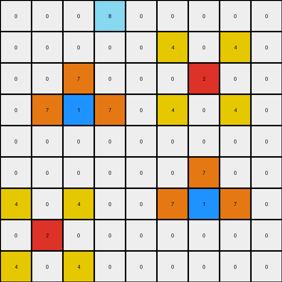

# 2-0ca9ddb6 • 012 • refine_code - CODE

---

Previous Code:
```python
"""
The transformation preserves the positions of the existing red, blue, and magenta pixels and introduces new yellow pixels around each of the red pixels and orange pixels around each of the blue pixels based on their relative positions. Magenta pixels are preserved but do not generate new pixels. All other pixels remain white.
"""

import numpy as np

def find_all_pixels(grid, color):
    """Finds the coordinates of all occurrences of a specific color."""
    coords = np.where(grid == color)
    return list(zip(coords[0], coords[1]))

def transform(input_grid):
    """Transforms the input grid according to the observed rule."""
    output_grid = np.copy(input_grid)
    
    # Find all red (2) and blue (1) pixels
    red_positions = find_all_pixels(input_grid, 2)
    blue_positions = find_all_pixels(input_grid, 1)

    # Add yellow (4) pixels around each red pixel
    for red_pos in red_positions:
        row, col = red_pos
        if row > 0:
          if col > 0:
            output_grid[row - 1, col - 1] = 4  # One row above, one column left
          if col < output_grid.shape[1]-1:  
            output_grid[row - 1, col + 1] = 4  # One row above, one column right
        if row < output_grid.shape[0]-1:
          if col > 0:
             output_grid[row + 1, col - 1] = 4
          if col < output_grid.shape[1]-1:
            output_grid[row + 1, col + 1] = 4
    # Add orange (7) pixels around each blue pixel
    for blue_pos in blue_positions:
        row, col = blue_pos
        if col > 0:
            output_grid[row, col - 1] = 7  # One column left
        if col < output_grid.shape[1] - 1:
            output_grid[row, col + 1] = 7  # One column right
        if row > 0:
            output_grid[row - 1, col] = 7  # One row above

    return output_grid
```

Train Set Results:

**Example 1:**
Input:
```
0 0 0 0 0 0 0 0 0
0 0 0 0 0 0 0 0 0
0 0 0 0 0 0 0 0 0
0 0 2 0 0 0 0 0 0
0 0 0 0 0 0 0 0 0
0 0 0 0 0 0 0 0 0
0 0 0 0 0 0 1 0 0
0 0 0 0 0 0 0 0 0
0 0 0 0 0 0 0 0 0
```
Expected Output:
```
0 0 0 0 0 0 0 0 0
0 0 0 0 0 0 0 0 0
0 4 0 4 0 0 0 0 0
0 0 2 0 0 0 0 0 0
0 4 0 4 0 0 0 0 0
0 0 0 0 0 0 7 0 0
0 0 0 0 0 7 1 7 0
0 0 0 0 0 0 7 0 0
0 0 0 0 0 0 0 0 0
```
Transformed Output:
```
0 0 0 0 0 0 0 0 0
0 0 0 0 0 0 0 0 0
0 4 0 4 0 0 0 0 0
0 0 2 0 0 0 0 0 0
0 4 0 4 0 0 0 0 0
0 0 0 0 0 0 7 0 0
0 0 0 0 0 7 1 7 0
0 0 0 0 0 0 0 0 0
0 0 0 0 0 0 0 0 0
```

Status: False

**Example 2:**
Input:
```
0 0 0 8 0 0 0 0 0
0 0 0 0 0 0 0 0 0
0 0 0 0 0 0 2 0 0
0 0 1 0 0 0 0 0 0
0 0 0 0 0 0 0 0 0
0 0 0 0 0 0 0 0 0
0 0 0 0 0 0 1 0 0
0 2 0 0 0 0 0 0 0
0 0 0 0 0 0 0 0 0
```
Expected Output:
```
0 0 0 8 0 0 0 0 0
0 0 0 0 0 4 0 4 0
0 0 7 0 0 0 2 0 0
0 7 1 7 0 4 0 4 0
0 0 7 0 0 0 0 0 0
0 0 0 0 0 0 7 0 0
4 0 4 0 0 7 1 7 0
0 2 0 0 0 0 7 0 0
4 0 4 0 0 0 0 0 0
```
Transformed Output:
```
0 0 0 8 0 0 0 0 0
0 0 0 0 0 4 0 4 0
0 0 7 0 0 0 2 0 0
0 7 1 7 0 4 0 4 0
0 0 0 0 0 0 0 0 0
0 0 0 0 0 0 7 0 0
4 0 4 0 0 7 1 7 0
0 2 0 0 0 0 0 0 0
4 0 4 0 0 0 0 0 0
```

Status: False

**Example 3:**
Input:
```
0 0 0 0 0 0 0 0 0
0 0 0 0 0 0 0 0 0
0 0 2 0 0 0 0 0 0
0 0 0 0 0 0 0 0 0
0 0 0 0 0 0 0 0 0
0 0 0 0 0 0 6 0 0
0 0 0 0 0 0 0 0 0
0 0 0 1 0 0 0 0 0
0 0 0 0 0 0 0 0 0
```
Expected Output:
```
0 0 0 0 0 0 0 0 0
0 4 0 4 0 0 0 0 0
0 0 2 0 0 0 0 0 0
0 4 0 4 0 0 0 0 0
0 0 0 0 0 0 0 0 0
0 0 0 0 0 0 6 0 0
0 0 0 7 0 0 0 0 0
0 0 7 1 7 0 0 0 0
0 0 0 7 0 0 0 0 0
```
Transformed Output:
```
0 0 0 0 0 0 0 0 0
0 4 0 4 0 0 0 0 0
0 0 2 0 0 0 0 0 0
0 4 0 4 0 0 0 0 0
0 0 0 0 0 0 0 0 0
0 0 0 0 0 0 6 0 0
0 0 0 7 0 0 0 0 0
0 0 7 1 7 0 0 0 0
0 0 0 0 0 0 0 0 0
```

Status: False
Okay, let's analyze the transformation rule based on the provided examples and the partially successful Python code.

**Natural Language Program**

Here's a breakdown of the observed transformation:

1.  **Identify Key Colors:** The transformation primarily involves red (2), blue (1), yellow (4), and orange (7) pixels. Magenta (6) and other colored pixels are present but do not initiate changes.

2.  **Red Pixel Action:** For every red pixel in the input:
    *   Place yellow pixels diagonally adjacent to the red pixel. Specifically, yellow pixels are placed at the top-left, top-right, bottom-left and bottom-right positions relative to the red pixel.
    * Boundary check: It should be verify if the position exists.

3.  **Blue Pixel Action:** For every blue pixel in the input:
    *   Place orange pixels cardinally adjacent (up, down, left, right to the blue pixel.
    * Boundary check: It should be verify if the position exists.

4. **Preservation:** Red, blue and magenta pixels present in the original input grid remain unchanged in their original positions in the output grid.

5.  **Background:** All other pixels that aren't red, blue, or affected by the red/blue pixel actions remain unchanged (effectively, most often, staying as background color 0).

**Improvements on the Previous Description**

The previous description missed the specific *diagonal* placement for yellow pixels around red, and included an incomplete placement for orange pixels around the blue. This revised description clarifies those points.

**Next Steps**

Based on this description I will edit the previous given code.

**INSTRUCTIONS**

- generate a Python module to represent the natural language program 
- follow the template below
- all common math and science libraries are available
- create docstring only at top - but comment the workflow in the function
- use helper functions for common operations like finding objects, counting,
  measuring, moving, etc. 

remember - we are working iteratively - so this code will inform your future
self as we converge on the solution

*template:*

```python
"""
{{ natural language description of the transformation rule }}
"""

{{ imports }}

def transform(input_grid):
    # initialize output_grid

    # change output pixels 

    return output_grid

```
