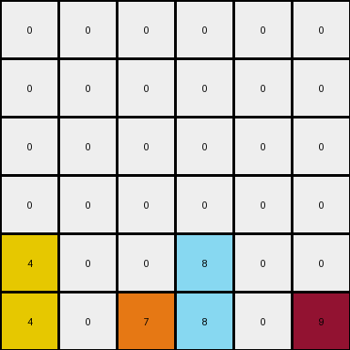
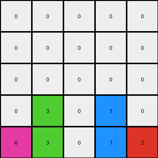

# 3-1e0a9b12 • 003 • refine_code - NLP

---

Previous Code:
```python
"""
1. Consider the objects that are not color 0 (the background).
2. Maintain the position of all objects in the bottom row.
3. For any object not in the bottom row:
  - Consider its current column.
  - Move object the lowest available cell in its same column.
"""

import numpy as np

def find_objects(grid):
    """Finds all objects in the grid. Returns as dict {color: [(y,x)]}"""
    objects = {}
    for y in range(grid.shape[0]):
        for x in range(grid.shape[1]):
            color = grid[y, x]
            if color != 0:
                if color not in objects:
                    objects[color] = []
                objects[color].append((y, x))
    return objects

def transform(input_grid):
    # initialize output_grid
    output_grid = np.zeros_like(input_grid)
    
    #find objects different to background color (0)
    objects = find_objects(input_grid)

    # Iterate through the objects
    for color, positions in objects.items():
      for y,x in positions:
        #if the object is in the last row
        if y == input_grid.shape[0]-1:
          #maintain current possition
          output_grid[y,x] = color
        else:
          #else, find lowest empty position at same column
          for row in range(input_grid.shape[0]-1, -1, -1):
            if output_grid[row,x] == 0:
              output_grid[row,x] = color
              break;

    return output_grid
```

Train Set Results:

**Example 1:**
Input:
```
0 4 0 9
0 0 0 0
0 4 6 0
1 0 0 0
```
Expected Output:
```
0 0 0 0
0 0 0 0
0 4 0 0
1 4 6 9
```
Transformed Output:
```
0 0 0 0
0 0 0 0
0 4 0 0
1 4 6 9
```

Status: True

**Example 2:**
Input:
```
0 0 0 0 0 9
0 0 0 8 0 0
0 0 0 0 0 0
4 0 0 0 0 0
4 0 7 8 0 0
4 0 7 0 0 0
```
Expected Output:
```
0 0 0 0 0 0
0 0 0 0 0 0
0 0 0 0 0 0
4 0 0 0 0 0
4 0 7 8 0 0
4 0 7 8 0 9
```
Transformed Output:
```
0 0 0 0 0 0
0 0 0 0 0 0
0 0 0 0 0 0
0 0 0 0 0 0
4 0 0 8 0 0
4 0 7 8 0 9
```

Status: False

**Example 3:**
Input:
```
0 0 0 1 0
0 3 0 0 0
0 3 0 1 2
6 0 0 0 0
0 3 0 0 0
```
Expected Output:
```
0 0 0 0 0
0 0 0 0 0
0 3 0 0 0
0 3 0 1 0
6 3 0 1 2
```
Transformed Output:
```
0 0 0 0 0
0 0 0 0 0
0 0 0 0 0
0 3 0 1 0
6 3 0 1 2
```

Status: False
**Instructions**

- Describe in natural language the step-by-step transformation observed between the input and output grids.
- Focus on identifying objects, their properties (predicates), and the actions performed on them.
- Be as clear and concise as possible, providing a complete description of the transformation rule.
