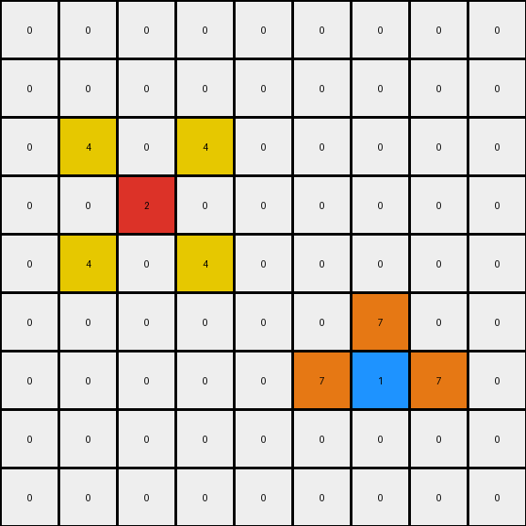

# 2-0ca9ddb6 • 004 • refine_code - CODE

---

Previous Code:
```python
"""
The transformation preserves the positions of the existing red and blue pixels and introduces new yellow pixels around the red pixel and orange pixels around the blue pixel based on their relative positions. The rest of the pixels stay white.
"""

import numpy as np

def find_pixel(grid, color):
    """Finds the coordinates of the first occurrence of a specific color."""
    coords = np.where(grid == color)
    if len(coords[0]) > 0:
        return (coords[0][0], coords[1][0])
    return None

def transform(input_grid):
    """Transforms the input grid according to the observed rule."""
    output_grid = np.copy(input_grid)
    
    # Find the red (2) and blue (1) pixels
    red_pos = find_pixel(input_grid, 2)
    blue_pos = find_pixel(input_grid, 1)

    # Add yellow (4) pixels around the red pixel
    if red_pos:
        row, col = red_pos
        if row > 0:
          if col > 0:
            output_grid[row - 1, col - 1] = 4  # One row above, one column left
          if col < output_grid.shape[1]-1:  
            output_grid[row - 1, col + 1] = 4  # One row above, one column right
        if row < output_grid.shape[0]-1:
          if col > 0:
             output_grid[row + 1, col - 1] = 4
          if col < output_grid.shape[1]-1:
            output_grid[row + 1, col + 1] = 4
    # Add orange (7) pixels around the blue pixel
    if blue_pos:
        row, col = blue_pos
        if col > 0:
            output_grid[row, col - 1] = 7  # One column left
        if col < output_grid.shape[1] - 1:
            output_grid[row, col + 1] = 7  # One column right
        if row > 0:
            output_grid[row - 1, col] = 7  # One row above

    return output_grid
```

Train Set Results:

**Example 1:**
Input:
```
0 0 0 0 0 0 0 0 0
0 0 0 0 0 0 0 0 0
0 0 0 0 0 0 0 0 0
0 0 2 0 0 0 0 0 0
0 0 0 0 0 0 0 0 0
0 0 0 0 0 0 0 0 0
0 0 0 0 0 0 1 0 0
0 0 0 0 0 0 0 0 0
0 0 0 0 0 0 0 0 0
```
Expected Output:
```
0 0 0 0 0 0 0 0 0
0 0 0 0 0 0 0 0 0
0 4 0 4 0 0 0 0 0
0 0 2 0 0 0 0 0 0
0 4 0 4 0 0 0 0 0
0 0 0 0 0 0 7 0 0
0 0 0 0 0 7 1 7 0
0 0 0 0 0 0 7 0 0
0 0 0 0 0 0 0 0 0
```
Transformed Output:
```
0 0 0 0 0 0 0 0 0
0 0 0 0 0 0 0 0 0
0 4 0 4 0 0 0 0 0
0 0 2 0 0 0 0 0 0
0 4 0 4 0 0 0 0 0
0 0 0 0 0 0 7 0 0
0 0 0 0 0 7 1 7 0
0 0 0 0 0 0 0 0 0
0 0 0 0 0 0 0 0 0
```

Status: False

**Example 2:**
Input:
```
0 0 0 8 0 0 0 0 0
0 0 0 0 0 0 0 0 0
0 0 0 0 0 0 2 0 0
0 0 1 0 0 0 0 0 0
0 0 0 0 0 0 0 0 0
0 0 0 0 0 0 0 0 0
0 0 0 0 0 0 1 0 0
0 2 0 0 0 0 0 0 0
0 0 0 0 0 0 0 0 0
```
Expected Output:
```
0 0 0 8 0 0 0 0 0
0 0 0 0 0 4 0 4 0
0 0 7 0 0 0 2 0 0
0 7 1 7 0 4 0 4 0
0 0 7 0 0 0 0 0 0
0 0 0 0 0 0 7 0 0
4 0 4 0 0 7 1 7 0
0 2 0 0 0 0 7 0 0
4 0 4 0 0 0 0 0 0
```
Transformed Output:
```
0 0 0 8 0 0 0 0 0
0 0 0 0 0 4 0 4 0
0 0 7 0 0 0 2 0 0
0 7 1 7 0 4 0 4 0
0 0 0 0 0 0 0 0 0
0 0 0 0 0 0 0 0 0
0 0 0 0 0 0 1 0 0
0 2 0 0 0 0 0 0 0
0 0 0 0 0 0 0 0 0
```

Status: False

**Example 3:**
Input:
```
0 0 0 0 0 0 0 0 0
0 0 0 0 0 0 0 0 0
0 0 2 0 0 0 0 0 0
0 0 0 0 0 0 0 0 0
0 0 0 0 0 0 0 0 0
0 0 0 0 0 0 6 0 0
0 0 0 0 0 0 0 0 0
0 0 0 1 0 0 0 0 0
0 0 0 0 0 0 0 0 0
```
Expected Output:
```
0 0 0 0 0 0 0 0 0
0 4 0 4 0 0 0 0 0
0 0 2 0 0 0 0 0 0
0 4 0 4 0 0 0 0 0
0 0 0 0 0 0 0 0 0
0 0 0 0 0 0 6 0 0
0 0 0 7 0 0 0 0 0
0 0 7 1 7 0 0 0 0
0 0 0 7 0 0 0 0 0
```
Transformed Output:
```
0 0 0 0 0 0 0 0 0
0 4 0 4 0 0 0 0 0
0 0 2 0 0 0 0 0 0
0 4 0 4 0 0 0 0 0
0 0 0 0 0 0 0 0 0
0 0 0 0 0 0 6 0 0
0 0 0 7 0 0 0 0 0
0 0 7 1 7 0 0 0 0
0 0 0 0 0 0 0 0 0
```

Status: False
Okay, let's analyze the transformation rule based on the provided examples and the partially successful Python code.

**Natural Language Program (Revised)**

Here's a refined description of the transformation, incorporating observations from all three examples and addressing the errors in the previous code:

1.  **Identify Key Objects:** Find the locations of the red (color 2) and blue (color 1) pixels within the input grid. These are the primary objects that drive the transformation.

2.  **Preserve Existing Pixels:** The red and blue pixels in the input grid remain unchanged in their original positions in the output grid.

3.  **Add Yellow Surroundings (Red):** For the red pixel:
    *   Place yellow (color 4) pixels diagonally adjacent to the red pixel. This means placing yellow pixels one row above and one column to the left and right, and one row below and one column to the left and right, if the red pixel is no on the edges.

4.  **Add Orange Surroundings (Blue):** For the blue pixel:
    *   Place orange (color 7) pixels horizontally and vertically adjacent to the blue pixel. This means placing orange pixels directly above, below, to the left, and to the right of the blue pixel, , if the blue pixel is no on the edges..

5. **Ignore other colors:** other colors pixels don't change.

**Issues with the prior attempt and why:**
- Example 1:
  - It is missing the orange pixel below the blue pixel.
- Example 2:
 - It is missing orange pixels below the blue pixel and next to the bottom left blue pixel. It is also missing the yellow pixels diagonally adjacent to the bottom left red pixel.
- Example 3:
  - It is missing the orange pixel below the blue pixel.

The revised natural language program aims for completeness and correctness, capturing all the observed transformations.

**INSTRUCTIONS**

- generate a Python module to represent the natural language program 
- follow the template below
- all common math and science libraries are available
- create docstring only at top - but comment the workflow in the function
- use helper functions for common operations like finding objects, counting,
  measuring, moving, etc. 

remember - we are working iteratively - so this code will inform your future
self as we converge on the solution

*template:*

```python
"""
{{ natural language description of the transformation rule }}
"""

{{ imports }}

def transform(input_grid):
    # initialize output_grid

    # change output pixels 

    return output_grid

```
