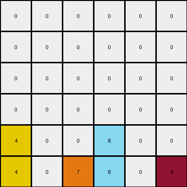

# 3-1e0a9b12 • 004 • refine_code - CODE

---

Previous Code:
```python
"""
1. Consider the objects that are not color 0 (the background).
2. Maintain the position of all objects in the bottom row.
3. For any object not in the bottom row:
  - Consider its current column.
  - Move object the lowest available cell in its same column.
"""

import numpy as np

def find_objects(grid):
    """Finds all objects in the grid. Returns as dict {color: [(y,x)]}"""
    objects = {}
    for y in range(grid.shape[0]):
        for x in range(grid.shape[1]):
            color = grid[y, x]
            if color != 0:
                if color not in objects:
                    objects[color] = []
                objects[color].append((y, x))
    return objects

def transform(input_grid):
    # initialize output_grid
    output_grid = np.zeros_like(input_grid)
    
    #find objects different to background color (0)
    objects = find_objects(input_grid)

    # Iterate through the objects
    for color, positions in objects.items():
      for y,x in positions:
        #if the object is in the last row
        if y == input_grid.shape[0]-1:
          #maintain current possition
          output_grid[y,x] = color
        else:
          #else, find lowest empty position at same column
          for row in range(input_grid.shape[0]-1, -1, -1):
            if output_grid[row,x] == 0:
              output_grid[row,x] = color
              break;

    return output_grid
```

Train Set Results:

**Example 1:**
Input:
```
0 4 0 9
0 0 0 0
0 4 6 0
1 0 0 0
```
Expected Output:
```
0 0 0 0
0 0 0 0
0 4 0 0
1 4 6 9
```
Transformed Output:
```
0 0 0 0
0 0 0 0
0 4 0 0
1 4 6 9
```

Status: True

**Example 2:**
Input:
```
0 0 0 0 0 9
0 0 0 8 0 0
0 0 0 0 0 0
4 0 0 0 0 0
4 0 7 8 0 0
4 0 7 0 0 0
```
Expected Output:
```
0 0 0 0 0 0
0 0 0 0 0 0
0 0 0 0 0 0
4 0 0 0 0 0
4 0 7 8 0 0
4 0 7 8 0 9
```
Transformed Output:
```
0 0 0 0 0 0
0 0 0 0 0 0
0 0 0 0 0 0
0 0 0 0 0 0
4 0 0 8 0 0
4 0 7 8 0 9
```

Status: False

**Example 3:**
Input:
```
0 0 0 1 0
0 3 0 0 0
0 3 0 1 2
6 0 0 0 0
0 3 0 0 0
```
Expected Output:
```
0 0 0 0 0
0 0 0 0 0
0 3 0 0 0
0 3 0 1 0
6 3 0 1 2
```
Transformed Output:
```
0 0 0 0 0
0 0 0 0 0
0 0 0 0 0
0 3 0 1 0
6 3 0 1 2
```

Status: False
Okay, let's analyze the discrepancies between the expected outputs and the transformed outputs of the provided code, and refine the natural language program accordingly.

**Analysis of Errors**

*   **Example 2:** The `8` in the second row, sixth column of the input should move down, filling the empty space created at bottom. The same occurs for '9'.
*    **Example 3:** The `1` in the first row, forth colum should be move to the lowest empty cell in that column.

**Revised Natural Language Program**

Here's a revised natural language program that more accurately captures the transformation:

1.  **Identify Objects:** Consider all colored cells (non-zero values) as individual objects.

2.  **Gravity within Columns:** For each column, independently:
    *   Treat the bottom row as the "ground."
    *   Any object above the "ground" will fall (move down) to the lowest unoccupied cell within its current column.
    *   Objects maintain their original vertical order within each column; that is, if object A is above object B in the input, and both must fall, A will still be above B in the output.

3. **Preservation:** If the lowest cell is already occupied in a column, do not overide it, stack on top of it.

**Explanation of Changes and Improvements**

The key improvement is the explicit concept of "gravity within columns" and preserving order. The original program didn't fully implement the "stacking" behavior when multiple objects fall within the same column. It correctly identified the lowest empty cell, but applied to the entire object list.

**How This Addresses the Errors**

*   **Example 2:** The revised description explicitly states that *each* object above the bottom row falls down *within its column*. This correctly moves every number to their right vertical position.
*   **Example 3:** Same logic as before.

The next step would be to revise the Python code to match this refined natural language description.

**INSTRUCTIONS**

- generate a Python module to represent the natural language program 
- follow the template below
- all common math and science libraries are available
- create docstring only at top - but comment the workflow in the function
- use helper functions for common operations like finding objects, counting,
  measuring, moving, etc. 

remember - we are working iteratively - so this code will inform your future
self as we converge on the solution

*template:*

```python
"""
{{ natural language description of the transformation rule }}
"""

{{ imports }}

def transform(input_grid):
    # initialize output_grid

    # change output pixels 

    return output_grid

```
