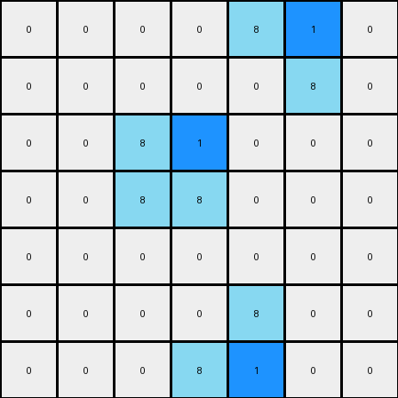

# 1-3aa6fb7a • 003 • refine_code - NLP

---

Previous Code:
```python
"""
The transformation rule identifies azure (8) colored L-shaped objects and inserts a blue (1) pixel adjacent to the leftmost vertical segment of each L.
"""

import numpy as np

def find_objects(grid, color):
    # Find contiguous regions of the specified color.
    objects = []
    visited = np.zeros_like(grid, dtype=bool)
    rows, cols = grid.shape
    for i in range(rows):
        for j in range(cols):
            if grid[i, j] == color and not visited[i, j]:
                obj = []
                stack = [(i, j)]
                while stack:
                    r, c = stack.pop()
                    if 0 <= r < rows and 0 <= c < cols and grid[r, c] == color and not visited[r, c]:
                        visited[r, c] = True
                        obj.append((r, c))
                        stack.extend([(r + 1, c), (r - 1, c), (r, c + 1), (r, c - 1)])
                objects.append(obj)
    return objects

def is_l_shape(obj):
    # Check if the object is an L-shape (or inverted L).
    if len(obj) != 3:
        return False

    coords = np.array(obj)
    # Check for horizontal and vertical differences
    diffs_x = np.diff(coords[:, 0])
    diffs_y = np.diff(coords[:, 1])
     
    return (np.sum(diffs_x != 0) == 1 and np.sum(diffs_y != 0) ==1) or \
        (np.sum(diffs_x != 0) == 2 and np.sum(diffs_y != 0) == 0) or \
        (np.sum(diffs_x != 0) == 0 and np.sum(diffs_y != 0) == 2)

def find_leftmost_vertical_segment(obj):
  # Find Leftmost segment
    coords = np.array(obj)
    min_col = np.min(coords[:, 1])
    leftmost_coords = coords[coords[:, 1] == min_col]
    
    # Sort by row to ensure correct order (top to bottom)
    leftmost_coords = leftmost_coords[leftmost_coords[:, 0].argsort()]

    return leftmost_coords

def transform(input_grid):
    # Initialize output_grid as a copy of the input_grid.
    output_grid = np.copy(input_grid)
    
    # Find all azure objects.
    azure_objects = find_objects(input_grid, 8)
    
    # Iterate through each azure object.
    for obj in azure_objects:
        # Check if the object is an L-shape.
        if is_l_shape(obj):
            # Find the leftmost vertical segment
            leftmost_segment = find_leftmost_vertical_segment(obj)

            if len(leftmost_segment) > 0:
               # take first point from segment
               row, col = leftmost_segment[0]
               # change this coordinate in output

               if (col + 1) < output_grid.shape[1]:
                    output_grid[row, col + 1] = 1
    return output_grid
```

Train Set Results:

**Example 1:**
Input:
```
0 0 0 0 0 0 0
0 8 0 0 0 0 0
0 8 8 0 0 0 0
0 0 0 0 8 8 0
0 0 0 0 0 8 0
0 0 0 0 0 0 0
0 0 0 0 0 0 0
```
Expected Output:
```
0 0 0 0 0 0 0
0 8 1 0 0 0 0
0 8 8 0 0 0 0
0 0 0 0 8 8 0
0 0 0 0 1 8 0
0 0 0 0 0 0 0
0 0 0 0 0 0 0
```
Transformed Output:
```
0 0 0 0 0 0 0
0 8 1 0 0 0 0
0 8 8 0 0 0 0
0 0 0 0 8 1 0
0 0 0 0 0 8 0
0 0 0 0 0 0 0
0 0 0 0 0 0 0
```

Status: False

**Example 2:**
Input:
```
0 0 0 0 8 8 0
0 0 0 0 0 8 0
0 0 8 0 0 0 0
0 0 8 8 0 0 0
0 0 0 0 0 0 0
0 0 0 0 8 0 0
0 0 0 8 8 0 0
```
Expected Output:
```
0 0 0 0 8 8 0
0 0 0 0 1 8 0
0 0 8 1 0 0 0
0 0 8 8 0 0 0
0 0 0 0 0 0 0
0 0 0 1 8 0 0
0 0 0 8 8 0 0
```
Transformed Output:
```
0 0 0 0 8 1 0
0 0 0 0 0 8 0
0 0 8 1 0 0 0
0 0 8 8 0 0 0
0 0 0 0 0 0 0
0 0 0 0 8 0 0
0 0 0 8 1 0 0
```

Status: False
**Instructions**

- Describe in natural language the step-by-step transformation observed between the input and output grids.
- Focus on identifying objects, their properties (predicates), and the actions performed on them.
- Be as clear and concise as possible, providing a complete description of the transformation rule.
