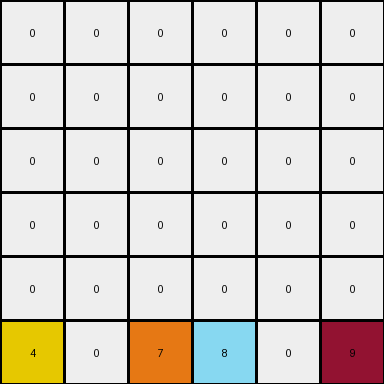
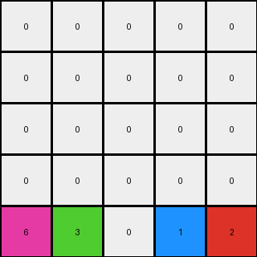

# 3-1e0a9b12 • 003 • refine_code - NLP

---

Previous Code:
```python
"""
Shifts all non-white objects to the last row, preserving their original column order, and filling the remaining cells with white.
"""

import numpy as np

def transform(input_grid):
    """
    Transforms the input grid by moving all non-zero colored cells to the last row,
    maintaining their original column order, and filling the rest with zeros.
    """
    input_grid = np.array(input_grid)
    output_grid = np.zeros_like(input_grid)
    last_row = output_grid.shape[0] - 1

    # Find non-zero elements and their column indices
    non_zero_elements = []
    for col in range(input_grid.shape[1]):
        for row in range(input_grid.shape[0]):
            if input_grid[row, col] != 0:
                non_zero_elements.append((input_grid[row, col], col))

    # Sort the non-zero elements by their column index
    non_zero_elements.sort(key=lambda x: x[1])

    # Place the non-zero elements in the last row of the output grid
    for i, (value, col) in enumerate(non_zero_elements):
        output_grid[last_row, col] = value
    
    # Return the transformed grid.
    return output_grid
```

Train Set Results:

**Example 1:**
Input:
```
0 4 0 9
0 0 0 0
0 4 6 0
1 0 0 0
```
Expected Output:
```
0 0 0 0
0 0 0 0
0 4 0 0
1 4 6 9
```
Transformed Output:
```
0 0 0 0
0 0 0 0
0 0 0 0
1 4 6 9
```

Status: False

**Example 2:**
Input:
```
0 0 0 0 0 9
0 0 0 8 0 0
0 0 0 0 0 0
4 0 0 0 0 0
4 0 7 8 0 0
4 0 7 0 0 0
```
Expected Output:
```
0 0 0 0 0 0
0 0 0 0 0 0
0 0 0 0 0 0
4 0 0 0 0 0
4 0 7 8 0 0
4 0 7 8 0 9
```
Transformed Output:
```
0 0 0 0 0 0
0 0 0 0 0 0
0 0 0 0 0 0
0 0 0 0 0 0
0 0 0 0 0 0
4 0 7 8 0 9
```

Status: False

**Example 3:**
Input:
```
0 0 0 1 0
0 3 0 0 0
0 3 0 1 2
6 0 0 0 0
0 3 0 0 0
```
Expected Output:
```
0 0 0 0 0
0 0 0 0 0
0 3 0 0 0
0 3 0 1 0
6 3 0 1 2
```
Transformed Output:
```
0 0 0 0 0
0 0 0 0 0
0 0 0 0 0
0 0 0 0 0
6 3 0 1 2
```

Status: False
**Instructions**

- Describe in natural language the step-by-step transformation observed between the input and output grids.
- Focus on identifying objects, their properties (predicates), and the actions performed on them.
- Be as clear and concise as possible, providing a complete description of the transformation rule.
