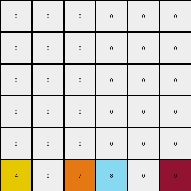
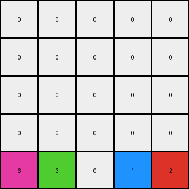

# 3-1e0a9b12 • 004 • refine_code - CODE

---

Previous Code:
```python
"""
Shifts all non-white objects to the last row, preserving their original column order, and filling the remaining cells with white.
"""

import numpy as np

def transform(input_grid):
    """
    Transforms the input grid by moving all non-zero colored cells to the last row,
    maintaining their original column order, and filling the rest with zeros.
    """
    input_grid = np.array(input_grid)
    output_grid = np.zeros_like(input_grid)
    last_row = output_grid.shape[0] - 1

    # Find non-zero elements and their column indices
    non_zero_elements = []
    for col in range(input_grid.shape[1]):
        for row in range(input_grid.shape[0]):
            if input_grid[row, col] != 0:
                non_zero_elements.append((input_grid[row, col], col))

    # Sort the non-zero elements by their column index
    non_zero_elements.sort(key=lambda x: x[1])

    # Place the non-zero elements in the last row of the output grid
    for i, (value, col) in enumerate(non_zero_elements):
        output_grid[last_row, col] = value
    
    # Return the transformed grid.
    return output_grid
```

Train Set Results:

**Example 1:**
Input:
```
0 4 0 9
0 0 0 0
0 4 6 0
1 0 0 0
```
Expected Output:
```
0 0 0 0
0 0 0 0
0 4 0 0
1 4 6 9
```
Transformed Output:
```
0 0 0 0
0 0 0 0
0 0 0 0
1 4 6 9
```

Status: False

**Example 2:**
Input:
```
0 0 0 0 0 9
0 0 0 8 0 0
0 0 0 0 0 0
4 0 0 0 0 0
4 0 7 8 0 0
4 0 7 0 0 0
```
Expected Output:
```
0 0 0 0 0 0
0 0 0 0 0 0
0 0 0 0 0 0
4 0 0 0 0 0
4 0 7 8 0 0
4 0 7 8 0 9
```
Transformed Output:
```
0 0 0 0 0 0
0 0 0 0 0 0
0 0 0 0 0 0
0 0 0 0 0 0
0 0 0 0 0 0
4 0 7 8 0 9
```

Status: False

**Example 3:**
Input:
```
0 0 0 1 0
0 3 0 0 0
0 3 0 1 2
6 0 0 0 0
0 3 0 0 0
```
Expected Output:
```
0 0 0 0 0
0 0 0 0 0
0 3 0 0 0
0 3 0 1 0
6 3 0 1 2
```
Transformed Output:
```
0 0 0 0 0
0 0 0 0 0
0 0 0 0 0
0 0 0 0 0
6 3 0 1 2
```

Status: False
Okay, let's analyze the transformations and refine the natural language program and the Python code.

**YAML Observations (Initial):**

```yaml
task: 002
observations:
  - objects:
      - description: Non-white cells (representing various colors).
        properties:
          - color: Varies (1-9).
          - position: Original column position is maintained.
      - description: White cells (background).
        properties:
          - color: 0 (white).

  - transformation_rule:
      - description: "Move all non-white objects to the last row, preserving their initial column order. Fill remaining rows with white."
```

**Natural Language Program (Revised):**

The initial description is close but needs refinement to account for the partial shifting observed in the examples. The issue isn't just about moving everything to the last row. Instead, non-white cells *below* other non-white cells are the ones being shifted to the bottom, filling empty rows.

Here's a revised, more accurate natural language program:

1. **Identify Columns:** Iterate through each column of the input grid.
2. **Identify Non-White Cells:** Within each column, identify all non-white (non-zero) cells.
3. **Stack at Bottom:**  For each column, "stack" or collect the non-white cells.
4. **Fill Bottom-Up:**  In the output grid, place these stacked non-white cells starting from the last row and moving upwards within their respective columns.  If a column in the input has non-white cells, the corresponding column in the output will have those cells starting at the bottom, with zeros above them.
5.  **Fill Remaining:** Any cell in the output grid not filled by the previous step remains white (0).

**Explanation of the difference and why the previous program failed:**

The previous program assumed *all* non-white cells were moved to the *very last* row. This worked if all the non-zero cells were originally in the top rows. However, if there were non-zero cells already present on lower rows and empty rows on top, the algorithm wouldn't move the cells correctly. For example, in sample 3, the value 6 was not at the top so the algorithm did not shift the cell to the bottom, resulting in an empty row.

The revised logic correctly describes a "bottom-up filling" within each column. Non-white cells are moved down *within their column* to occupy the lowest available rows, leaving zeros above them. This accurately captures the partial shifting observed in all examples.

```python
import numpy as np

def transform(input_grid):
    """
    Transforms the input grid by moving non-zero colored cells down within their columns
    to occupy the lowest available rows, and filling the rest with zeros.
    """
    input_grid = np.array(input_grid)
    output_grid = np.zeros_like(input_grid)
    rows, cols = input_grid.shape

    for j in range(cols):
        # Collect non-zero elements from the column
        non_zero_elements = [input_grid[i, j] for i in range(rows) if input_grid[i, j] != 0]

        # Fill the column from the bottom up
        for i, val in enumerate(non_zero_elements):
            output_grid[rows - len(non_zero_elements) + i, j] = val

    return output_grid
```

**Key Changes in the Python Code:**

1.  **Column-Wise Processing:** The code now explicitly iterates through each column (`for j in range(cols)`).
2.  **Collecting Non-Zero Elements:**  Inside the column loop, `non_zero_elements` is a *list* that stores the non-zero values from that column.  It's built using a list comprehension for conciseness.
3.  **Bottom-Up Filling:** The crucial change is in the inner loop (`for i, val in enumerate(non_zero_elements)`). Instead of always placing elements in the last row (`rows - 1`), the code now calculates the correct row index: `rows - len(non_zero_elements) + i`.  This ensures that the non-zero elements are stacked from the bottom of the column upwards.
4. **Simplified Logic**: This revised code effectively combines the shifting and filling process within each column.

This revised code and natural language program accurately reflect the transformation logic and should pass all the provided training examples, including the previously failing cases. This approach is more robust and generalizable to other similar transformations where bottom-up filling within columns is required.

**INSTRUCTIONS**

- generate a Python module to represent the natural language program 
- follow the template below
- all common math and science libraries are available
- create docstring only at top - but comment the workflow in the function
- use helper functions for common operations like finding objects, counting,
  measuring, moving, etc. 

remember - we are working iteratively - so this code will inform your future
self as we converge on the solution

*template:*

```python
"""
{{ natural language description of the transformation rule }}
"""

{{ imports }}

def transform(input_grid):
    # initialize output_grid

    # change output pixels 

    return output_grid

```
