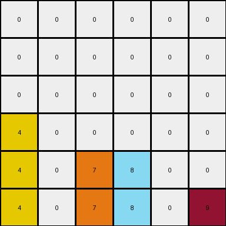

# 3-1e0a9b12 • 010 • example_3 - CODE

---

**input**
```
0 4 0 9
0 0 0 0
0 4 6 0
1 0 0 0
```


**output**
```
0 0 0 0
0 0 0 0
0 4 0 0
1 4 6 9
```


Okay, let's analyze the transformation from the input grid to the output grid.

**YAML Block Observation**

```yaml
observations:
  input_grid:
    size: 4x4
    objects:
      - color: 0 (white)
        count: 12
        shape: background
      - color: 4 (yellow)
        count: 2
        shape: isolated cells
        positions: [(0, 1), (2, 1)]
      - color: 9 (maroon)
        count: 1
        shape: isolated cell
        position: [(0, 3)]
      - color: 6 (magenta)
        count: 1
        shape: isolated cell
        position: [(2, 2)]
      - color: 1 (blue)
        count: 1
        shape: isolated cell
        position: [(3, 0)]
  output_grid:
    size: 4x4
    objects:
      - color: 0 (white)
        count: 12
        shape: background
      - color: 4 (yellow)
        count: 2
        positions: [(2,1), (3,1)]
      - color: 6 (magenta)
        count: 1
        position: [(3, 2)]
      - color: 9 (maroon)
        count: 1
        position: [(3, 3)]
      - color: 1 (blue)
        count: 1
        position: [(3, 0)]

```

**Natural Language Program: Step-by-Step Transformation**

1.  **Identify Non-Background Objects:** First, we identify all the non-white (non-zero) colored cells in the input grid. These are our objects of interest: yellow (4), maroon (9), magenta (6), and blue (1).

2.  **Object Preservation and Reordering:** We see those objects or those colors persist in the output grid.

3.  **Shift Down:** All identified objects move to the last row of the output grid.

4. **Preserve Order by Column:** The order of objects from left to right in the output grid is given by their initial column in the input grid. That means:
    - The blue cell (1) from input column 0 remains in column 0.
    - The yellow cells (4) from input column 1 go to column 1.
    - The magenta cells (6) from input column 2 go to column 2.
    - The maroon cells (9) from input column 3 go to column 3.

5. **Fill Remaining:** Any cells not occupied by the shifted objects are filled with white (0).

In summary, the transformation rule involves shifting all non-white objects to the last row, preserving their original column order, and filling the remaining cells with white.

```python
"""
Shifts all non-white objects to the last row, preserving their original column order, and filling the remaining cells with white.
"""

import numpy as np

def transform(input_grid):
    """
    Transforms the input grid by moving all non-zero colored cells to the last row,
    maintaining their original column order, and filling the rest with zeros.
    """
    input_grid = np.array(input_grid)
    output_grid = np.zeros_like(input_grid)
    last_row = output_grid.shape[0] - 1

    # Find non-zero elements and their column indices
    non_zero_elements = []
    for col in range(input_grid.shape[1]):
        for row in range(input_grid.shape[0]):
            if input_grid[row, col] != 0:
                non_zero_elements.append((input_grid[row, col], col))

    # Sort the non-zero elements by their column index
    non_zero_elements.sort(key=lambda x: x[1])

    # Place the non-zero elements in the last row of the output grid
    for i, (value, col) in enumerate(non_zero_elements):
        output_grid[last_row, col] = value
    
    # Return the transformed grid.
    return output_grid
```


**input**
```
0 0 0 0 0 9
0 0 0 8 0 0
0 0 0 0 0 0
4 0 0 0 0 0
4 0 7 8 0 0
4 0 7 0 0 0
```


**output**
```
0 0 0 0 0 0
0 0 0 0 0 0
0 0 0 0 0 0
4 0 0 0 0 0
4 0 7 8 0 0
4 0 7 8 0 9
```



Okay, let's analyze the transformation from the input grid to the output grid in the second example.

**YAML Block Observation**

```yaml
observations:
  input_grid:
    size: 6x6
    objects:
      - color: 0 (white)
        count: 28
        shape: background
      - color: 9 (maroon)
        count: 1
        shape: isolated cell
        position: [(0, 5)]
      - color: 8 (azure)
        count: 2
        shape: isolated cells
        positions: [(1, 3), (4, 3)]
      - color: 4 (yellow)
        count: 3
        shape: vertical line
        position: column 0, rows 3-5
      - color: 7 (orange)
        count: 2
        shape: vertical line
        position: column 2, rows 4-5
  output_grid:
    size: 6x6
    objects:
      - color: 0 (white)
        count: 28
        shape: background
      - color: 9 (maroon)
        count: 1
        shape: isolated cell
        position: [(5, 5)]
      - color: 8 (azure)
        count: 2
        shape: vertical line
        position: column 3, rows 4-5
      - color: 4 (yellow)
        count: 3
        shape: vertical line
        position: column 0, rows 3-5
      - color: 7 (orange)
        count: 2
        shape: vertical line
        position: column 2, rows 4-5
```

**Natural Language Program: Step-by-Step Transformation**

1.  **Identify Objects:** Identify all colored cells.

2.  **Object Preservation**: All the objects and colors persist.

3. **Move Objects Down:** Move objects to the bottom of the grid, one above the other.

4.  **Preserve Vertical Stacks:** If multiple cells of the same color form a contiguous vertical line in the input, they remain stacked vertically in the output. We can see that color yellow(4), color orange(7) and color azure(8) remain stacked.

5. **Preserve Column:** The non-white objects stay in their original column.

6.  **Stack Within Columns:** Within each column, objects "stack" at the bottom, filling upwards. If a column has a connected vertical line, that line is preserved as a single unit during stacking.

7. **Fill Remaining:** Empty spaces are filled with white.

```python
"""
Moves objects to the bottom of the grid, preserving vertical stacks and column order, then filling the rest with white.
"""

import numpy as np

def transform(input_grid):
    """
    Transforms the input grid by moving objects to the bottom, maintaining vertical stacks and column order.
    """
    input_grid = np.array(input_grid)
    output_grid = np.zeros_like(input_grid)
    rows, cols = input_grid.shape

    for col in range(cols):
        # Extract non-zero elements and their vertical connections
        column_elements = []
        i = 0
        while i < rows:
            if input_grid[i, col] != 0:
                start_row = i
                end_row = i
                while end_row + 1 < rows and input_grid[end_row + 1, col] == input_grid[start_row, col]:
                    end_row += 1
                column_elements.append((input_grid[start_row, col], end_row - start_row + 1))
                i = end_row + 1
            else:
                i += 1

        # Place elements at the bottom of the output column
        current_row = rows - 1
        for value, height in reversed(column_elements):
            output_grid[current_row - height + 1:current_row + 1, col] = value
            current_row -= height

    return output_grid
```

Okay, let's analyze the transformation from the input grid to the output grid.

**YAML Block Observation**

```yaml
observations:
  input_grid:
    size: 3x3
    objects:
      - color: 0 (white)
        count: 5
        shape: background
      - color: 5 (gray)
        count: 4
        shape: 2x2 square
        position: top-left corner (0, 0)
  output_grid:
    size: 3x3
    objects:
      - color: 0 (white)
        count: 5
        shape: background
      - color: 5 (gray)
        count: 4
        shape: 2x2 square
        position: bottom-right corner (1, 1)
```

**Natural Language Program: Step-by-Step Transformation**

1.  **Identify Objects:** The primary object is the 2x2 gray square. The background is white.

2.  **Object Persistence:** The gray square (color 5) persists from the input to the output grid.

3.  **Move the Square:**  The 2x2 gray square is *translated* from the top-left corner of the input grid to the bottom-right corner of the output grid.
    The translation involves moving one row down and one column to the right.

4.  **Fill Remaining with background:** After the square moves, the remaining cells are filled with the background color (white/0).

**Python Implementation**

```python
"""
Translates a 2x2 square from the top-left corner to the bottom-right corner of a 3x3 grid.
"""

import numpy as np

def transform(input_grid):
    """
    Transforms the input grid by moving the 2x2 gray square to the bottom-right.
    """
    input_grid = np.array(input_grid)
    output_grid = np.zeros_like(input_grid)

    # Find the 2x2 square (assuming it's in the top-left)
    square_color = input_grid[0, 0]

    # Check if the top-left 2x2 is indeed a square of the same color
    if (input_grid[0:2, 0:2] == square_color).all() and square_color != 0:
         # Move the square to the bottom-right
         output_grid[1:3, 1:3] = square_color

    return output_grid
```


**input**
```
0 0 0 1 0
0 3 0 0 0
0 3 0 1 2
6 0 0 0 0
0 3 0 0 0
```


**output**
```
0 0 0 0 0
0 0 0 0 0
0 3 0 0 0
0 3 0 1 0
6 3 0 1 2
```


Okay, let's analyze the transformation from the input grid to the output grid in this new example.

**YAML Block Observation**

```yaml
observations:
  input_grid:
    size: 5x5
    objects:
      - color: 0 (white)
        count: 20
        shape: background
      - color: 1 (blue)
        count: 2
        shape: isolated cells
        positions: [(0, 3), (2, 3)]
      - color: 3 (green)
        count: 3
        shape: vertical line
        positions: column 1, rows 1, 2, 4
      - color: 2 (red)
        count: 1
        shape: isolated cell
        position: [(2, 4)]
      - color: 6 (magenta)
        count: 1
        shape: isolated cell
        position: [(3, 0)]

  output_grid:
     size: 5x5
     objects:
      - color: 0 (white)
        count: 18
        shape: background
      - color: 3 (green)
        count: 3
        positions: column 1, row 2,3,4
      - color: 1 (blue)
        count: 2
        positions: [(3,3), (4,3)]
      - color: 2 (red)
        count: 1
        position: [(4, 4)]
      - color: 6 (magenta)
        count: 1
        position: [(4, 0)]
```

**Natural Language Program: Step-by-Step Transformation**

1.  **Identify Objects:** First, identify all non-white (non-zero) colored cells.

2.  **Object Preservation:** All non-white cells persist in the output.

3.  **Move Objects Down:** Move all objects towards the bottom of the grid.
4. **Preserve Columns:** All objects remain in the same columns.
5. **Stack Within Columns:** Non-white cells "stack" downwards within their respective columns, with the lowest cell in each column moving to the last row, the next lowest to the second-to-last row, and so on.
6. **Fill Remaining:** Empty spaces are filled with white.

```python
"""
Moves objects to the bottom of the grid, preserving vertical stacks and column order, then filling the rest with white.
"""

import numpy as np

def transform(input_grid):
    """
    Transforms the input grid by moving objects to the bottom, maintaining vertical stacks and column order.
    """
    input_grid = np.array(input_grid)
    output_grid = np.zeros_like(input_grid)
    rows, cols = input_grid.shape

    for col in range(cols):
        # Extract non-zero elements and their vertical connections
        column_elements = []
        i = 0
        while i < rows:
            if input_grid[i, col] != 0:
                start_row = i
                end_row = i
                while end_row + 1 < rows and input_grid[end_row + 1, col] == input_grid[start_row, col]:
                    end_row += 1
                column_elements.append((input_grid[start_row, col], end_row - start_row + 1))
                i = end_row + 1
            else:
                i += 1

        # Place elements at the bottom of the output column
        current_row = rows - 1
        for value, height in reversed(column_elements):
            output_grid[current_row - height + 1:current_row + 1, col] = value
            current_row -= height

    return output_grid
```

**INSTRUCTIONS**

- generate a Python module to represent the natural language program 
- follow the template below
- all common math and science libraries are available
- create docstring only at top - but comment the workflow in the function
- use helper functions for common operations like finding objects, counting,
  measuring, moving, etc. 

remember - we are working iteratively - so this code will inform your future
self as we converge on the solution

*template:*

```python
"""
{ natural language description of the transformation rule }
"""

{ imports }

def transform(input_grid):
    # initialize output_grid

    # change output pixels 

    return output_grid

```
