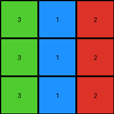

# 4-0d3d703e • 002 • example_1 - CODE

---

**input**
```
3 1 2
3 1 2
3 1 2
```




**output**
```
4 5 6
4 5 6
4 5 6
```


Okay, let's analyze the transformation from the input grid to the output grid.

**YAML Block for Initial Observations**

```yaml
task: 001
observations:
  input_grid:
    size: 3x3
    objects:
      - color: 3
        shape: vertical line
        count: 3
        positions: [[0,0], [1,0], [2,0]]
      - color: 1
        shape: vertical line
        count: 3
        positions: [[0,1], [1,1], [2,1]]
      - color: 2
        shape: vertical line
        count: 3
        positions: [[0,2], [1,2], [2,2]]
  output_grid:
    size: 3x3
    objects:
      - color: 4
        shape: vertical line
        count: 3
        positions: [[0,0], [1,0], [2,0]]
      - color: 5
        shape: vertical line
        count: 3
        positions: [[0,1], [1,1], [2,1]]
      - color: 6
        shape: vertical line
        count: 3
        positions: [[0,2], [1,2], [2,2]]
```

**Natural Language Program: Step-by-Step Transformation**

1.  **Object Identification**: In the input grid, we identify three vertical lines of different colors (3, 1, and 2), each occupying a single column.

2.  **Color Transformation Rule**:
    *   The color 3 (green) in the input is transformed to color 4 (yellow) in the output.
    *   The color 1 (blue) in the input is transformed to color 5 (gray) in the output.
    *   The color 2 (red) in the input is transformed to color 6 (magenta) in the output.

3.  **Spatial Arrangement**: The spatial arrangement (shape, position and size) and count of objects remains unchanged.

4. **Formal description**
    *   The transformation follows a simple rule: `input_color + 1 = output_color`.

In summary, the input grid consists of vertical lines that maintain their positions but undergo a uniform color change according to a simple rule, resulting in the output grid.

**INSTRUCTIONS**

- generate a Python module to represent the natural language program 
- follow the template below
- all common math and science libraries are available
- create docstring only at top - but comment the workflow in the function
- use helper functions for common operations like finding objects, counting,
  measuring, moving, etc. 

remember - we are working iteratively - so this code will inform your future
self as we converge on the solution

*template:*

```python
"""
{ natural language description of the transformation rule }
"""

{ imports }

def transform(input_grid):
    # initialize output_grid

    # change output pixels 

    return output_grid

```
