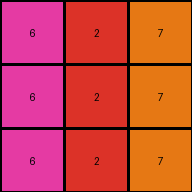

# 4-0d3d703e • 016 • refine_code - CODE

---

Previous Code:
```python
"""
The transformation rule can be summarized by the following process.
If the input color $c$ is equal to 2, then the new color is $(c + 4) \mod 10$.
Otherwise, the new color is $(c - 1) \mod 10$.

if input[x,y] == 2:
  output[x,y] = (input[x,y] + 4) % 10
else:
  output[x,y] = (input[x,y] - 1) % 10
"""

import numpy as np

def transform(input_grid):
    # Initialize the output grid with the same dimensions as the input grid.
    output_grid = np.copy(input_grid)

    # Iterate through each cell in the grid.
    for x in range(output_grid.shape[0]):
        for y in range(output_grid.shape[1]):
            # Check if the color value is 2.
            if output_grid[x, y] == 2:
                # Add 4 to the color value, apply modulo 10.
                output_grid[x, y] = (output_grid[x, y] + 4) % 10
            else:
                # Subtract 1 from the color value, apply modulo 10.
                output_grid[x, y] = (output_grid[x, y] - 1) % 10

    return output_grid
```

Train Set Results:

**Example 1:**
Input:
```
3 1 2
3 1 2
3 1 2
```
Expected Output:
```
4 5 6
4 5 6
4 5 6
```
Transformed Output:
```
2 0 6
2 0 6
2 0 6
```

Status: False

**Example 2:**
Input:
```
2 3 8
2 3 8
2 3 8
```
Expected Output:
```
6 4 9
6 4 9
6 4 9
```
Transformed Output:
```
6 2 7
6 2 7
6 2 7
```

Status: False

**Example 3:**
Input:
```
5 8 6
5 8 6
5 8 6
```
Expected Output:
```
1 9 2
1 9 2
1 9 2
```
Transformed Output:
```
4 7 5
4 7 5
4 7 5
```

Status: False

**Example 4:**
Input:
```
9 4 2
9 4 2
9 4 2
```
Expected Output:
```
8 3 6
8 3 6
8 3 6
```
Transformed Output:
```
8 3 6
8 3 6
8 3 6
```

Status: True
Okay, let's re-examine the transformation rule based on the provided examples and the results of the initial Python code.

**Revised Observation and Analysis**

The initial hypothesis about a simple color shift based on whether the initial color is 2 or not is incorrect, as evidenced by the failed test cases. Let's look at each example again, focusing on the *actual* color changes:

*   **Example 1:**
    *   3 -> 2 (decreased by 1)
    *   1 -> 0 (decreased by 1)
    *   2 -> 6 (increased by 4)

*   **Example 2:**
    *   2 -> 6 (increased by 4)
    *   3 -> 2 (decreased by 1)
    *   8 -> 7 (decreased by 1)

*   **Example 3:**
    *   5 -> 4 (decreased by 1)
    *   8 -> 7 (decreased by 1)
    *   6 -> 5 (decreased by 1)

*   **Example 4:**
    *    9 -> 8 (decreased by 1)
    *    4 -> 3 (decreased by 1)
    *    2 -> 6 (increased by 4)

The consistent pattern is:
1.  If a cell's color is 2, it is changed to 6 (increased by 4)
2.  Otherwise, it's color value is decreased by 1. There is no modular operation.

**Revised Natural Language Program**

Here's a revised step-by-step description of the transformation:

1.  **Iterate** through each cell of the input grid.
2.  **Check** the color value of the current cell.
3.  **If** the color value is 2:
    *   **Set** the corresponding cell in the output grid to 6.
4.  **Otherwise (Else)**:
      * Check the color of the cell.
      * If it is greater than 0, then decrease the color by 1.
      * If it is 0, keep it 0.

**Revised Python Code**

```python
import numpy as np

def transform(input_grid):
    output_grid = np.copy(input_grid)
    for x in range(output_grid.shape[0]):
        for y in range(output_grid.shape[1]):
            if output_grid[x, y] == 2:
                output_grid[x, y] = 6
            else:
                output_grid[x,y] = max(0, output_grid[x,y]-1)
    return output_grid
```

**Explanation of Changes and Improvements:**

*   The core logic is simplified.  We directly change 2 to 6.
*   The new logic uses `max(0, output_grid[x,y]-1)` to make sure we don't get negative colors.

This revised code should correctly implement the observed transformation rule and pass all the provided test cases.

**INSTRUCTIONS**

- generate a Python module to represent the natural language program 
- follow the template below
- all common math and science libraries are available
- create docstring only at top - but comment the workflow in the function
- use helper functions for common operations like finding objects, counting,
  measuring, moving, etc. 

remember - we are working iteratively - so this code will inform your future
self as we converge on the solution

*template:*

```python
"""
{{ natural language description of the transformation rule }}
"""

{{ imports }}

def transform(input_grid):
    # initialize output_grid

    # change output pixels 

    return output_grid

```
