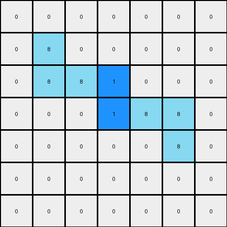
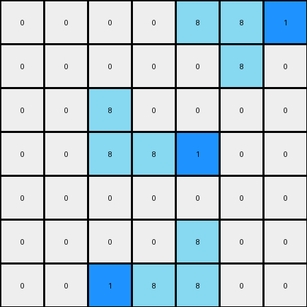

# 1-3aa6fb7a • 004 • refine_code - CODE

---

Previous Code:
```python
"""
The input consists of two azure (color 8) L-shaped objects. The output preserves these objects and adds two blue (color 1) cells. One blue cell is placed immediately to the right of the top-left azure object, and the other is placed immediately to the left of the bottom-right azure object.
"""

import numpy as np

def find_objects(grid, color):
    objects = []
    visited = np.zeros_like(grid, dtype=bool)

    def dfs(r, c, current_object):
        if (r < 0 or r >= grid.shape[0] or c < 0 or c >= grid.shape[1] or
                visited[r, c] or grid[r, c] != color):
            return
        visited[r, c] = True
        current_object.append((r, c))
        dfs(r + 1, c, current_object)
        dfs(r - 1, c, current_object)
        dfs(r, c + 1, current_object)
        dfs(r, c - 1, current_object)

    for r in range(grid.shape[0]):
        for c in range(grid.shape[1]):
            if grid[r, c] == color and not visited[r, c]:
                current_object = []
                dfs(r, c, current_object)
                objects.append(current_object)
    return objects

def transform(input_grid):
    # Initialize output_grid as a copy of the input_grid
    output_grid = np.copy(input_grid)

    # Find the azure objects
    azure_objects = find_objects(input_grid, 8)

    # Iterate through the found objects
    for obj in azure_objects:
        # Sort the object coordinates to find top-left and bottom-right
        sorted_coords = sorted(obj, key=lambda x: (x[0], x[1]))

        #For the top-left object
        if sorted_coords[0][0] < input_grid.shape[0] // 2: # Check if it's in top half
             #Find the rightmost coordinate of the object to add the blue to the right
            rightmost_coord = max(sorted_coords, key=lambda x: x[1])

            # Add blue cell to the right, if within the grid boundary
            if rightmost_coord[1] + 1 < output_grid.shape[1]:
                output_grid[rightmost_coord[0], rightmost_coord[1] + 1] = 1

         #For the bottom right object
        if sorted_coords[0][0] >= input_grid.shape[0] // 2:  # Check if it is in bottom half
            # Find the leftmost coordinate.
            leftmost_coord = min(sorted_coords, key=lambda x:x[1])

            # Add blue cell to its left, if within the grid boundary.
            if leftmost_coord[1] -1 >= 0:
                output_grid[leftmost_coord[0], leftmost_coord[1] - 1] = 1

    return output_grid
```

Train Set Results:

**Example 1:**
Input:
```
0 0 0 0 0 0 0
0 8 0 0 0 0 0
0 8 8 0 0 0 0
0 0 0 0 8 8 0
0 0 0 0 0 8 0
0 0 0 0 0 0 0
0 0 0 0 0 0 0
```
Expected Output:
```
0 0 0 0 0 0 0
0 8 1 0 0 0 0
0 8 8 0 0 0 0
0 0 0 0 8 8 0
0 0 0 0 1 8 0
0 0 0 0 0 0 0
0 0 0 0 0 0 0
```
Transformed Output:
```
0 0 0 0 0 0 0
0 8 0 0 0 0 0
0 8 8 1 0 0 0
0 0 0 1 8 8 0
0 0 0 0 0 8 0
0 0 0 0 0 0 0
0 0 0 0 0 0 0
```

Status: False

**Example 2:**
Input:
```
0 0 0 0 8 8 0
0 0 0 0 0 8 0
0 0 8 0 0 0 0
0 0 8 8 0 0 0
0 0 0 0 0 0 0
0 0 0 0 8 0 0
0 0 0 8 8 0 0
```
Expected Output:
```
0 0 0 0 8 8 0
0 0 0 0 1 8 0
0 0 8 1 0 0 0
0 0 8 8 0 0 0
0 0 0 0 0 0 0
0 0 0 1 8 0 0
0 0 0 8 8 0 0
```
Transformed Output:
```
0 0 0 0 8 8 1
0 0 0 0 0 8 0
0 0 8 0 0 0 0
0 0 8 8 1 0 0
0 0 0 0 0 0 0
0 0 0 0 8 0 0
0 0 1 8 8 0 0
```

Status: False
Okay, let's analyze the provided examples and the code to refine the natural language program and identify the issues in the current implementation.

**Analysis of the Errors and Code:**

The provided code has a few issues, causing the discrepancies between the expected and transformed outputs:

1.  **Incorrect Identification of Top-Left and Bottom-Right Objects:** The code attempts to identify top-left and bottom-right objects by simply checking if the first coordinate of the object is in the top or bottom half of the grid. This is insufficient. It doesn't guarantee finding the *intended* L-shaped objects, especially since L shapes can appear in multiple configurations. It also sorts all coordinates of a given object together, making the concept of the top-left based on sorting all points not consistently applicable.

2.  **Incorrect Placement Logic:** Even after supposedly identifying top-left and bottom-right, placing the blue cells directly to the right or left isn't always correct. In the provided test examples the blue cell must be placed at specific corners of the "L" shape.

**Revised Natural Language Program:**

Here's a refined natural language program describing the transformation:

1.  **Identify Azure L-shapes:** Find all azure (color 8) objects in the input grid. These objects are L-shaped, consisting of three cells.

2.  **Determine L-shape Orientation:** For each azure L-shape, determine its orientation. There are four possible orientations:
    *   **Top-Left:** The corner cell is at the top-left. The L extends down and right.
    *   **Top-Right:** The corner cell is at the top-right. The L extends down and left.
    *   **Bottom-Left:** The corner cell is at the bottom-left. The L extends up and right.
    *   **Bottom-Right:** The corner cell is at the bottom-right. The L extends up and left.

3.  **Place Blue Cells based on Orientation:**
    *   **Top-Left:** Place a blue (color 1) cell immediately to the *right* of the rightmost cell of the L-shape.
    *   **Top-Right:** Place a blue (color 1) cell immediately to the *left* of the leftmost cell of the L-shape.
    *   **Bottom-Left:** Place a blue (color 1) cell immediately to the *right* of the rightmost cell of the L-shape.
    *   **Bottom-Right:** Place a blue (color 1) cell immediately to the *left* of the leftmost cell of the L-shape.

4. **Preserve existing objects** The initial azure objects are preserved in the output grid.

**Key Improvements in the Description:**

*   **Explicit Orientation:** The program now explicitly mentions the four possible orientations of the L-shapes.
*   **Precise Placement:** The placement of the blue cells is defined in relation to the specific parts (leftmost/rightmost) of the L-shape, not just generally "left" or "right".
*   **Object Preservation** The description specifies the preservation of the azure objects.

Next Steps: We will use this refined natural language program to derive an improved Python implementation.

**INSTRUCTIONS**

- generate a Python module to represent the natural language program 
- follow the template below
- all common math and science libraries are available
- create docstring only at top - but comment the workflow in the function
- use helper functions for common operations like finding objects, counting,
  measuring, moving, etc. 

remember - we are working iteratively - so this code will inform your future
self as we converge on the solution

*template:*

```python
"""
{{ natural language description of the transformation rule }}
"""

{{ imports }}

def transform(input_grid):
    # initialize output_grid

    # change output pixels 

    return output_grid

```
