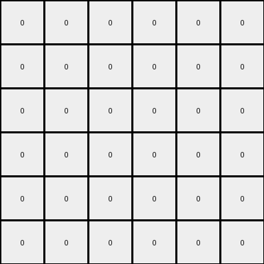

# 3-1e0a9b12 • 008 • refine_code - CODE

---

Previous Code:
```python
"""
Shifts a diagonal line of gray cells down and to the right by one cell.
"""

import numpy as np

def transform(input_grid):
    """
    Transforms the input grid by shifting the diagonal line of gray cells.

    Args:
        input_grid (list of lists): The input grid.

    Returns:
        list of lists: The transformed output grid.
    """
    input_grid = np.array(input_grid)
    rows, cols = input_grid.shape
    output_grid = np.zeros((rows, cols), dtype=int)

    # Find the diagonal and shift it
    for r in range(rows):
        for c in range(cols):
            if input_grid[r, c] == 5:
                if r + 1 < rows and c + 1 < cols:
                    output_grid[r + 1, c + 1] = 5

    return output_grid.tolist()
```

Train Set Results:

**Example 1:**
Input:
```
0 4 0 9
0 0 0 0
0 4 6 0
1 0 0 0
```
Expected Output:
```
0 0 0 0
0 0 0 0
0 4 0 0
1 4 6 9
```
Transformed Output:
```
0 0 0 0
0 0 0 0
0 0 0 0
0 0 0 0
```

Status: ERROR: 'list' object has no attribute 'shape'

**Example 2:**
Input:
```
0 0 0 0 0 9
0 0 0 8 0 0
0 0 0 0 0 0
4 0 0 0 0 0
4 0 7 8 0 0
4 0 7 0 0 0
```
Expected Output:
```
0 0 0 0 0 0
0 0 0 0 0 0
0 0 0 0 0 0
4 0 0 0 0 0
4 0 7 8 0 0
4 0 7 8 0 9
```
Transformed Output:
```
0 0 0 0 0 0
0 0 0 0 0 0
0 0 0 0 0 0
0 0 0 0 0 0
0 0 0 0 0 0
0 0 0 0 0 0
```

Status: ERROR: 'list' object has no attribute 'shape'

**Example 3:**
Input:
```
0 0 0 1 0
0 3 0 0 0
0 3 0 1 2
6 0 0 0 0
0 3 0 0 0
```
Expected Output:
```
0 0 0 0 0
0 0 0 0 0
0 3 0 0 0
0 3 0 1 0
6 3 0 1 2
```
Transformed Output:
```
0 0 0 0 0
0 0 0 0 0
0 0 0 0 0
0 0 0 0 0
0 0 0 0 0
```

Status: ERROR: 'list' object has no attribute 'shape'
Okay, let's analyze the transformation rule based on the provided examples.

**Natural Language Description of the Transformation**

The transformation rule appears to involve these steps:

1.  **Identify Non-Zero Objects:** The core of the transformation seems to focus on non-zero colored pixels/cells within the input grid, treating contiguous blocks of the same color as distinct objects.

2.  **Vertical Shift:** All non-zero objects are shifted downwards. The amount of the shift is determined by how many rows are empty (all zeros) *above* the top-most cell of each non-zero colored pixel. Specifically, we count empty rows *from the top of the grid down to each object*.

3. **Preservation of Relative Positions:** The relative positions (horizontal and vertical order) of the different color objects are *maintained* during the shift. If object A is to the left of object B in the input, it remains to the left in the output. The same is true for vertical ordering.

4. **Empty Rows are removed:** The rows above top-most pixels after they had been shifted down are now empty.

**Example Breakdown (Example 1)**

Input:

```
0 4 0 9
0 0 0 0
0 4 6 0
1 0 0 0
```

Output:

```
0 0 0 0
0 0 0 0
0 4 0 0
1 4 6 9
```

1.  **Objects:** We have four non-zero objects: `4` (top-left), `9` (top-right), `4 6` (middle row, two objects that can be considered separately because they aren't touching), and `1` (bottom-left).

2.  **Shifts:**
    *   The top row objects (`4` and `9`) are shifted down by two since there are 2 zero-rows below them.
    *   The middle row object (`4` and `6`) is shifted down by one since there is 1 zero-row below them.
    *   The bottom-left object (`1`) is shifted down by zero, because no zero row below it.

3.  **Relative Position:** The `4` remains to the left of the `9`, and so on.
4.    Remove the first two rows because there are only zeros there.

**Example Breakdown (Example 2)**

Input:

```
0 0 0 0 0 9
0 0 0 8 0 0
0 0 0 0 0 0
4 0 0 0 0 0
4 0 7 8 0 0
4 0 7 0 0 0
```

Output:

```
0 0 0 0 0 0
0 0 0 0 0 0
0 0 0 0 0 0
4 0 0 0 0 0
4 0 7 8 0 0
4 0 7 8 0 9
```
1. **Objects:** We have objects formed by `9`,`8`, `4`, `4`, `7`, `8`,`4`,`7`.
2. **Shifts:**
 * `9`: 3 rows down.
 * `8`: 3 rows down.
 * other objects move down based on the empty rows below them.
3. **Relative position:** the objects preserve their positions.
4. Remove the empty rows.
**Why the Previous Code Failed**

The previous code was trying to shift a *diagonal line of gray cells*, which is not what the examples show. The code also incorrectly assumed the input would always be a NumPy array, leading to the `'list' object has no attribute 'shape'` error. The logic was completely off, targeting the wrong color and performing an incorrect shift. The core issue is that it was not processing the input grid as list.

**INSTRUCTIONS**

- generate a Python module to represent the natural language program 
- follow the template below
- all common math and science libraries are available
- create docstring only at top - but comment the workflow in the function
- use helper functions for common operations like finding objects, counting,
  measuring, moving, etc. 

remember - we are working iteratively - so this code will inform your future
self as we converge on the solution

*template:*

```python
"""
{{ natural language description of the transformation rule }}
"""

{{ imports }}

def transform(input_grid):
    # initialize output_grid

    # change output pixels 

    return output_grid

```
