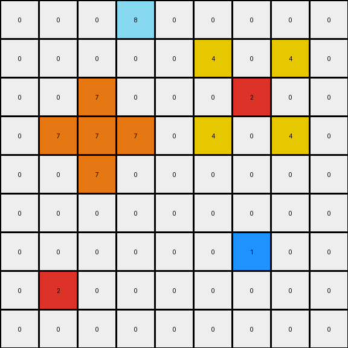

# 2-0ca9ddb6 • 003 • refine_code - NLP

---

Previous Code:
```python
"""
Copies a red and blue pixel from the input grid to the output grid. Adds yellow pixels above and below the red pixel and orange pixels surrounding the blue pixel.
"""

import numpy as np

def find_object(grid, color):
    # Find the coordinates of a single-cell object of the specified color.
    coords = np.where(grid == color)
    if len(coords[0]) > 0:
        return (coords[0][0], coords[1][0])
    return None

def transform(input_grid):
    """
    Transforms the input grid according to the defined rules:
    1. Copies the red (2) and blue (1) pixels.
    2. Adds yellow (4) pixels above and below the red pixel.
    3. Adds orange (7) pixels around the blue pixel.
    """
    output_grid = np.copy(input_grid)

    # Find the red and blue pixels
    red_pos = find_object(input_grid, 2)
    blue_pos = find_object(input_grid, 1)
    
    # Copy red pixel
    if red_pos:
      output_grid[red_pos] = 2

    # Copy blue pixel
    if blue_pos:
        output_grid[blue_pos] = 1

    # Add yellow pixels above and below the red pixel
    if red_pos:
        row, col = red_pos
        output_grid[row - 1, col -1] = 4
        output_grid[row - 1, col + 1] = 4
        output_grid[row + 1, col - 1] = 4
        output_grid[row + 1, col + 1] = 4

    # Add orange pixels around the blue pixel
    if blue_pos:
        row, col = blue_pos
        for i in range(row - 1, row + 2):
            output_grid[i, col] = 7
        for j in range(col - 1, col + 2):
            output_grid[row, j] = 7

    return output_grid
```

Train Set Results:

**Example 1:**
Input:
```
0 0 0 0 0 0 0 0 0
0 0 0 0 0 0 0 0 0
0 0 0 0 0 0 0 0 0
0 0 2 0 0 0 0 0 0
0 0 0 0 0 0 0 0 0
0 0 0 0 0 0 0 0 0
0 0 0 0 0 0 1 0 0
0 0 0 0 0 0 0 0 0
0 0 0 0 0 0 0 0 0
```
Expected Output:
```
0 0 0 0 0 0 0 0 0
0 0 0 0 0 0 0 0 0
0 4 0 4 0 0 0 0 0
0 0 2 0 0 0 0 0 0
0 4 0 4 0 0 0 0 0
0 0 0 0 0 0 7 0 0
0 0 0 0 0 7 1 7 0
0 0 0 0 0 0 7 0 0
0 0 0 0 0 0 0 0 0
```
Transformed Output:
```
0 0 0 0 0 0 0 0 0
0 0 0 0 0 0 0 0 0
0 4 0 4 0 0 0 0 0
0 0 2 0 0 0 0 0 0
0 4 0 4 0 0 0 0 0
0 0 0 0 0 0 7 0 0
0 0 0 0 0 7 7 7 0
0 0 0 0 0 0 7 0 0
0 0 0 0 0 0 0 0 0
```

Status: False

**Example 2:**
Input:
```
0 0 0 8 0 0 0 0 0
0 0 0 0 0 0 0 0 0
0 0 0 0 0 0 2 0 0
0 0 1 0 0 0 0 0 0
0 0 0 0 0 0 0 0 0
0 0 0 0 0 0 0 0 0
0 0 0 0 0 0 1 0 0
0 2 0 0 0 0 0 0 0
0 0 0 0 0 0 0 0 0
```
Expected Output:
```
0 0 0 8 0 0 0 0 0
0 0 0 0 0 4 0 4 0
0 0 7 0 0 0 2 0 0
0 7 1 7 0 4 0 4 0
0 0 7 0 0 0 0 0 0
0 0 0 0 0 0 7 0 0
4 0 4 0 0 7 1 7 0
0 2 0 0 0 0 7 0 0
4 0 4 0 0 0 0 0 0
```
Transformed Output:
```
0 0 0 8 0 0 0 0 0
0 0 0 0 0 4 0 4 0
0 0 7 0 0 0 2 0 0
0 7 7 7 0 4 0 4 0
0 0 7 0 0 0 0 0 0
0 0 0 0 0 0 0 0 0
0 0 0 0 0 0 1 0 0
0 2 0 0 0 0 0 0 0
0 0 0 0 0 0 0 0 0
```

Status: False

**Example 3:**
Input:
```
0 0 0 0 0 0 0 0 0
0 0 0 0 0 0 0 0 0
0 0 2 0 0 0 0 0 0
0 0 0 0 0 0 0 0 0
0 0 0 0 0 0 0 0 0
0 0 0 0 0 0 6 0 0
0 0 0 0 0 0 0 0 0
0 0 0 1 0 0 0 0 0
0 0 0 0 0 0 0 0 0
```
Expected Output:
```
0 0 0 0 0 0 0 0 0
0 4 0 4 0 0 0 0 0
0 0 2 0 0 0 0 0 0
0 4 0 4 0 0 0 0 0
0 0 0 0 0 0 0 0 0
0 0 0 0 0 0 6 0 0
0 0 0 7 0 0 0 0 0
0 0 7 1 7 0 0 0 0
0 0 0 7 0 0 0 0 0
```
Transformed Output:
```
0 0 0 0 0 0 0 0 0
0 4 0 4 0 0 0 0 0
0 0 2 0 0 0 0 0 0
0 4 0 4 0 0 0 0 0
0 0 0 0 0 0 0 0 0
0 0 0 0 0 0 6 0 0
0 0 0 7 0 0 0 0 0
0 0 7 7 7 0 0 0 0
0 0 0 7 0 0 0 0 0
```

Status: False
**Instructions**

- Describe in natural language the step-by-step transformation observed between the input and output grids.
- Focus on identifying objects, their properties (predicates), and the actions performed on them.
- Be as clear and concise as possible, providing a complete description of the transformation rule.
