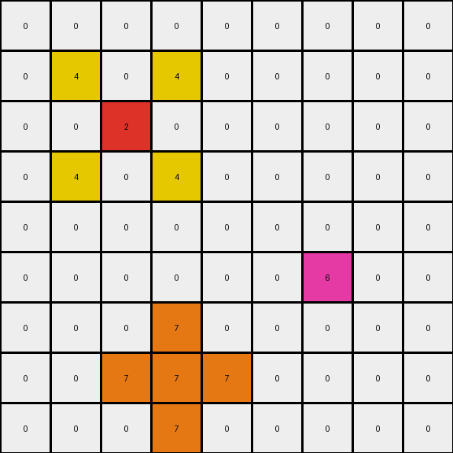

# 2-0ca9ddb6 • 007 • refine_code - NLP

---

Previous Code:
```python
"""
Copies azure, red, and blue pixels from the input grid to the output grid. Adds yellow pixels above and below each red pixel and orange pixels surrounding each blue pixel.
"""

import numpy as np

def find_objects(grid, color):
    # Find the coordinates of all single-cell objects of the specified color.
    coords = np.where(grid == color)
    return list(zip(coords[0], coords[1]))

def transform(input_grid):
    """
    Transforms the input grid according to the defined rules:
    1. Copies azure (8), red (2), and blue (1) pixels.
    2. Adds yellow (4) pixels above and below each red pixel.
    3. Adds orange (7) pixels around each blue pixel.
    """
    output_grid = np.copy(input_grid)

    # Find the azure, red and blue pixels
    azure_pixels = find_objects(input_grid, 8)
    red_pixels = find_objects(input_grid, 2)
    blue_pixels = find_objects(input_grid, 1)

    # Copy azure, red and blue pixels
    for pos in azure_pixels:
      output_grid[pos] = 8
    for pos in red_pixels:
      output_grid[pos] = 2
    for pos in blue_pixels:
        output_grid[pos] = 1

    # Add yellow pixels above and below each red pixel
    for row, col in red_pixels:
        if row > 0:
          output_grid[row - 1, col-1] = 4
          output_grid[row - 1, col+1] = 4
        if row < output_grid.shape[0] - 1:
          output_grid[row + 1, col-1] = 4
          output_grid[row + 1, col+1] = 4

    # Add orange pixels around each blue pixel
    for row, col in blue_pixels:
        for i in range(row - 1, row + 2):
            if 0 <= i < output_grid.shape[0]:
                output_grid[i, col] = 7
        for j in range(col - 1, col + 2):
            if 0 <= j < output_grid.shape[1]:
                output_grid[row, j] = 7

    return output_grid
```

Train Set Results:

**Example 1:**
Input:
```
0 0 0 0 0 0 0 0 0
0 0 0 0 0 0 0 0 0
0 0 0 0 0 0 0 0 0
0 0 2 0 0 0 0 0 0
0 0 0 0 0 0 0 0 0
0 0 0 0 0 0 0 0 0
0 0 0 0 0 0 1 0 0
0 0 0 0 0 0 0 0 0
0 0 0 0 0 0 0 0 0
```
Expected Output:
```
0 0 0 0 0 0 0 0 0
0 0 0 0 0 0 0 0 0
0 4 0 4 0 0 0 0 0
0 0 2 0 0 0 0 0 0
0 4 0 4 0 0 0 0 0
0 0 0 0 0 0 7 0 0
0 0 0 0 0 7 1 7 0
0 0 0 0 0 0 7 0 0
0 0 0 0 0 0 0 0 0
```
Transformed Output:
```
0 0 0 0 0 0 0 0 0
0 0 0 0 0 0 0 0 0
0 4 0 4 0 0 0 0 0
0 0 2 0 0 0 0 0 0
0 4 0 4 0 0 0 0 0
0 0 0 0 0 0 7 0 0
0 0 0 0 0 7 7 7 0
0 0 0 0 0 0 7 0 0
0 0 0 0 0 0 0 0 0
```

Status: False

**Example 2:**
Input:
```
0 0 0 8 0 0 0 0 0
0 0 0 0 0 0 0 0 0
0 0 0 0 0 0 2 0 0
0 0 1 0 0 0 0 0 0
0 0 0 0 0 0 0 0 0
0 0 0 0 0 0 0 0 0
0 0 0 0 0 0 1 0 0
0 2 0 0 0 0 0 0 0
0 0 0 0 0 0 0 0 0
```
Expected Output:
```
0 0 0 8 0 0 0 0 0
0 0 0 0 0 4 0 4 0
0 0 7 0 0 0 2 0 0
0 7 1 7 0 4 0 4 0
0 0 7 0 0 0 0 0 0
0 0 0 0 0 0 7 0 0
4 0 4 0 0 7 1 7 0
0 2 0 0 0 0 7 0 0
4 0 4 0 0 0 0 0 0
```
Transformed Output:
```
0 0 0 8 0 0 0 0 0
0 0 0 0 0 4 0 4 0
0 0 7 0 0 0 2 0 0
0 7 7 7 0 4 0 4 0
0 0 7 0 0 0 0 0 0
0 0 0 0 0 0 7 0 0
4 0 4 0 0 7 7 7 0
0 2 0 0 0 0 7 0 0
4 0 4 0 0 0 0 0 0
```

Status: False

**Example 3:**
Input:
```
0 0 0 0 0 0 0 0 0
0 0 0 0 0 0 0 0 0
0 0 2 0 0 0 0 0 0
0 0 0 0 0 0 0 0 0
0 0 0 0 0 0 0 0 0
0 0 0 0 0 0 6 0 0
0 0 0 0 0 0 0 0 0
0 0 0 1 0 0 0 0 0
0 0 0 0 0 0 0 0 0
```
Expected Output:
```
0 0 0 0 0 0 0 0 0
0 4 0 4 0 0 0 0 0
0 0 2 0 0 0 0 0 0
0 4 0 4 0 0 0 0 0
0 0 0 0 0 0 0 0 0
0 0 0 0 0 0 6 0 0
0 0 0 7 0 0 0 0 0
0 0 7 1 7 0 0 0 0
0 0 0 7 0 0 0 0 0
```
Transformed Output:
```
0 0 0 0 0 0 0 0 0
0 4 0 4 0 0 0 0 0
0 0 2 0 0 0 0 0 0
0 4 0 4 0 0 0 0 0
0 0 0 0 0 0 0 0 0
0 0 0 0 0 0 6 0 0
0 0 0 7 0 0 0 0 0
0 0 7 7 7 0 0 0 0
0 0 0 7 0 0 0 0 0
```

Status: False
**Instructions**

- Describe in natural language the step-by-step transformation observed between the input and output grids.
- Focus on identifying objects, their properties (predicates), and the actions performed on them.
- Be as clear and concise as possible, providing a complete description of the transformation rule.
