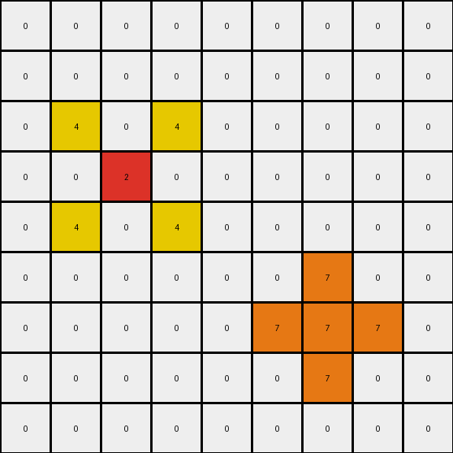
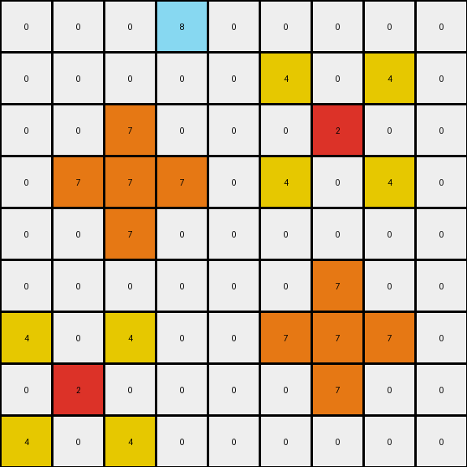

# 2-0ca9ddb6 • 012 • refine_code - CODE

---

Previous Code:
```python
"""
Copies red, blue, and magenta pixels from the input grid to the output grid. Adds yellow pixels above and below the red pixel and orange pixels surrounding the blue pixel.
"""

import numpy as np

def find_objects(grid, color):
    # Find the coordinates of all single-cell objects of the specified color.
    coords = np.where(grid == color)
    return list(zip(coords[0], coords[1]))

def transform(input_grid):
    """
    Transforms the input grid according to the defined rules:
    1. Copies red (2), blue (1), and magenta (6) pixels.
    2. Adds yellow (4) pixels above and below the red pixel.
    3. Adds orange (7) pixels around the blue pixel.
    """
    output_grid = np.copy(input_grid)

    # Find the red, blue and magenta pixels
    red_pixels = find_objects(input_grid, 2)
    blue_pixels = find_objects(input_grid, 1)
    magenta_pixels = find_objects(input_grid, 6)

    # Copy red, blue and magenta pixels
    for pos in red_pixels:
        output_grid[pos] = 2
    for pos in blue_pixels:
        output_grid[pos] = 1
    for pos in magenta_pixels:
        output_grid[pos]= 6

    # Add yellow pixels above and below the red pixel
    for row, col in red_pixels:
        if row > 0:
          output_grid[row - 1, col-1] = 4
          output_grid[row - 1, col+1] = 4
        if row < output_grid.shape[0] - 1:
          output_grid[row + 1, col-1] = 4
          output_grid[row + 1, col+1] = 4

    # Add orange pixels around the blue pixel
    for row, col in blue_pixels:
        for i in range(row - 1, row + 2):
            if 0 <= i < output_grid.shape[0]:
                output_grid[i, col] = 7
        for j in range(col - 1, col + 2):
            if 0 <= j < output_grid.shape[1]:
                output_grid[row, j] = 7

    return output_grid
```

Train Set Results:

**Example 1:**
Input:
```
0 0 0 0 0 0 0 0 0
0 0 0 0 0 0 0 0 0
0 0 0 0 0 0 0 0 0
0 0 2 0 0 0 0 0 0
0 0 0 0 0 0 0 0 0
0 0 0 0 0 0 0 0 0
0 0 0 0 0 0 1 0 0
0 0 0 0 0 0 0 0 0
0 0 0 0 0 0 0 0 0
```
Expected Output:
```
0 0 0 0 0 0 0 0 0
0 0 0 0 0 0 0 0 0
0 4 0 4 0 0 0 0 0
0 0 2 0 0 0 0 0 0
0 4 0 4 0 0 0 0 0
0 0 0 0 0 0 7 0 0
0 0 0 0 0 7 1 7 0
0 0 0 0 0 0 7 0 0
0 0 0 0 0 0 0 0 0
```
Transformed Output:
```
0 0 0 0 0 0 0 0 0
0 0 0 0 0 0 0 0 0
0 4 0 4 0 0 0 0 0
0 0 2 0 0 0 0 0 0
0 4 0 4 0 0 0 0 0
0 0 0 0 0 0 7 0 0
0 0 0 0 0 7 7 7 0
0 0 0 0 0 0 7 0 0
0 0 0 0 0 0 0 0 0
```

Status: False

**Example 2:**
Input:
```
0 0 0 8 0 0 0 0 0
0 0 0 0 0 0 0 0 0
0 0 0 0 0 0 2 0 0
0 0 1 0 0 0 0 0 0
0 0 0 0 0 0 0 0 0
0 0 0 0 0 0 0 0 0
0 0 0 0 0 0 1 0 0
0 2 0 0 0 0 0 0 0
0 0 0 0 0 0 0 0 0
```
Expected Output:
```
0 0 0 8 0 0 0 0 0
0 0 0 0 0 4 0 4 0
0 0 7 0 0 0 2 0 0
0 7 1 7 0 4 0 4 0
0 0 7 0 0 0 0 0 0
0 0 0 0 0 0 7 0 0
4 0 4 0 0 7 1 7 0
0 2 0 0 0 0 7 0 0
4 0 4 0 0 0 0 0 0
```
Transformed Output:
```
0 0 0 8 0 0 0 0 0
0 0 0 0 0 4 0 4 0
0 0 7 0 0 0 2 0 0
0 7 7 7 0 4 0 4 0
0 0 7 0 0 0 0 0 0
0 0 0 0 0 0 7 0 0
4 0 4 0 0 7 7 7 0
0 2 0 0 0 0 7 0 0
4 0 4 0 0 0 0 0 0
```

Status: False

**Example 3:**
Input:
```
0 0 0 0 0 0 0 0 0
0 0 0 0 0 0 0 0 0
0 0 2 0 0 0 0 0 0
0 0 0 0 0 0 0 0 0
0 0 0 0 0 0 0 0 0
0 0 0 0 0 0 6 0 0
0 0 0 0 0 0 0 0 0
0 0 0 1 0 0 0 0 0
0 0 0 0 0 0 0 0 0
```
Expected Output:
```
0 0 0 0 0 0 0 0 0
0 4 0 4 0 0 0 0 0
0 0 2 0 0 0 0 0 0
0 4 0 4 0 0 0 0 0
0 0 0 0 0 0 0 0 0
0 0 0 0 0 0 6 0 0
0 0 0 7 0 0 0 0 0
0 0 7 1 7 0 0 0 0
0 0 0 7 0 0 0 0 0
```
Transformed Output:
```
0 0 0 0 0 0 0 0 0
0 4 0 4 0 0 0 0 0
0 0 2 0 0 0 0 0 0
0 4 0 4 0 0 0 0 0
0 0 0 0 0 0 0 0 0
0 0 0 0 0 0 6 0 0
0 0 0 7 0 0 0 0 0
0 0 7 7 7 0 0 0 0
0 0 0 7 0 0 0 0 0
```

Status: False
Okay, let's analyze the observed transformations and refine the natural language program description.

**Analysis of the Previous Results and Errors**

The previous code and its execution reveal several key issues:

1.  **Incorrect Yellow Placement:** Yellow pixels are placed to the *left and right* of above and below the red pixels, not directly above and below. Also the yellow pixels are not only one pixel up or down, they are in a diagonal position, not directly above or below.
2.  **Incomplete Orange Placement:** Orange pixels should completely surround the blue pixel (all 8 neighbors), but the code was only putting them in cross shape, not a square shape, around it.
3. Copy of other colors: Only the colors red, blue and magenta must be copied, any other color, like azure in example 2, must not be copied to the output.

**Revised Natural Language Program**

Here's a revised natural language program description of the transformation rule, addressing the issues identified above:

1.  **Copy Specific Colors:** Copy all pixels that are red (color 2), blue (color 1), or magenta (color 6) from the input grid to the output grid, maintaining their original positions. All other colors must not be copied.
2.  **Yellow Surround of Red:** For every red pixel in the input grid:
    *   Place a yellow pixel (color 4) one cell *diagonally up and to the left*.
    *   Place a yellow pixel (color 4) one cell *diagonally up and to the right*.
    *   Place a yellow pixel (color 4) one cell *diagonally down and to the left*.
    *   Place a yellow pixel (color 4) one cell *diagonally down and to the right*.
    Ensure these placements are within the bounds of the grid.
3.  **Orange Surround of Blue:** For every blue pixel in the input grid:
    *   Place orange pixels (color 7) in all eight neighboring cells (horizontally, vertically, and diagonally) surrounding the blue pixel. Ensure these placements are within the bounds of the grid.

**Explanation of Changes and Reasoning**

*   **Specificity in Copying:** Explicitly stating which colors to copy, and to not copy the rest, prevents unintended carryover of other colors.
*   **Diagonal Placement:** The previous description missed the diagonal nature of the yellow pixel additions. This revision clearly specifies "diagonally up/down and left/right".
* **Complete Surround:** Using 8 neighbors for sorrounding instead of cross shaped sorround.

The next step will be to create the code implementation.

**INSTRUCTIONS**

- generate a Python module to represent the natural language program 
- follow the template below
- all common math and science libraries are available
- create docstring only at top - but comment the workflow in the function
- use helper functions for common operations like finding objects, counting,
  measuring, moving, etc. 

remember - we are working iteratively - so this code will inform your future
self as we converge on the solution

*template:*

```python
"""
{{ natural language description of the transformation rule }}
"""

{{ imports }}

def transform(input_grid):
    # initialize output_grid

    # change output pixels 

    return output_grid

```
