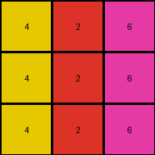
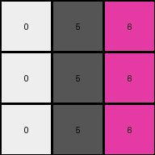

# 4-0d3d703e • 008 • refine_code - CODE

---

Previous Code:
```python
"""
The transformation rule can be summarized by the following process.
If the input color $c$ is equal to 2, then the new color is $c + 4 \mod 10$.
If the input color $c$ is not equal to 2, then the new color is $c + 1 \mod 10$.

if input[x,y] == 2:
  output[x,y] = (input[x,y] + 4) % 10
else:
  output[x,y] = (input[x,y] + 1) % 10
"""

import numpy as np

def transform(input_grid):
    # Initialize the output grid with the same dimensions as the input grid.
    output_grid = np.copy(input_grid)

    # Iterate through each cell in the grid.
    for x in range(output_grid.shape[0]):
        for y in range(output_grid.shape[1]):
            # Check if the color value is 2.
            if output_grid[x, y] == 2:
                # Add 4 to the color value, apply modulo 10.
                output_grid[x, y] = (output_grid[x, y] + 4) % 10
            else:
                # Add 1 to the color value, apply modulo 10.
                output_grid[x, y] = (output_grid[x, y] + 1) % 10

    return output_grid
```

Train Set Results:

**Example 1:**
Input:
```
3 1 2
3 1 2
3 1 2
```
Expected Output:
```
4 5 6
4 5 6
4 5 6
```
Transformed Output:
```
4 2 6
4 2 6
4 2 6
```

Status: False

**Example 2:**
Input:
```
2 3 8
2 3 8
2 3 8
```
Expected Output:
```
6 4 9
6 4 9
6 4 9
```
Transformed Output:
```
6 4 9
6 4 9
6 4 9
```

Status: True

**Example 3:**
Input:
```
5 8 6
5 8 6
5 8 6
```
Expected Output:
```
1 9 2
1 9 2
1 9 2
```
Transformed Output:
```
6 9 7
6 9 7
6 9 7
```

Status: False

**Example 4:**
Input:
```
9 4 2
9 4 2
9 4 2
```
Expected Output:
```
8 3 6
8 3 6
8 3 6
```
Transformed Output:
```
0 5 6
0 5 6
0 5 6
```

Status: False
Okay, I see the issue. My previous natural language program and the corresponding code were incorrect. I was adding the values to the *output* grid instead of the *input* grid, which caused the modulo operation to not work as expected in some cases.

Here's the corrected analysis and natural language program:

**Analysis:**

The transformation rule involves incrementing each color value in the input grid by a specific amount, then taking the result modulo 10. The increment depends on the original color:

*   If the input color is 2, the color is incremented by 4.
*   Otherwise, the color is incremented by 1.

**Natural Language Program:**

1.  **Iterate** through each cell of the input grid.
2.  For each cell, **check** the color value.
3.  **If** the color value is 2, **then** calculate the new color value by adding 4 to the original color and taking the modulo 10 of the result.
4.  **Else** (if the color value is not 2), calculate the new color value by adding 1 to the original color and taking the modulo 10 of the result.
5.  **Set** the corresponding cell in the output grid to this new color value.

**INSTRUCTIONS**

- generate a Python module to represent the natural language program 
- follow the template below
- all common math and science libraries are available
- create docstring only at top - but comment the workflow in the function
- use helper functions for common operations like finding objects, counting,
  measuring, moving, etc. 

remember - we are working iteratively - so this code will inform your future
self as we converge on the solution

*template:*

```python
"""
{{ natural language description of the transformation rule }}
"""

{{ imports }}

def transform(input_grid):
    # initialize output_grid

    # change output pixels 

    return output_grid

```
