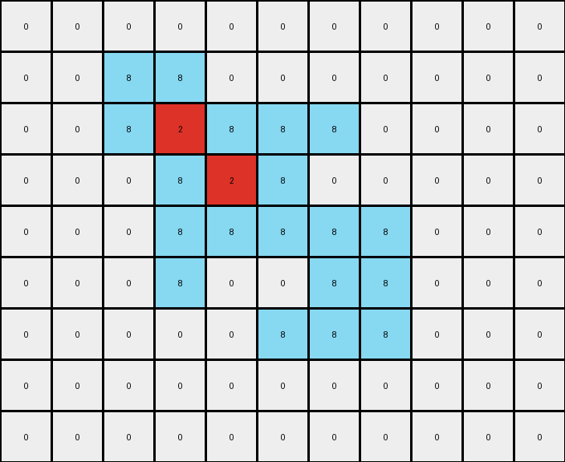
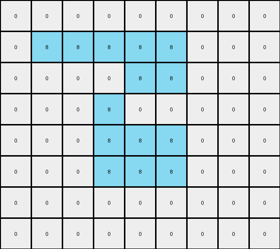

# 5-150deff5 • 007 • refine_code - NLP

---

Previous Code:
```python
"""
1.  **Identify the Gray Object:** Locate the contiguous gray (color 5) areas in the input grid. This forms the basis of the transformation.
2.  **Change Gray to Azure:** All instances of gray (color 5) are changed to azure (color 8).
3. **Change central-connected pixels to Red:** Inside the azure areas, if a pixel originally colored gray (5) had four neighbors that were also gray (up, down, left, right, orthogonal), it is changed to red (color 2). The resulting red pixels are adjacent to one another and form a connected object (component).
"""

import numpy as np

def get_neighbors(grid, r, c):
    """ Return 4 neighbors of the cell in grid"""

    rows, cols = grid.shape
    neighbors = []
    if r > 0:
        neighbors.append((r - 1, c))
    if r < rows - 1:
        neighbors.append((r + 1, c))
    if c > 0:
        neighbors.append((r, c - 1))
    if c < cols - 1:
        neighbors.append((r, c + 1))
    return neighbors

def transform(input_grid):
    """Transforms the input grid according to the specified rules."""
    
    output_grid = np.copy(input_grid)
    rows, cols = output_grid.shape

    # Change all gray (5) to azure (8)
    for r in range(rows):
        for c in range(cols):
            if output_grid[r, c] == 5:
                output_grid[r, c] = 8

    # Create a temporary grid to track the original positions of gray pixels
    temp_grid = np.copy(input_grid)

    # Change central-connected pixels to red (2)
    for r in range(rows):
        for c in range(cols):
            if temp_grid[r, c] == 5:
                neighbors = get_neighbors(temp_grid, r, c)
                # Ensure that we only consider neighbors within the bounds of the grid
                valid_neighbors = [(nr, nc) for nr, nc in neighbors if 0 <= nr < rows and 0 <= nc < cols]
                neighbor_colors = [temp_grid[nr, nc] for nr, nc in valid_neighbors]
                if all(color == 5 for color in neighbor_colors) and len(valid_neighbors) == 4:
                    output_grid[r, c] = 2
    return output_grid
```

Train Set Results:

**Example 1:**
Input:
```
0 0 0 0 0 0 0 0 0 0 0
0 0 5 5 0 0 0 0 0 0 0
0 0 5 5 5 5 5 0 0 0 0
0 0 0 5 5 5 0 0 0 0 0
0 0 0 5 5 5 5 5 0 0 0
0 0 0 5 0 0 5 5 0 0 0
0 0 0 0 0 5 5 5 0 0 0
0 0 0 0 0 0 0 0 0 0 0
0 0 0 0 0 0 0 0 0 0 0
```
Expected Output:
```
0 0 0 0 0 0 0 0 0 0 0
0 0 8 8 0 0 0 0 0 0 0
0 0 8 8 2 2 2 0 0 0 0
0 0 0 2 8 8 0 0 0 0 0
0 0 0 2 8 8 8 8 0 0 0
0 0 0 2 0 0 8 8 0 0 0
0 0 0 0 0 2 2 2 0 0 0
0 0 0 0 0 0 0 0 0 0 0
0 0 0 0 0 0 0 0 0 0 0
```
Transformed Output:
```
0 0 0 0 0 0 0 0 0 0 0
0 0 8 8 0 0 0 0 0 0 0
0 0 8 2 8 8 8 0 0 0 0
0 0 0 8 2 8 0 0 0 0 0
0 0 0 8 8 8 8 8 0 0 0
0 0 0 8 0 0 8 8 0 0 0
0 0 0 0 0 8 8 8 0 0 0
0 0 0 0 0 0 0 0 0 0 0
0 0 0 0 0 0 0 0 0 0 0
```

Status: False

**Example 2:**
Input:
```
0 0 0 0 0 0 0 0 0 0
0 5 5 5 5 5 5 0 0 0
0 5 5 5 5 5 5 0 0 0
0 0 0 5 0 0 5 0 0 0
0 0 0 0 5 5 5 0 0 0
0 0 0 0 5 5 5 0 0 0
0 0 0 0 5 0 0 0 0 0
0 0 0 0 0 0 0 0 0 0
```
Expected Output:
```
0 0 0 0 0 0 0 0 0 0
0 8 8 2 8 8 2 0 0 0
0 8 8 2 8 8 2 0 0 0
0 0 0 2 0 0 2 0 0 0
0 0 0 0 2 8 8 0 0 0
0 0 0 0 2 8 8 0 0 0
0 0 0 0 2 0 0 0 0 0
0 0 0 0 0 0 0 0 0 0
```
Transformed Output:
```
0 0 0 0 0 0 0 0 0 0
0 8 8 8 8 8 8 0 0 0
0 8 8 2 8 8 8 0 0 0
0 0 0 8 0 0 8 0 0 0
0 0 0 0 8 8 8 0 0 0
0 0 0 0 8 8 8 0 0 0
0 0 0 0 8 0 0 0 0 0
0 0 0 0 0 0 0 0 0 0
```

Status: False

**Example 3:**
Input:
```
0 0 0 0 0 0 0 0 0
0 5 5 5 5 5 0 0 0
0 0 0 0 5 5 0 0 0
0 0 0 5 0 0 0 0 0
0 0 0 5 5 5 0 0 0
0 0 0 5 5 5 0 0 0
0 0 0 0 0 0 0 0 0
0 0 0 0 0 0 0 0 0
```
Expected Output:
```
0 0 0 0 0 0 0 0 0
0 2 2 2 8 8 0 0 0
0 0 0 0 8 8 0 0 0
0 0 0 2 0 0 0 0 0
0 0 0 2 8 8 0 0 0
0 0 0 2 8 8 0 0 0
0 0 0 0 0 0 0 0 0
0 0 0 0 0 0 0 0 0
```
Transformed Output:
```
0 0 0 0 0 0 0 0 0
0 8 8 8 8 8 0 0 0
0 0 0 0 8 8 0 0 0
0 0 0 8 0 0 0 0 0
0 0 0 8 8 8 0 0 0
0 0 0 8 8 8 0 0 0
0 0 0 0 0 0 0 0 0
0 0 0 0 0 0 0 0 0
```

Status: False
**Instructions**

- Describe in natural language the step-by-step transformation observed between the input and output grids.
- Focus on identifying objects, their properties (predicates), and the actions performed on them.
- Be as clear and concise as possible, providing a complete description of the transformation rule.
