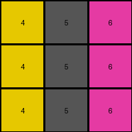

# 4-0d3d703e • 002 • example_1 - CODE

---

**input**
```
3 1 2
3 1 2
3 1 2
```


**output**
```
4 5 6
4 5 6
4 5 6
```



Okay, let's analyze the transformation from the input grid to the output grid.

**YAML Summary of Observations**

```yaml
task: 001
input_grid:
  size: 3x3
  objects:
    - color: 3
      count: 3
      shape: vertical line
      position: left column
    - color: 1
      count: 3
      shape: vertical line
      position: middle column
    - color: 2
      count: 3
      shape: vertical line
      position: right column
output_grid:
  size: 3x3
  objects:
    - color: 4
      count: 3
      shape: vertical line
      position: left column
    - color: 5
      count: 3
      shape: vertical line
      position: middle column
    - color: 6
      count: 3
      shape: vertical line
      position: right column
transformation_rule:
  description: Each vertical line of a specific color in the input grid is transformed into a vertical line of a different, corresponding color in the output grid. The spatial arrangement (left, middle, right columns) remains the same, and it suggests a consistent color mapping.
```

**Natural Language Program: Step-by-step Transformation**

1.  **Identify Objects:** In the input grid, we observe three distinct vertical lines, each occupying a single column and consisting of a uniform color. These are our primary objects.

2.  **Color Mapping:** The core transformation is a color substitution. The specific mapping appears to be:
    *   Input color 3 (left column) becomes output color 4.
    *   Input color 1 (middle column) becomes output color 5.
    *   Input color 2 (right column) becomes output color 6.

3.  **Spatial Preservation:** The positions and shapes of the objects (vertical lines) are preserved. Each object in the input has a direct, spatially corresponding counterpart in the output. No objects are added or removed, and they maintain their shape and size, only their color changes.

4. **Complete Description**: The input grid consists of three vertical lines of colors 3, 1, and 2. The output grid has the same structure but substitutes each input color with a distinct color.

This transformation rule focuses on a consistent color mapping while preserving the spatial structure of the input grid.

**INSTRUCTIONS**

- generate a Python module to represent the natural language program 
- follow the template below
- all common math and science libraries are available
- create docstring only at top - but comment the workflow in the function
- use helper functions for common operations like finding objects, counting,
  measuring, moving, etc. 

remember - we are working iteratively - so this code will inform your future
self as we converge on the solution

*template:*

```python
"""
{ natural language description of the transformation rule }
"""

{ imports }

def transform(input_grid):
    # initialize output_grid

    # change output pixels 

    return output_grid

```
